# Workflow Tracks — translation of § 25, مسارات العمل

A direct translation of section 25 of the ministry's technical proposal
(`__العرض-الفني-لنظام-إدارة-المشاريع 1.html`, v1.0, 2026-08-11) — the fourteen swimlane
process diagrams (المسار 1–14) that define who does what, when, and under which authority.
Nothing here is invented: every step, lane, and closing note is carried over from the source
document, redrawn as a UML sequence diagram instead of the source's own swimlane boxes, so the
logic reads as a flow instead of a grid. Arabic terms are kept literal alongside the translation.

**Why this document exists.** The demo runsheet (`demo/runsheet.html`) narrates a build-from-zero
walkthrough of the app. This document is its source of truth for *what the ministry actually
specified* — so the remaining parts of the demo can be checked against the proposal's own words,
not against improvised narration.

A navigable version of the same fourteen diagrams is published at:
<https://claude.ai/code/artifact/PLACEHOLDER>

---

## How to read a diagram

- **Solid arrow (`->>`)** — a handoff: one actor's action moves the work to another actor (a
  submission, an approval passed forward, an escalation target).
- **Dashed arrow (`-->>`)** — an automatic or return-direction step: a system computation, a
  validation, an approval/rejection decision, an alert.
- **Note over an actor** — a manual step performed inside that actor's own lane, with nothing yet
  handed off.
- **`alt` / `else` blocks** — a genuine fork in the source diagram (a data-source choice, an
  approve/return decision, a threshold check with two outcomes). Every fork in these diagrams
  comes from an explicit branch step in the source (numbered `Nأ`) — none are inferred.
- Every message is prefixed with its original step number from the source, so any diagram line
  can be traced back to `المسار N` in the proposal HTML.
- **المرحلة N من M** phase boundaries are marked with a `Note` spanning the full diagram width.

### The three-way responsibility split

The source's own preamble to §25, translated in full (it governs all fourteen tracks):

> Workflow tracks are the core of this technical proposal, because they define who does what,
> when, and under what authority — and they draw a clear line between three responsibilities:
> what Projects Administration does, what the specialist user does, and what the system executes
> automatically. The tracks are designed as swimlanes: each horizontal row represents an entity
> or a role, steps advance right to left, and responsibility moves between rows as it changes
> hands.

| Responsibility | What it covers, across every track |
|---|---|
| **إدارة المشاريع** (Projects Administration) | reviewing submitted records and approving or returning them; managing contracts and addenda; leading the application of change orders; closing progress periods; following up escalated alerts |
| **المستخدم المختص** (The specialist user) | entering data at its source: defining the project, uploading the BOQ and the schedules, updating progress, recording payments and receipts, uploading documents, creating change orders |
| **النظام** (The system) | validating inputs; computing and deriving; creating versions; propagating impact to linked modules; evaluating alert rules; automatic escalation once a deadline is exceeded; recording every operation in the audit log |

---

## المسار 1 — Track 1 — Defining the Project and Linking It to the University

**Start:** the decision to include the project in the entity's plan.
**End:** an approved project record ready to receive contracts.

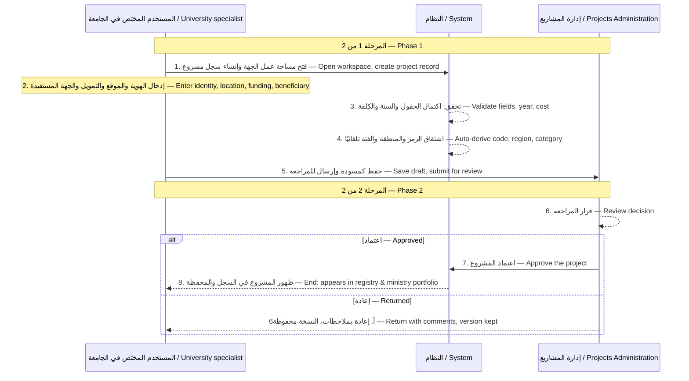

**What the user enters:** the project name, its type, the inclusion year, the execution phase,
its status, the location and coordinates, the funding, the beneficiary entity, the organizational
structure, and the consultant.

**What the system validates:** mandatory fields are complete · the inclusion year is valid · the
approved cost is greater than zero · the project belongs to exactly one organizational unit.

**What the user sees:** the project card with its fields, the values the system derives
automatically from the classification and the entity, and an activity log of the edits.

**Reflection on other modules:** enables adding contracts · lists the project on the university's
and ministry's dashboards · feeds location data to the GIS.

**Alerts:** a new project added · a mandatory document is missing.

---

## المسار 2 — Track 2 — Creating Contracts and Linking Them to the Project

**Start:** issuance of the award (صدور الإحالة).
**End:** an effective contract ready to receive the BOQ, the schedule, and payments.

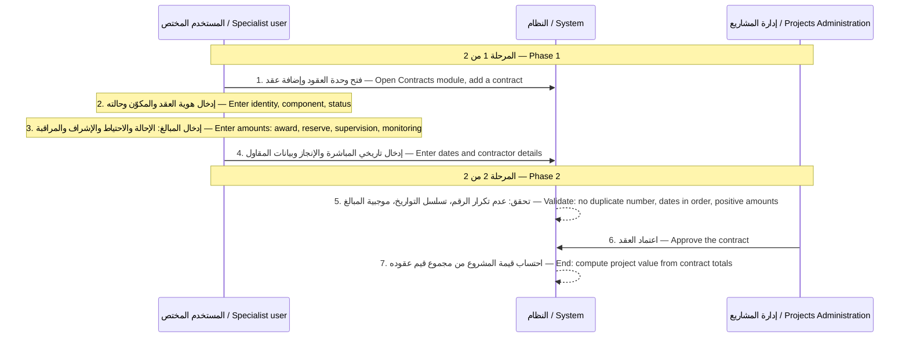

**What the user enters:** the contract's name and code, its component and status, the award,
reserve, supervision, and monitoring amounts, the commencement and completion dates, the
contractor's name, the executing entity, and contact details.

**What the system validates:** the contract number is not duplicated within the organizational
unit · the dates are in sequence · the amounts are positive · the contract belongs to exactly one
project.

**What the user sees:** the contract card with its tabs (Overview · Details · Payments · Addenda
& Amendments · Activity log), and the cost broken down across its three components.

**Reflection on other modules:** the derived project value · enables uploading the BOQ and
importing the schedule · enables recording payments against the contract.

**Alerts:** a new contract added · the contract's duration is approaching its end.

---

## المسار 3 — Track 3 — Uploading the Bill of Quantities and Reviewing It

**Start:** the contractual BOQ becoming available.
**End:** an approved BOQ version linked to the contract.

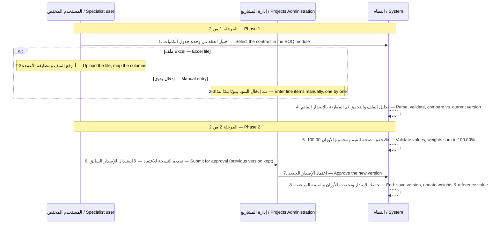

**What the user enters:** the BOQ file, or its line items entered manually: the code,
description, section, unit, quantity, and unit price.

**What the system validates:** the columns map correctly · the values are valid · the weights sum
to 100.00% · the line items belong exclusively to the selected contract.

**What the user sees:** a five-step import wizard (upload the file · parse · validate · compare ·
confirm and link), and the comparison result against the current version before submission.

**Reflection on other modules:** the line-item weights · the contract's reference value · enables
linking to activities · the basis for computing earned value.

**Alerts:** a project with no approved BOQ · unpriced line items.

---

## المسار 4 — Track 4 — Importing the Schedule, or Building It Inside the System

**Start:** the work programme becoming available.
**End:** an approved schedule with a reference baseline and computed weights.

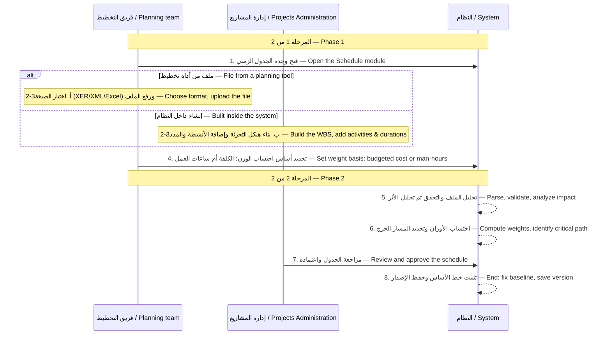

**What the user enters:** the schedule file, or activities entered manually: the identifier, name,
its position in the WBS, the duration, the start and end dates, and the budgeted cost.

**What the system validates:** the WBS structure is sound · activities and milestones are
complete · the weight basis is valid · the dates are consistent.

**What the user sees:** a five-step import wizard ending in an impact analysis then confirmation;
and a Gantt chart compared against the baseline, with a status legend.

**Reflection on other modules:** enables linking BOQ lines to activities · the basis for computing
progress and planned value · identifies the critical path and float.

**Alerts:** no approved schedule exists · a key milestone approaching · an activity on the
critical path is delayed.

---

## المسار 5 — Track 5 — Linking BOQ Lines to Activities

**Start:** an approved BOQ and an approved schedule both being available.
**End:** full coverage that allows progress and earned value to be derived.

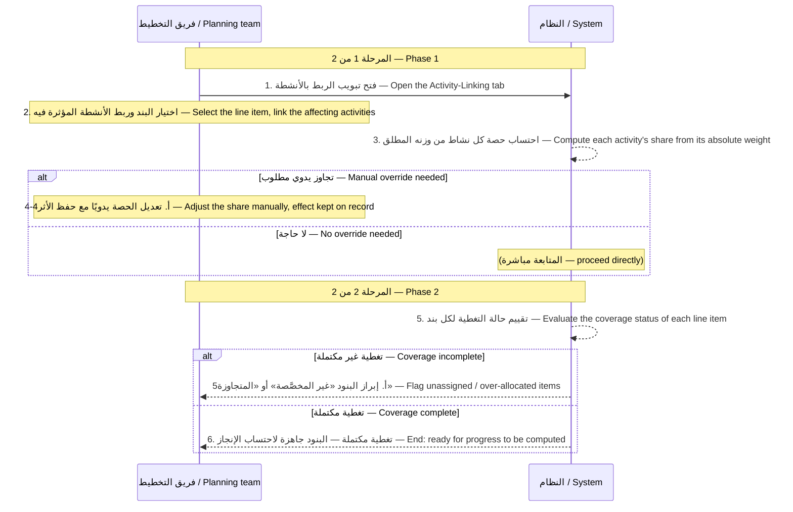

**What the user enters:** selecting the activities linked to each line item, and adjusting the
shares when needed.

**What the system validates:** the sum of the shares does not exceed the total · the line item and
the activity belong to the same contract · classifying the coverage status.

**What the user sees:** the "Activities" and "Allocated weight" columns in the BOQ register, and
the allocation status: fully allocated / partial / over-allocated / unassigned.

**Reflection on other modules:** converts activity progress into line-item completion percentages
· computes quantities executed and earned value · feeds the performance indicators.

**Alerts:** line items not allocated to activities · an over-allocation.

---

## المسار 6 — Track 6 — Updating Progress and Approving It

**Start:** the update period ending.
**End:** an approved progress reading, reflected onto quantities, values, and indicators.

> This is the track behind the runsheet's two-desk step 07 (`P-238`/`P-239`) — a progress reading
> is *submitted* by القسم المصدر (the originating department) and *approved* by إدارة المشاريع,
> and nothing on the bill moves until that approval lands.

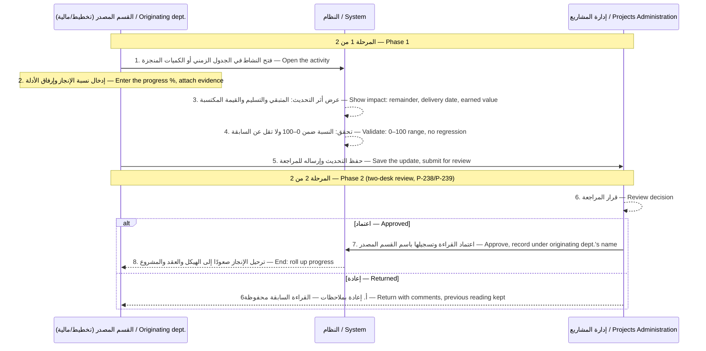

**What the user enters:** the activity's progress percentage or the quantity executed, and the
supporting evidence.

**What the system validates:** the percentage limits · no regression below the previous reading ·
an activity link must exist before computation.

**What the user sees:** the remaining duration in days, the delivery impact on the project's
progress, the financial impact, the activity's cost and its earned value, and the remaining
budget.

**Reflection on other modules:** line-item completion percentages · quantities executed and
remaining · earned value · SPI and CPI · the university's and ministry's dashboards.

**Alerts:** no progress update recorded within the set period · an activity on the critical path
is delayed.

---

## المسار 7 — Track 7 — Closing the Progress Period and Moving to the Next Period

**Start:** approval of the period's reading.
**End:** a closed, comparable period and a new open period.

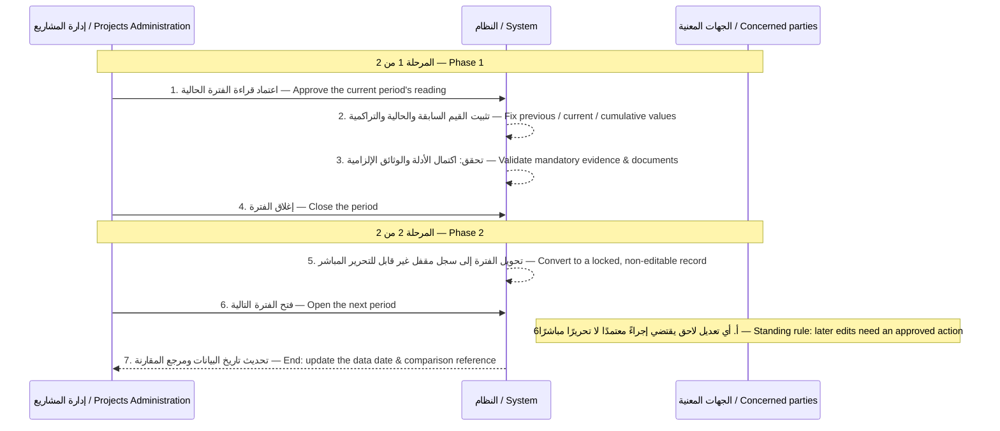

**What the user enters:** confirming the period's closure once its readings and evidence are
complete.

**What the system validates:** the period's readings are complete · evidence exists · no pending
actions block the closure.

**What the user sees:** the approved data date, the "previous reading" comparison reference, and
the log of updates received from the departments.

**Reflection on other modules:** stability of historical comparisons · accuracy of the indicators
· closing the fiscal-year record in the Financial Status module.

**Alerts:** a period not closed on time · an attempt to edit a locked period.

---

## المسار 8 — Track 8 — Creating the Payment Certificate, Reviewing It, and Approving It

**Start:** submission of the المستخلص (payment certificate) and ذرعات الأعمال (work-measurement
sheets).
**End:** a payment certificate approved and disbursed ahead of the statutory deadline.

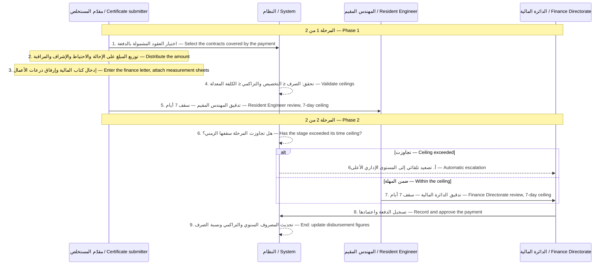

**What the user enters:** the contracts covered, the amounts per line item, the finance letter and
its date, the work-measurement sheets, and the supporting documents.

**What the system validates:** the disbursement ceilings against the allocation and the adjusted
cost · the finance letter and measurement sheets are complete · computing the time consumed at
each review stage.

**What the user sees:** a five-step recording wizard ending in a review, a review-deadline bar
showing each stage's status, and the statutory disbursement deadline with the time remaining.

**Reflection on other modules:** the cumulative disbursement · the disbursement percentage ·
financial progress · the financial-changes log · the performance indicators.

**Alerts:** the review deadline exceeded, with escalation · the disbursement approaching the
allocation · the cumulative disbursement exceeding the cost.

---

## المسار 9 — Track 9 — Creating the Change Order, Approving It, and Reflecting It onto the Contract, the BOQ, and the Schedule

**Start:** the contractor's or supplier's request and the consultant's approval (prior inputs, not
stages).
**End:** an effective contract addendum and a closed order.

> The same six-stage process documented in `spec/03-CHANGE-ORDER-PROCESS.md` — that file gives
> the stage owners, the conditions that skip stage 3 and stage 4, and the external-party rules;
> this diagram is the source proposal's own rendering of the same process, including the input
> steps before entry and the application steps after the ministerial order.

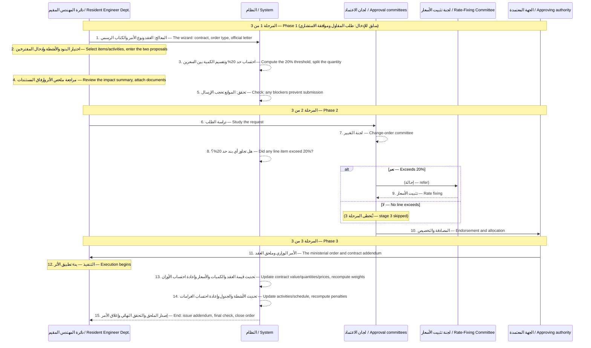

**What the user enters:** the contract, the order type, the justification and the official
letter, the affected line items and activities, the amount of change, the excess quantity's rate
as proposed by the contractor and by the Resident Engineer Department, and the attachments.

**What the system validates:** the order is confined to a single contract · an order with no line
items is blocked · a decrease beyond the remaining quantity is blocked · computing the 20%
threshold and splitting the pricing · re-validating that the weights sum to 100%.

**What the user sees:** an explicit comparison between the contractor's proposal, the Resident
Engineer Department's proposal, and the value approved by the pricing committee; the approval
path with its six stages and their deadlines; and the list of the nine application steps.

**Reflection on other modules:** the contract's effective value and its addenda · the line items'
quantities, prices, and weights · the activities' durations and dates · the delay penalties · the
adjusted cost and the performance indicators.

**Alerts:** an order awaiting a decision · a stage deadline exceeded, with escalation · one of the
application steps failing.

---

## المسار 10 — Track 10 — Distributing Supply-Project Line Items Across Universities

**Start:** approval of the supply contract and its items.
**End:** an approved distribution, measurable against receipts.

> The equipment/supply fork's own track — compare against the runsheet's Act three (`S1`–`S4`),
> which walks `PRJ-0439` through the equivalent works-side steps.

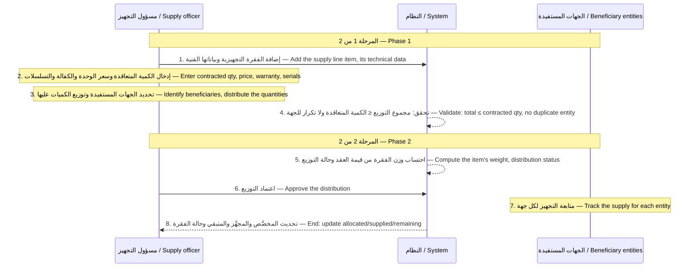

**What the user enters:** the item's code, the device, the manufacturer, the model, the country of
origin, the unit, the contracted quantity, the unit price, the warranty, and the serial-number
range; and the beneficiary entities and each entity's quantity.

**What the system validates:** the contracted quantity is not exceeded · an entity is not
duplicated on the item · computing the item's weight and the receipt percentage.

**What the user sees:** the distribution table, with "Allocated" and "Received" columns per
entity plus the total, a receipt-percentage progress bar, and an "incomplete receipt" warning
stating the remaining count.

**Reflection on other modules:** the item's progress and the project's progress · the receipts log
· the item-lookup service · redistribution orders.

**Alerts:** the supply is delayed · a shortfall in the allocated quantities · an item not yet
supplied.

---

## المسار 11 — Track 11 — Supply, Delivery, and Preliminary and Final Receipt

**Start:** materials arriving at the warehouse.
**End:** a receipt documented with its minutes and papers, and closure of the line item's
obligation.

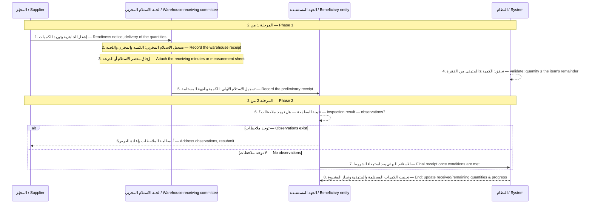

**What the user enters:** the receipt number (generated by the system), the date, the quantity,
the warehouse or the receiving entity, the committee, the inspection result, the observations,
and the receiving documents.

**What the system validates:** the remaining quantity is not exceeded · the quantity and the
warehouse or the receiving entity are mandatory · generating a sequential receipt number.

**What the user sees:** the warehouse-receipt and preliminary-receipt cards, and the item's
archive with its versions, and a "remaining" hint while entering data.

**Reflection on other modules:** the received and remaining quantities · the item's status · the
supply project's progress · the receipts log at the contract level · the documents archive.

**Alerts:** a delayed receipt · a shortfall in the receiving documents · an item whose receipt is
incomplete.

---

## المسار 12 — Track 12 — Managing Documents and Drawings

**Start:** the document or drawing becoming available.
**End:** an approved revision saved in the record without replacing what preceded it.

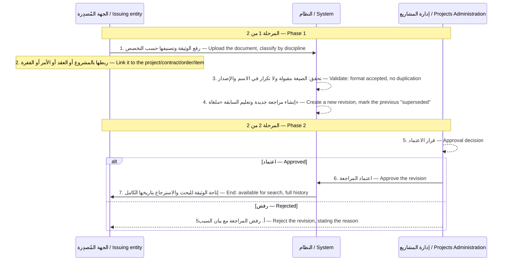

**What the user enters:** the file, the document number, its title, its discipline, the issuing
entity, the transmittal number, and the reason for the revision.

**What the system validates:** the format is accepted · duplication is blocked · the sequence and
the versions are kept · the uploader and the date are recorded.

**What the user sees:** the documents register with the document and revision counts, a details
panel with Preview / Revisions / Markups / Details tabs, and a "latest revision only" toggle.

**Reflection on other modules:** the project's mandatory documents being complete · the
attachments of change orders, payments, and receipts · the project's readiness to move between
phases.

**Alerts:** a mandatory document awaiting approval · a phase missing documents.

---

## المسار 13 — Track 13 — Issuing Alerts and Escalation

**Start:** an alert rule's condition being met at the data date.
**End:** an alert acknowledged and closed, or escalated to the higher level.

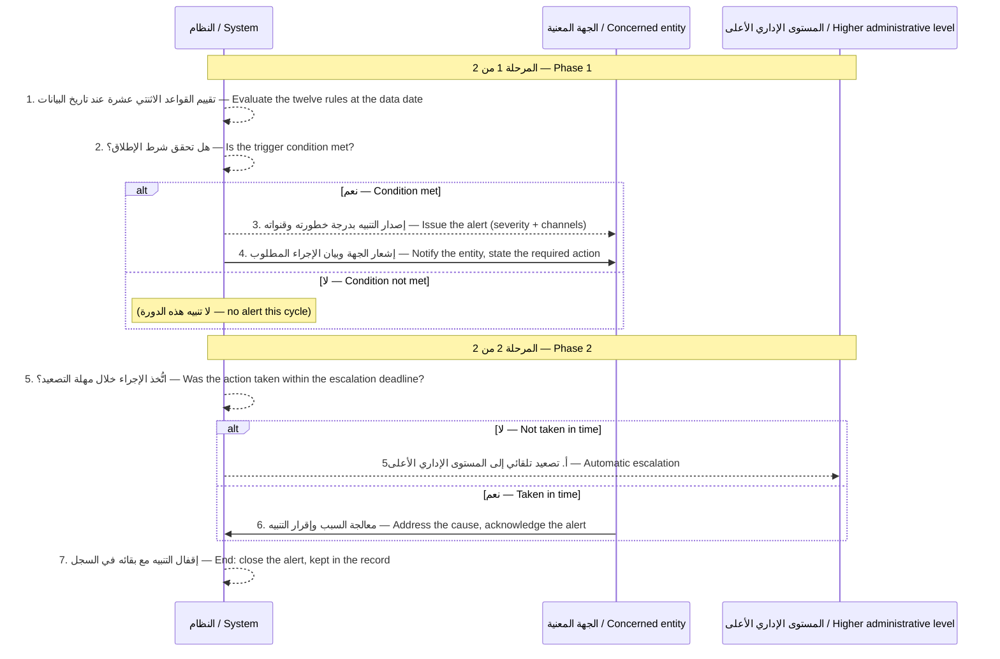

**What the user enters:** acknowledging the alert or reopening it, and addressing the cause in its
original module.

**What the system validates:** evaluating the rules' conditions · computing the delay duration ·
applying each rule's escalation deadline · stopping alerts as soon as their rule is disabled.

**What the user sees:** the alerts center, with severity cards (critical / medium / low) and their
status (open / closed), and the text of the required action and the escalation destination.

**Reflection on other modules:** highlighting the record that caused the alert · listing the
action in the required-actions list · feeding the alerts-and-escalation report.

**Alerts:** the alert itself is the output; it recurs at its rule's frequency until addressed.

---

## المسار 14 — Track 14 — Performance Display and Reporting at the Project, University, and Ministry Levels

**Start:** BOQ, schedule, progress, and disbursement data being complete.
**End:** a run report, or an updated indicator dashboard, at all three levels.

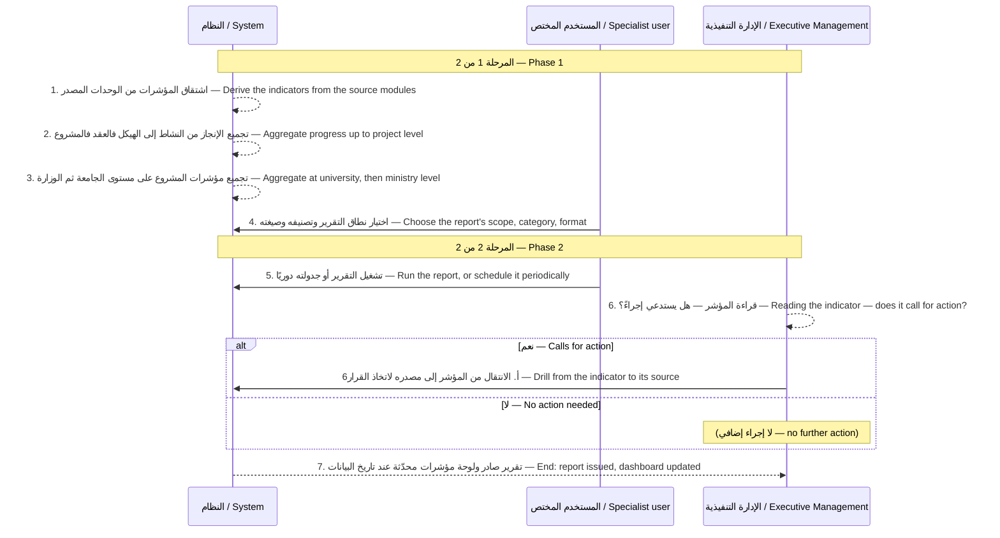

**What the user enters:** the report's scope (project or portfolio), its category, its format, and
its frequency.

**What the system validates:** the source data is complete · the computation rules are consistent
· the indicators match across the levels.

**What the user sees:** the reports library with its categories, frequencies, and last-run date,
and the indicator dashboards at the project, university, and ministry levels.

**Reflection on other modules:** the system modifies no data in this track; its function is
display, aggregation, and drilling to the source.

**Alerts:** indicators falling below the acceptable threshold · delayed or high-risk projects on
the monitoring dashboard.

---

## Source

Translated from `docs/__العرض-الفني-لنظام-إدارة-المشاريع 1.html`, §25 (مسارات العمل), v1.0,
2026-08-11. Every step, lane, and closing note above is carried over from that document —
nothing here was generated from the running app or from the demo runsheet. Where the app's
current behaviour diverges from a track (a table not yet built, a rule not yet enforced), that is
a gap to note against this document, not a reason to edit the translation.
