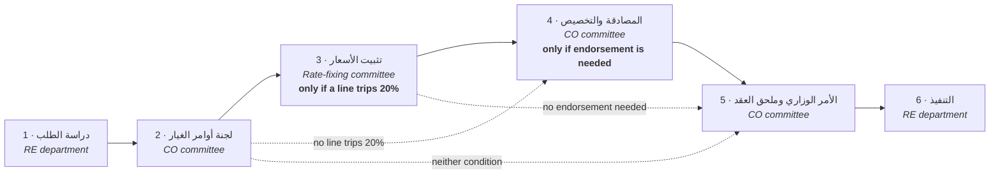
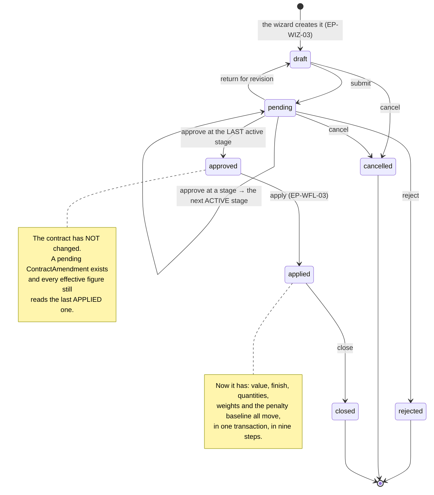
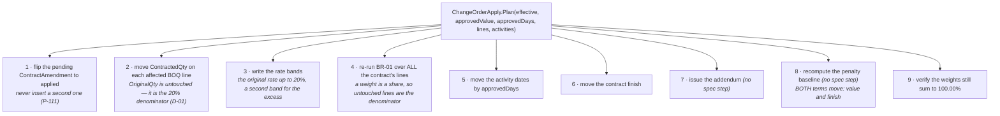
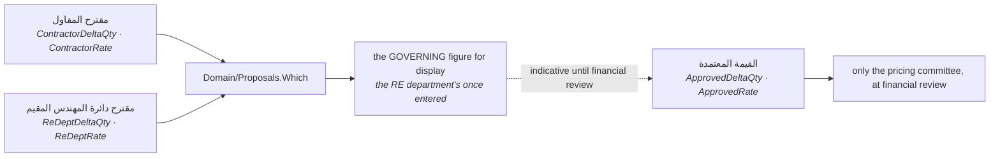

# UML — the change-order lifecycle

The one flow this system exists for, end to end: `03 §2–§10`, **الأشكال 29–42**
and **الشكل 57–60**.

Three sentences carry it, and everything below is those three drawn out:

1. **The contract is the working context.** One order belongs to one contract
   and may never span two (CLAUDE.md §5.1).
2. **Approved ≠ Applied ≠ Closed.** Approving changes nothing. Applying creates
   a contract amendment and moves quantities, dates and the penalty baseline.
   Closing verifies it (§5.2).
3. **External parties are statuses, not stages.** They are recorded *inside* the
   owning stage against a letter number and date (§5.5).

---

## 1. The six stages

`03 §2` names exactly six, and `Domain/WorkflowMachine.Stages` is that list.
Two of them are conditional and a skipped stage is listed explicitly with its
reason — never silently omitted.



**Who may act is not a matter of taste.** `Domain/ViewerRelation.For` resolves
exactly one relation for any viewer and any order — `awaiting` · `recorder` ·
`acted` · `upcoming` · `none` — and actions render only for the first two
(BR-14). Everyone else sees an explicit locked note, never a bare disabled
button.

---

## 2. The lifecycle



---

## 3. What a decision does

```mermaid
sequenceDiagram
  autonumber
  actor U as the stage's owner
  participant PG as change-order.page.ts
  participant W as EP-WFL-01
  participant M as Domain/WorkflowMachine
  participant DB as SQL

  U->>PG: opens the record
  PG->>PG: Available(lifecycle, relation, externalStates)
  Note over PG,W: the page MIRRORS the rule; the endpoint<br/>CALLS it. Two lists of one rule is P-115's defect
  U->>PG: approve
  PG->>W: POST …/decisions {action}
  W->>M: Decide(stageNo, action, plan)
  M-->>W: the next ACTIVE stage, or `approved`
  W->>DB: stamp this stage; open the next with a fresh clock
  alt the decision approves the LAST active stage
    W->>DB: INSERT ContractAmendment (AppliedAt = NULL)
    Note over W,DB: the projection becomes true the moment<br/>it becomes true (P-111)
  end
  W-->>PG: re-read
```

**A return keeps its own decision.** The returning stage stays `returned` with
what it decided; the stage it goes back to reopens with a fresh clock, and
`resubmit` moves it forward again (P-114).

---

## 4. What an apply does — the nine steps of الشكل 30

`Domain/ChangeOrderApply.Plan` produces all nine and `EP-WFL-03` executes them
together. Two of the nine have no spec step of their own — issuing the addendum
and recomputing penalties — and are marked as such rather than invented.



> **The 20% rule is per BOQ line, against the ORIGINAL quantity** (D-01), and
> only لجنة تثبيت الأسعار sets the binding excess rate — never the wizard
> (§5.3). A line that trips the threshold is what inserts stage 3 into the
> chain in the first place.

---

## 5. Two proposals, one decision



Until the approved value exists, the revised contract value is **تقديرية** and
labelled as such. All three sets of columns persist — none overwrites another
(§5.6).

---

## 6. Where each piece lives

| Piece | File |
|---|---|
| the six stages, skips, and what a decision advances to | `Domain/WorkflowMachine.cs` |
| who may act at all | `Domain/ViewerRelation.cs` |
| what submission blocks | `Domain/ChangeOrderGates.cs` |
| the 20% split | `Domain/TierSplit.cs` |
| which proposal governs | `Domain/Proposals.cs` |
| the nine apply steps | `Domain/ChangeOrderApply.cs` |
| the amendment arithmetic | `Domain/Amendments.cs` |
| the record's own figures | `Domain/ChangeOrderRecord.cs` |
| the register · the record · the wizard · the workflow | [change-orders.md](change-orders.md) · [change-order-record.md](change-order-record.md) · [change-order-wizard.md](change-order-wizard.md) · [change-order-workflow.md](change-order-workflow.md) |

---

## 7. What is not built

- **Supply redistribution between beneficiaries** (الشكل 58) needs الفقرات
  التجهيزية, which has no table (P-110).
- **Closing** moves the lifecycle and verifies nothing further; `03 §10`'s
  closeout checks are not modelled.
- **The approval of an imported BOQ version** (المسار 3 steps 7–8) has no
  figure in the appendix and no endpoint (P-87).
