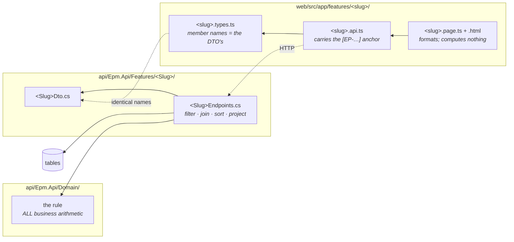
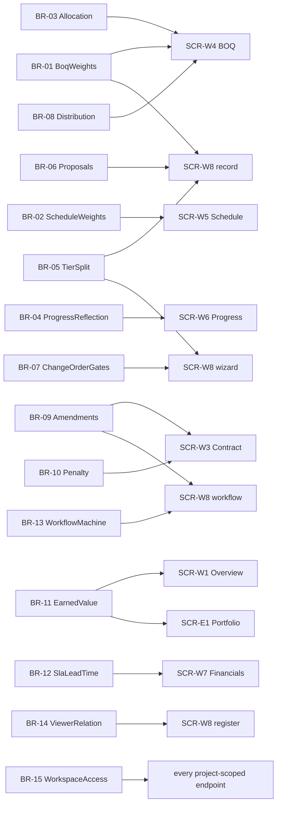

# UML — the feature map

Screen → endpoint → domain rule → table, for the whole build. **57 endpoints,
29 domain files, 36 tables.**

This is the four-hops-with-one-name guarantee from CLAUDE.md, drawn once. If a
number on a screen is wrong, this page says which endpoint produced it, which
domain function computed it and which table it came out of — and the anchor is
the same string in all four places, so `grep -rn "EP-BOQ-03" api web` finds
every touchpoint.

---

## 1. The shape every feature has

**The one direction that matters:** arithmetic only ever moves *up* from
`Domain/`. An endpoint may not compute a weight, a share, a tier split, a
penalty or a lifecycle transition, and Angular computes nothing but display
formatting (§3.1).

---

## 2. Enterprise screens

| Screen | Endpoint | Domain | Principal tables |
|---|---|---|---|
| SCR-E1 Portfolio | `EP-PRT-01` | `ProjectValue` · `EarnedValue` | Projects · Contracts · ContractAmendments |
| SCR-E2 Projects | `EP-PRJ-01` | `ProjectValue` | Projects · Contracts |
| المسار 1 Project definition | `EP-PRJ-02` · `EP-PRJ-03` · `EP-PRJ-04` | `ProjectDefinition` | Projects · ProjectActivityEvents |
| SCR-E3 Contracts | `EP-CNT-01` | `ContractRollup` · `Amendments` | Contracts · ContractAmendments · ChangeOrders |
| SCR-E4 Entities | `EP-ENT-01` | `WorkspaceAccess` | Workspaces · Projects |
| SCR-E5 Schedule control | `EP-SCT-01` | `PlannedProgress` | Projects · Activities |
| SCR-E6 Alerts centre | `EP-ALR-01` · `EP-ALR-02` | — | Alerts · Projects |
| SCR-E7 Reports | `EP-RPT-01` | — (`ReportCatalog`) | the EpmDb model itself |
| Workspaces | `EP-WSP-01` · `EP-WSP-02` | `WorkspaceAccess` | Workspaces |
| /docs rules reference | `EP-DOCS-01` | **all fifteen, executed live** | — (pure functions) |
| Lookups | `EP-LKP-01` | — (`LookupCatalog`) | Lookups |
| Dev fixture | `EP-DEV-01` · `EP-DEV-02` · `EP-DEV-03` | — | all of them |

---

## 3. The project workspace

| Tab | Endpoint | Domain | Principal tables |
|---|---|---|---|
| SCR-W1 Overview | `EP-OVW-01` | `ProjectValue` · `EarnedValue` · `ModuleReadiness` | Projects · Contracts · BoqItems · Activities |
| SCR-W2 Information | `EP-INF-01` | `ProjectDefinition` | Projects · Beneficiaries · ProjectActivityEvents |
| SCR-W3 Contract | `EP-CON-01` · `EP-CON-02` | `ContractRollup` · `Amendments` · `Penalty` | Contracts · ContractAmendments · Payments |
| المسار 2 Contract definition | `EP-CON-03` … `EP-CON-05` | `ContractDefinition` | Contracts · ContractActivityEvents |
| SCR-W4 BOQ | `EP-BOQ-01` … `EP-BOQ-08` | `BoqWeights` · `Allocation` · `Distribution` · `ProgressReflection` | BoqItems · BoqActivityLinks · BoqDistributions · BoqRateBands |
| المسار 3 BOQ import | `EP-BOQ-09` … `EP-BOQ-11` | `BoqImport` | BoqImportVersions · BoqImportVersionItems |
| SCR-W5 Schedule | `EP-SCD-01` · `EP-SCD-02` | `ScheduleWeights` · `PlannedProgress` | Activities |
| SCR-W6 Progress | `EP-PRG-01` · `EP-PRG-02` | `ProgressReflection` | Activities · BoqActivityLinks · BoqItems |
| SCR-W7 Financials | `EP-FIN-01` | `SlaLeadTime` · `ProjectValue` | Payments · PaymentAuditStages · ProjectAllocations |
| SCR-W8 Change orders | `EP-CHG-01` | `ViewerRelation` | ChangeOrders · ChangeOrderStages |
| SCR-W8 CO record | `EP-CHG-02` | `ChangeOrderRecord` · `TierSplit` · `Proposals` · `WorkflowMachine` | the seven CO tables |
| SCR-W8 CO wizard | `EP-WIZ-01` … `EP-WIZ-03` | `ChangeOrderGates` · `TierSplit` | ChangeOrders · ChangeOrderLines · BoqItems |
| SCR-W8 CO workflow | `EP-WFL-01` … `EP-WFL-03` | `WorkflowMachine` · `ChangeOrderApply` · `Amendments` | ChangeOrderStages · ContractAmendments · BoqRateBands |
| SCR-W9 Risk | `EP-RSK-01` | `RiskSeverity` | Risks |
| SCR-W10 3D model | `EP-MDL-01` | — | ModelElements · ModelVersions · BoqItems · Activities |
| SCR-W11 Meetings | `EP-MTG-01` | — | Meetings · MeetingActions |
| SCR-W12 Documents | `EP-DOC-01` | `DocumentRevisions` | Documents · DocumentRevisions |
| SCR-W13 Alerts | `EP-PAL-01` · `EP-PAL-02` | `AlertInbox` | Alerts · AlertRules |
| SCR-W14 Reports | `EP-PRP-01` | — (`ReportCatalog`) | counts across the project's tables |
| SCR-W15 Audit | `EP-AUD-01` | — | the three activity trails |

**Four screens have no `Domain/` file, and that is a finding rather than an
omission.** SCR-W10, SCR-W11, SCR-W14 and SCR-W15 are registers: every figure on
them was observed and recorded, and the counts are counts. Adding a rule to any
of them would be inventing one.

---

## 4. Which rule governs which screen

All fifteen are also rendered on **`/docs`**, each with its worked example
executed through the same function the endpoints call. That page is the check
that this map stays true.

---

## 5. Where a change lands

| If you are changing… | Edit | And nothing else |
|---|---|---|
| what a number MEANS | `api/Epm.Api/Domain/<Rule>.cs` | the endpoint and both screens follow |
| which rows a screen shows | that feature's `…Endpoints.cs` | |
| a field on a screen | the DTO **and** the `.types.ts` — same names | |
| a status, kind or discipline NAME | a `Lookups` row | not code |
| a report definition | `Features/Reports/ReportCatalog.cs` | shared by SCR-E7 and SCR-W14 |
| a documented rule's text | `Domain/RuleCatalog.cs` | `/docs` re-renders it |
| the fixture's story | `Features/Dev/Fixture.cs` | it is DATA, illustrative, never ministry figures |
| anything visual | `web/src/styles/` is the reference, copied — grep before writing a rule | new rules go in `web/src/styles.css`, tokens only |
