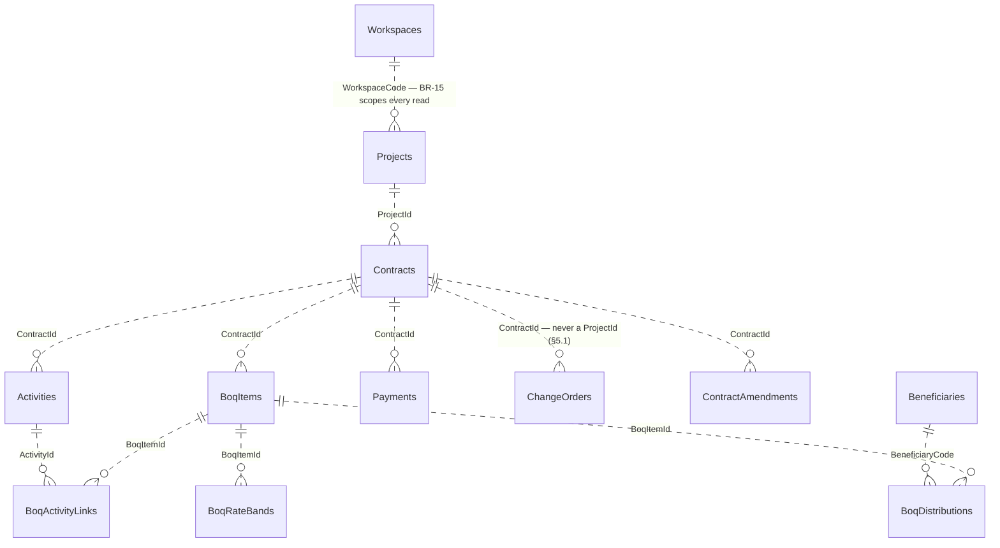
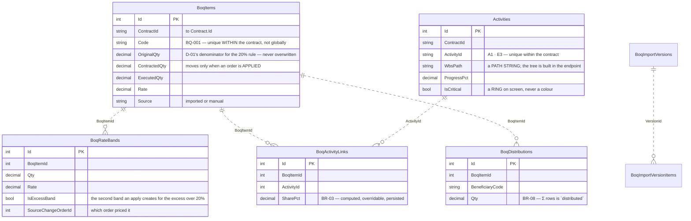
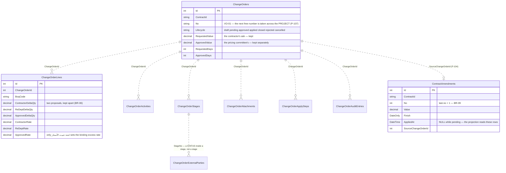
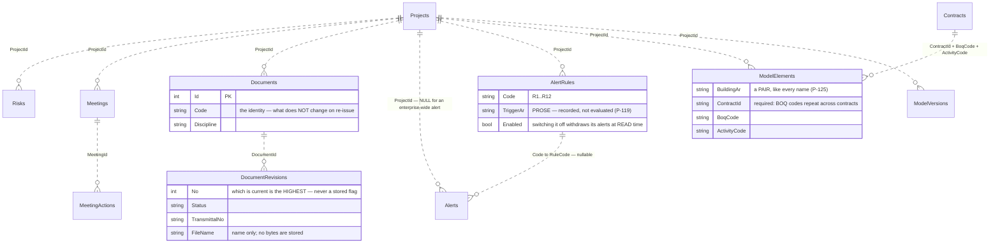
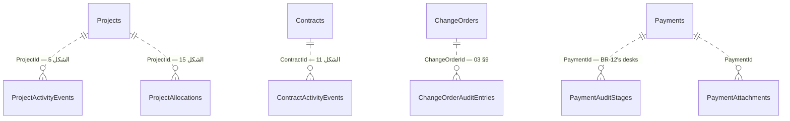

# UML — the whole schema

Every table in `EpmDb`, and how they find each other.

**36 tables, and not one foreign key.** CLAUDE.md §3.3: storage is flat, tables
join through plain ID columns in the endpoint, and *that query is the
relationship*. Every line below is dotted (`||..o{`) for that reason — a solid
one would be a lie about a constraint the database does not hold.

The invariants those constraints would have carried are checked in endpoints
instead, where they can be read (§3.4).

---

## 1. The spine — project → contract → everything

Three rules shape the whole schema and they are worth stating before the boxes:

1. **The contract is the working context.** A BOQ item, an activity, a payment
   and a change order each belong to exactly one CONTRACT. The project is
   derived from the contract and never asked for again (§5.1). That is why
   `ChangeOrders` has no `ProjectId` — SCR-W15 and SCR-W14 reach a project's
   orders *through* its contracts.
2. **Original values are never overwritten** (§5.6). `original` / `before` /
   `requested` / `approved` / `applied` are separate columns that all persist.
3. **Derived values are never stored** (§3.5). Project value, BOQ weight,
   effective contract value, progress, penalties — none of them is a column.

---

## 2. The bill of quantities and the schedule

> **An import writes a VERSION, never the bill** (P-87). `BoqImportVersions` and
> its items accumulate; nothing moves into `BoqItems` until an approval step
> that is not built.

---

## 3. The change order — seven tables for one decision

> **Approved ≠ Applied ≠ Closed** (§5.2). Approval creates the *pending*
> `ContractAmendment`; applying FLIPS it rather than inserting a second one
> (P-111). An approved-but-unapplied order is a projection everywhere it
> appears and is never folded into an effective figure.

---

## 4. The registers Phase 6 added

---

## 5. The trails, and the one table that is not there

> **There is no `AuditEvents` table and there should not be** (P-122). SCR-W15
> reads the three trails above; a fourth store copying them would be a second
> answer to «من غيّر هذا الحقل ومتى», and the copy drifts the first time one of
> the three gains a column.

---

## 6. The two tables every screen reads

| Table | What it is | Read by |
|---|---|---|
| `Lookups` | Every stored code's label, in both languages — `06 §1–§11`'s value lists, one table, one endpoint (`EP-LKP-01`) | every page with a status, a kind or a discipline |
| `Workspaces` | The scope BR-15 enforces. `WorkspaceScope.Deny` refuses before anything is read | every project-scoped endpoint |

**What is deliberately NOT a table:** the twelve report definitions
(`ReportCatalog.cs`) and the fifteen documented rules (`RuleCatalog.cs`). Both
are capabilities of the system rather than records in it, and both would be
split across two mechanisms if their labels lived in `Lookups`.

---

## 7. Schema changes

No migrations. `EnsureCreated()` builds the schema on boot if it is absent and
never wipes; a schema change is `POST /api/dev/reset` (CLAUDE.md §4). Money is
`decimal`, never `float` (D-11); quantities and percentages `decimal(18,4)`.

`Data/Entities/` also holds documented starting points for tables no page reads
yet. Two were removed during Phase 6 rather than wired in — `ModelObject` (its
massing geometry fed a viewer `07 §8` puts out of scope) and `AuditEvent` (see
§5) — because a starting point that will never be written is a promise the
schema does not keep.
