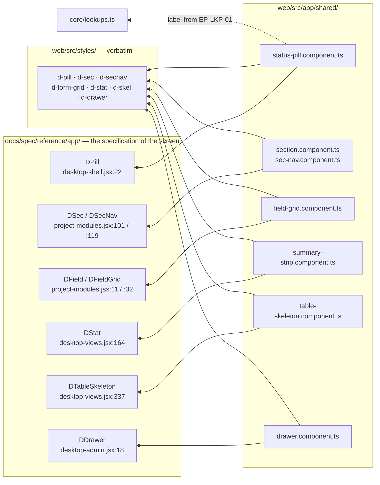
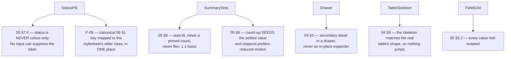
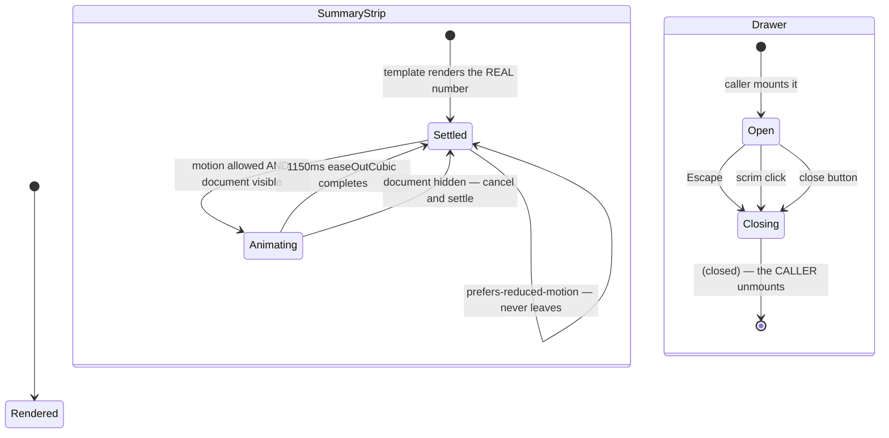

# UML — Shared UI primitives (Phase 1.3)

The components every screen reuses, ported once from the reference prototype.
No endpoint, no table — these are presentation only.

`web/src/app/shared/`. Each is standalone, `ViewEncapsulation.None`, and carries
**no component CSS**: every class comes from `web/src/styles/`, copied verbatim
(P-07).

---

## 1. What they are and where they came from

| Component | Selector | Reference | Used by |
|---|---|---|---|
| `StatusPillComponent` | `<epm-status-pill>` | `DPill` | everywhere a 06 enum is shown |
| `SectionComponent` | `<epm-section>` | `DSec` | every project tab |
| `SecNavComponent` | `<epm-sec-nav>` | `DSecNav` | long tabs |
| `FieldGridComponent` | `<epm-field-grid>` | `DField` / `DFieldGrid` | Information, Contract |
| `SummaryStripComponent` | `<epm-summary-strip>` | `DStat` | every tab header, portfolio |
| `TableSkeletonComponent` | `<epm-table-skeleton>` | `DTableSkeleton` | every register |
| `DrawerComponent` | `<epm-drawer>` | `DDrawer` | BOQ distribution, amendment panel |

---

## 2. The binding rules each one enforces

These are the reason the primitives exist. A rule enforced in one component
cannot be forgotten on screen 14.

### Status pill — the label is not optional

`05 §7.6` is binding: *"Status is never colour-only — pair every colour with a
label or icon."* There is no `showLabel` input, because that input would
eventually be set to false. Codes with no pill class of their own fall through
to the neutral pill and stay labelled.

The label comes from `EP-LKP-01`, so one component renders **any** 06
enumeration — project status, contract status, lifecycle, amendment state,
coverage — without a per-screen label map.

### Summary strip — two rules that are easy to break

**Column count.** The copied stylesheet pins `.d-grid.stats` to `repeat(4, 1fr)`.
Measured at a 1024 viewport, five stats under that rule lay out **2 + 2 + 1** —
the ballooned orphan `05 §8` exists to prevent. `.d-grid.stats.fit` in
`src/styles.css` overrides only the column count (P-17).

**The count-up.** `05 §6` requires the settled value to be *seeded*, not merely
arrived at. The template renders the real number; only the animated path
overwrites it with `0`, and hiding the document settles immediately.
`requestAnimationFrame` is throttled to zero ticks while a document is hidden —
background tab, unfocused preview, and **every screenshot / PDF / PPTX export
path** — so a strip that animates to the right number still exports as zeroes
unless the settled value is the default state.

### Drawer — not an expander

`04 §3`. An in-place expander pushes the register down and loses the row you
were comparing against; the drawer keeps the table still. Escape closes, the
scrim closes, `role="dialog" aria-modal="true"`.

---

## 3. States

---

## 4. Where to change what

| You want to… | Touch these |
|---|---|
| Change how a status pill looks | `web/src/styles/` — the class, not the component |
| Add a status code | the `Lookups` table; add a `.d-pill.<code>` only if it needs its own colour |
| Change the summary-strip columns | `.d-grid.stats.fit` in `src/styles.css` — **not** the verbatim `desktop.css` |
| Change the count-up timing | `summary-strip.component.ts`; keep the settle-on-hidden path |
| Add a primitive | `web/src/app/shared/`, ported from a named reference component, no component CSS |

---

## 5. Known gaps

- **Five of the seven have no consumer yet.** `StatusPill` and `TableSkeleton`
  are live on the Projects list. `Section`, `SecNav`, `FieldGrid`,
  `SummaryStrip` and `Drawer` compile and follow their reference components,
  but their first real screen is the workspace shell (Phase 3) — so they are
  verified by build and by the CSS measurement above, not yet by a rendered
  page. Check each against its reference the first time a tab mounts it.
- **`FieldGrid` is 2 columns, not the auto-fill ROADMAP asked for** (P-18) —
  the reference's cell borders depend on the 2-column count.
- **`SecNav` scrolls `.d-detail-body`**, which only exists inside the Phase 3
  workspace shell; it falls back to `scrollIntoView` elsewhere.
- **No focus trap in the drawer.** Escape and the scrim close it and it is
  `aria-modal`, but focus is not cycled inside. Worth adding when the first
  drawer with a form lands (BOQ distribution, Phase 4.2).
- **No unit tests.** These are presentation with no arithmetic; the rules they
  enforce are structural (a label always renders, a grid uses auto-fit) and are
  checked in the browser. If one grows logic, it gets a spec.
