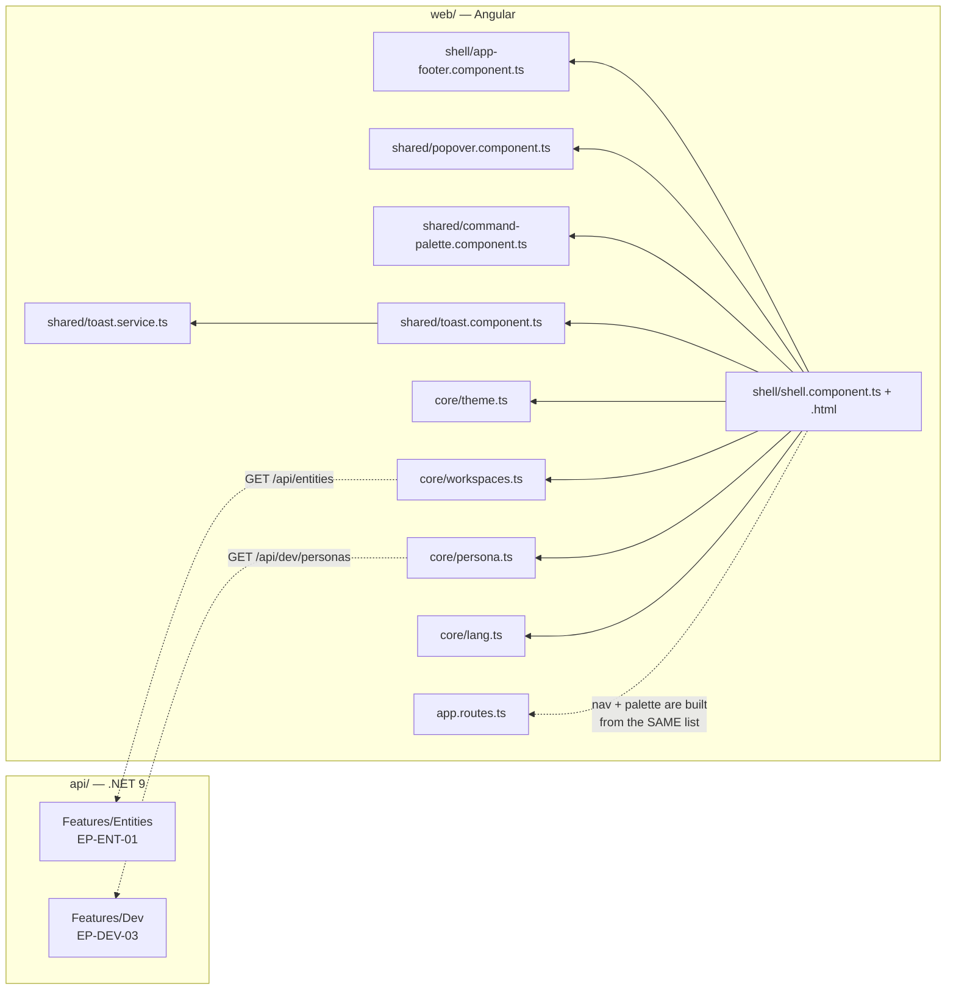
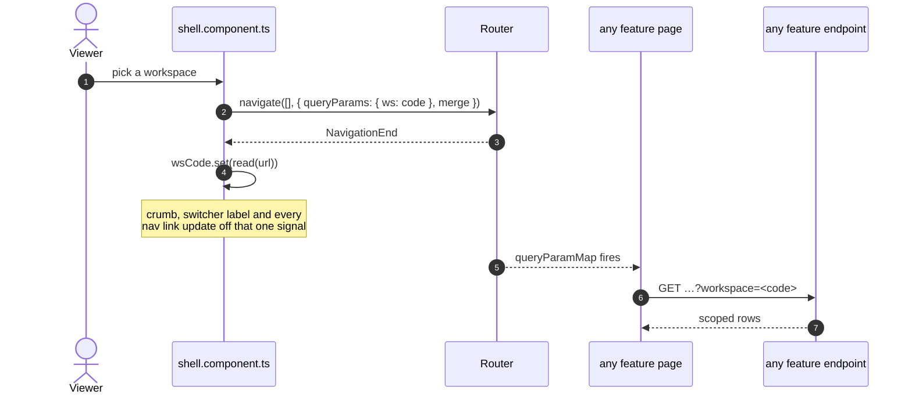

# UML — Shell (Phase 2.9)

The application chrome: sidebar, topbar, canvas and app footer. **No screen of
its own and no endpoint of its own** — it frames every page and reads two
services the features already own.

Reference components: **`DSidebar`** `:155` · **`DTopbar`** `:448` ·
**`DAppFooter`** `:716` · **`DCommandPalette`** `:105` · **`DPopover`** `:41` —
all in `../epm@design/system-revamp` `app/desktop-shell.jsx`.

---

## 1. What files make up the shell

> **The shell adds no endpoint.** The workspace switcher reads `EP-ENT-01` —
> the same list the Entities register renders — so there is no second source of
> truth for what a workspace is.

---

## 2. Scope: the switcher navigates, it does not hold state

**Why the URL and not a service field.** Every enterprise endpoint already
accepts `?workspace=` and every page already reads `?ws=`. Keeping scope in the
URL means a scoped view is a **shareable link** and survives a reload — neither
is true of a field on a service. It also means the switcher needs no knowledge
of which page is open: it changes one query param and the page reacts.

---

## 3. Regions and what each one is for

| Region | Class | Behaviour |
|---|---|---|
| Outer frame | `.d-fill` | fixed, `overflow: hidden` — the app never scrolls, the canvas does |
| Grid | `.d-app` | `256px 1fr`, and `data-side="collapsed"` swaps it to `68px` |
| Collapse | `.d-side-toggle` | persisted in `localStorage.epm_side`; labels, counts and the account id all hide off the same attribute |
| Scope | `.d-side-switch` → `.d-pop` | navigates with `?ws=` |
| Nav | `.d-nav-item` | `routerLinkActive`, carries `?ws=` forward, `.d-nav-count` badge |
| Identity | `.d-side-acct` → `.d-pop` | persona switcher (P-05), theme, language |
| Crumb | `.d-topbar .d-crumb` | ministry, plus the workspace when scoped |
| Search | `.d-search` → `.d-cmdk` | ⌘K / Ctrl-K |
| Footer | `.d-appfoot` | org · **environment badge** · support · version |

**The environment badge is not decoration.** Every figure in the system comes
from an illustrative fixture, and «بيئة تجريبية» is the only thing on screen
that says so. A screenshot without it can be mistaken for ministry data.

---

## 4. States

```mermaid
stateDiagram-v2
    [*] --> Idle
    Idle --> Switcher: click .d-side-switch
    Idle --> Account: click .d-side-acct
    Idle --> Palette: ⌘K or click .d-search
    Switcher --> Idle: pick · Esc · scrim · scroll
    Account --> Idle: pick · Esc · scrim · scroll
    Palette --> Idle: Enter · Esc · scrim

    Idle --> Collapsed: .d-side-toggle
    Collapsed --> Idle: .d-side-toggle
    Collapsed: persisted; labels + counts + account id hidden
```

Only one overlay is open at a time — `closeOverlays()` runs before any opens.
A popover **closes on scroll**: it is positioned against a rect, and one that
drifts away from its trigger has lost the thing it was explaining.

---

## 5. Known gaps

| # | Gap | Why |
|---|---|---|
| 1 | Page-head actions are demo stubs | They are in the reference too, and each says so in its toast. Export is Phase 2.6; the P6 import parser is out of scope (`07 §8`) |
| 2 | ⌘K offers navigation and preferences, not records | Searching projects and contracts needs a debounced multi-endpoint search. The reference's palette is navigation-only too |
| 3 | No admin plane | `DSidebar` has a whole second mode for it. `07 §8` defers administration |
| 4 | No notifications bell | Reference has one in `.d-topbar`; SCR-E6 is the register and the bell is its unread summary — Phase 6 |
| 5 | Sidebar collapse has no keyboard shortcut | The reference has none either |

---

## 6. One thing the shell does that the reference does not

**The persona switcher lives in `.d-side-acct`.** The reference has a signed-in
user there; this prototype has no authentication, so the *account* and the
*persona* are the same thing (P-05). Putting it in that slot rather than in the
topbar means the topbar matches the reference exactly, and the switcher is
still one click from anywhere — which is what `03 §7` asks for, because
switching persona is the fastest way to review the permission model.
