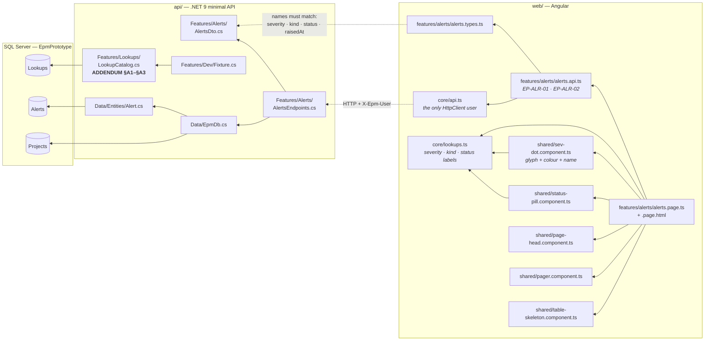
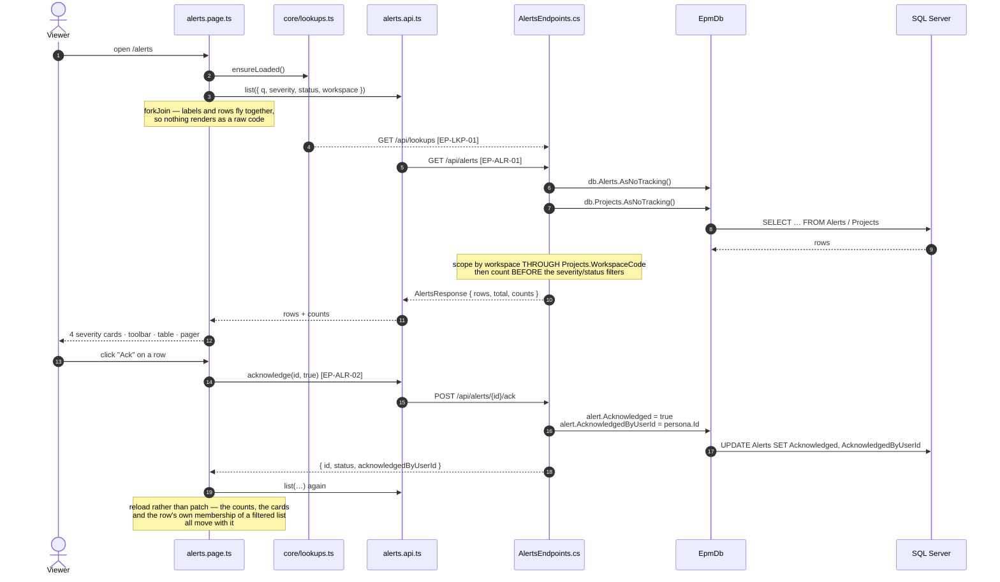
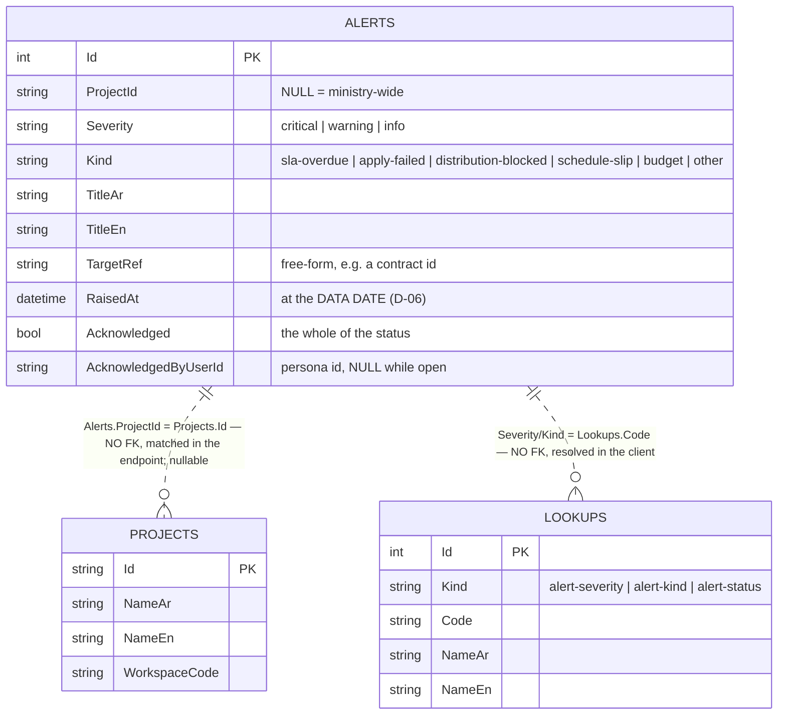
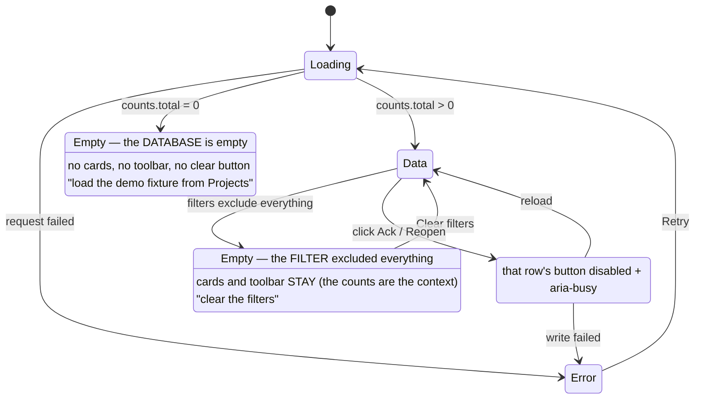

# UML — Alerts Center (Phase 2.4)

**SCR-E6** — the portfolio-wide alert register (`04 §2`).
Endpoints **`EP-ALR-01`** `GET /api/alerts` · **`EP-ALR-02`** `POST /api/alerts/{id}/ack`

Reference component: **`DAlertsCenter`** — the v1.1 branch,
`../epm@design/system-revamp` `app/enterprise-areas.jsx:106`.
*(`ROADMAP.md` still cites `enterprise-areas.jsx:65`, which is the pre-v1.1
component in `docs/spec/reference/`. That one has a card feed and no table; the
v1.1 one is the register below. Same drift as 2.1–2.3 — see §6.)*

**This is the first screen in the system that WRITES.** Everything before it
projects stored rows; acknowledging an alert changes one.

---

## 1. What files make up this feature

> **No `Domain/` node, and that is deliberate.** This screen counts and filters
> rows; it derives nothing. The one thing that looks like a rule — *is this
> alert overdue* — is **BR-12**, and it belongs to the change-order workflow
> (Phase 5.4) which is what will RAISE these rows. An alert is the *output* of
> a rule, not a second copy of it.

---

## 2. The request, end to end

---

## 3. What it reads and writes

**Writes:** `Alerts.Acknowledged` and `Alerts.AcknowledgedByUserId`, via
`EP-ALR-02`. Nothing else on this screen writes.

**Status is not a column.** `open` / `acknowledged` are derived from the bool by
`AlertsEndpoints.StatusOf()` — one place, so the filter and the row can never
disagree about what *open* means.

---

## 4. What the screen can look like

The two empty states are genuinely different (`04 §9`) and were checked
separately in the browser: the empty-database state renders **no** severity band
and **no** toolbar, because there is nothing to summarise and nothing to clear.

---

## 5. Where to change what

| Change | File |
|---|---|
| A column, its order, the row action | `web/src/app/features/alerts/alerts.page.html` |
| Card labels, foot lines, filter behaviour | `web/src/app/features/alerts/alerts.page.ts` |
| Chrome strings (headings, chips, buttons) | `web/src/app/core/lang.ts` |
| Severity / kind / status **labels** | `api/…/Features/Lookups/LookupCatalog.cs` — ADDENDUM §A1–§A3 |
| A severity's glyph or tone | `web/src/app/shared/sev-dot.component.ts` |
| The query, scoping, counts | `api/…/Features/Alerts/AlertsEndpoints.cs` |
| The payload shape | `AlertsDto.cs` **and** `alerts.types.ts` — names must stay identical |
| Which columns exist at all | `api/…/Data/Entities/Alert.cs`, then `POST /api/dev/reset` |
| The demo rows | `api/…/Features/Dev/Fixture.cs` |

---

## 6. Known gaps

| # | Gap | Why it is a gap and not a defect |
|---|---|---|
| 1 | **No page-head actions.** The reference carries *تصدير* (Export) and *قواعد التنبيه* (Alert rules). | Both are `showToast('… — demo')` stubs. The built Contracts page omits the same pair from `DContractsAll`, so this follows the repo's own precedent rather than adding two buttons that do nothing. Export is Phase 2.6; alert rules are `07 §2` (the rules engine is not in scope). |
| 2 | **Rows are not clickable.** The reference opens the project workspace on row click. | There is no project workspace until Phase 3. A row that looks clickable and goes nowhere is worse than one that does not. Wire it in Phase 3 alongside `/projects/:id`. |
| 3 | **No `snoozed` status.** The reference has three. | Nothing in `02` or `03` defines when a snooze expires or who may set one. Storing it would be an invented rule on a legal record. `Acknowledged` is a bool and yields the two states the escalation rules actually reference. |
| 4 | **Severity is not driven by a rule.** Fixture rows carry a stored severity. | In production these are raised by domain events — BR-12 SLA breach, a failed apply step (`03 §6`), a blocked distribution (`02 §8`). Those rules arrive in Phases 4 and 5 and will write these rows. Until then the severity is data, and the screen is honest that it is reading, not deriving. |
| 5 | **No escalation timeline.** `DModAlerts` (SCR-W13) has one per alert. | That is the project Alerts tab, Phase 6. It also needs the `Body` columns this entity does not carry yet — see `Alert.cs`. |
| 6 | The `ROADMAP.md` 2.4 row still points at the pre-v1.1 `enterprise-areas.jsx:65`. | Corrected in this doc, in `TRACE.md` and in the ROADMAP row itself. The v1.1 reference lives in the sibling `epm` repo on `origin/design/system-revamp`, not under `docs/spec/reference/`, which is still the pre-v1.1 copy. |

---

## 7. Two things this screen does that the reference does not

**The acknowledge persists, with a name on it.** The reference toggles an
`ackMap` in component state — right for a clickable prototype, wrong here. An
acknowledgement is somebody accepting that they have seen an alert; one that
evaporates on refresh, or that records no one, is indistinguishable from the
alert never having been read. `EP-ALR-02` writes `Acknowledged` and stamps the
persona (`P-05`) into `AcknowledgedByUserId`.

**Nothing is raised in the future.** The reference feed carries dates after its
own stated data date — `2026-09-08` on a screen headed *بيانات حتى 2026-08-10*.
Every fixture alert here sits on or before the project data date `2026-08-02`
(`D-06`). A wall clock would make the whole feed drift out of the fixture's
world within a month.
