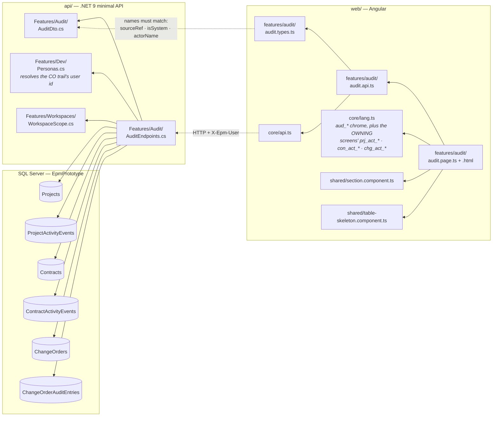
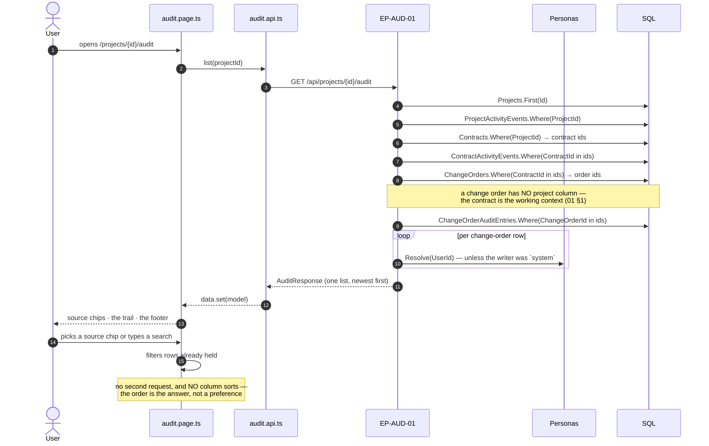
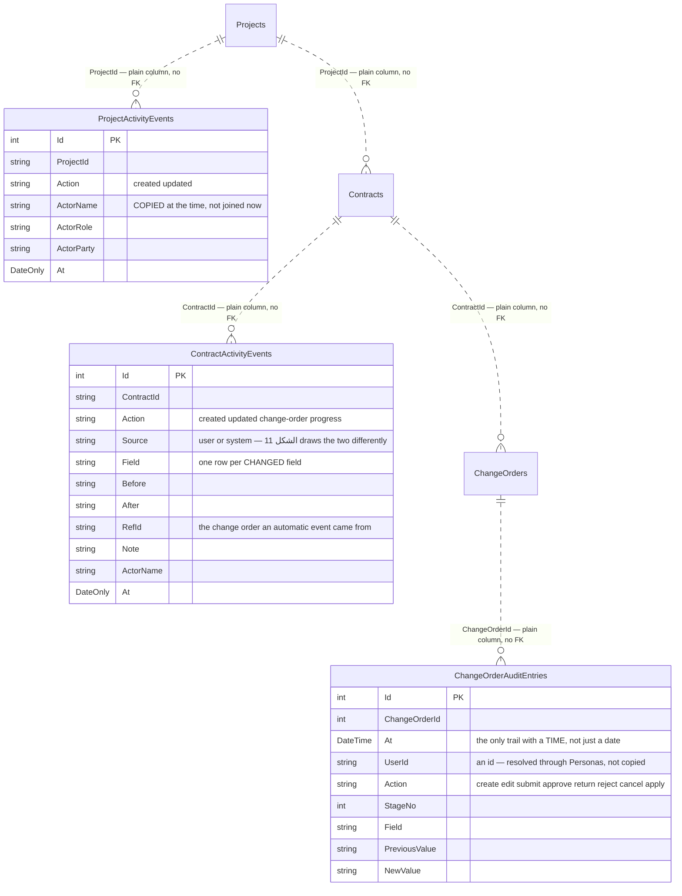
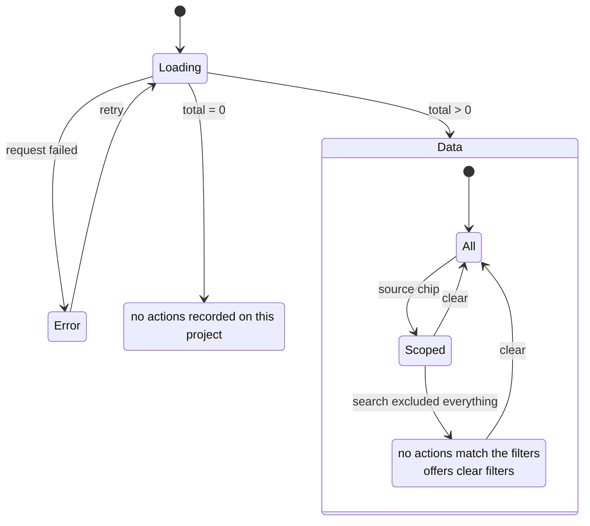

# UML — Audit Trail (Phase 6)

**SCR-W15** — سجل التدقيق · `04 §3`.
Endpoint **`EP-AUD-01`** · `GET /api/projects/{projectId}/audit`

Reference component: **`DModAudit`** — `project-modules.jsx:3005`.

**There is no audit table, and that is the design** (P-122). This screen writes
nothing and stores nothing; it is a union of the logs the system already keeps
beside the records they describe. So it cannot disagree with the tab that owns
the record — SCR-W3's سجل النشاط and this screen render the same contract rows,
because they read the same table.

---

## 1. What files make up this feature

> **The verbs keep their owning screen's wording.** A change-order approval
> reads «موافقة» here because that is what `chg_act_approve` says on the record
> page; a project edit reads «عدّل التعريف» because that is `prj_act_updated` on
> SCR-W2. One verb, one wording, wherever it is read.

---

## 2. What happens when the tab opens

---

## 3. What it reads and writes

**`EP-AUD-01` writes nothing, and no table belongs to this feature.**

| Not a table | Why | Where the rows come from |
|---|---|---|
| `AuditEvents` | Every endpoint that writes one of the three would have to write this too — a second answer that drifts (P-122) | the three logs above |
| a `Source` column | It would be a label somebody assigned, and could be wrong | the table the row was read from |

---

## 4. What the screen can look like

Newest first in every state, and nothing sorts.

---

## 5. Where to change what

| Change | File |
|---|---|
| Which trails the union reads, how a row is projected | `api/Epm.Api/Features/Audit/AuditEndpoints.cs` |
| A field on the trail | `AuditDto.cs` **and** `audit.types.ts` — same names |
| What a verb reads as | the OWNING screen's key in `core/lang.ts` (`prj_act_*` · `con_act_*` · `chg_act_*`) |
| Column layout, the diff rendering | `audit.page.html` |
| Screen chrome text | `core/lang.ts` `aud_*` |

---

## 6. Known gaps

- **Three trails, not everything.** A BOQ edit, a payment, a progress entry and
  a document revision are not logged anywhere yet, so they cannot appear here.
  Each would be recorded beside its own record, and this screen would pick it
  up with one more query.
- **No sign-ins, no permission changes.** The reference's own AUDIT dataset is
  full of them; they are enterprise events with no project to belong to, and
  nothing records them.
- **Two of the three trails copy the actor; the third resolves it.** The
  project and contract logs store `ActorName`/`Role`/`Party` at the time of the
  edit — deliberately, since a persona list can change. `ChangeOrderAuditEntries`
  stores only `UserId`, so renaming a persona would silently rewrite history on
  those rows. Making it copy like the other two is a schema change with a
  backfill, not a projection change.
- **Dates, not times, on two of the three.** Only the change-order trail
  records a time, so rows from the same day cannot be ordered against each
  other exactly.
- **No export.** An audit trail is the one register most likely to be asked for
  as a file; RPT-11 defines that report and producing it is not built.
