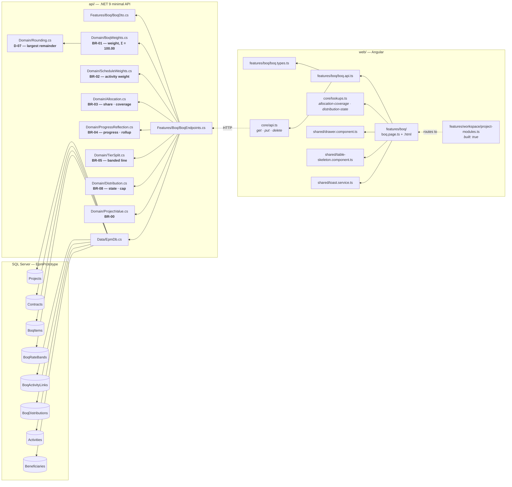
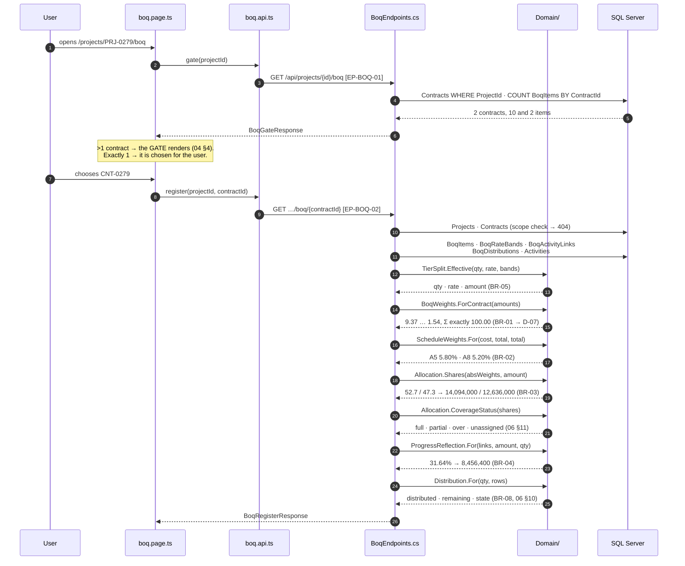
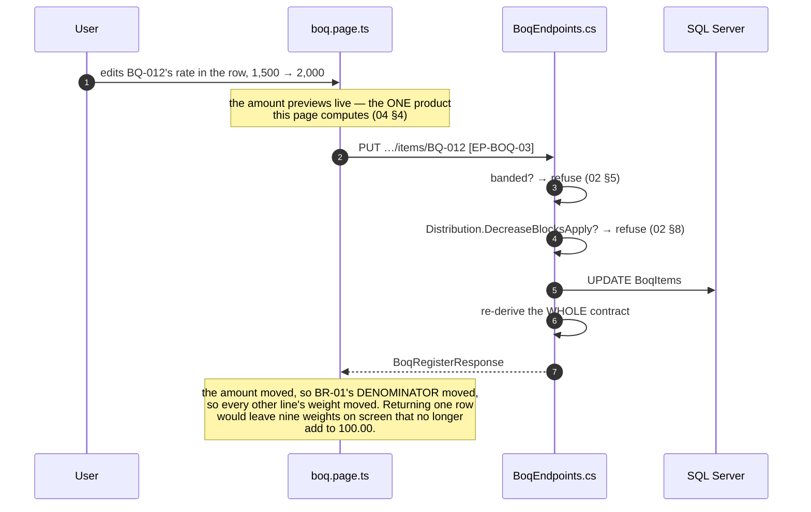
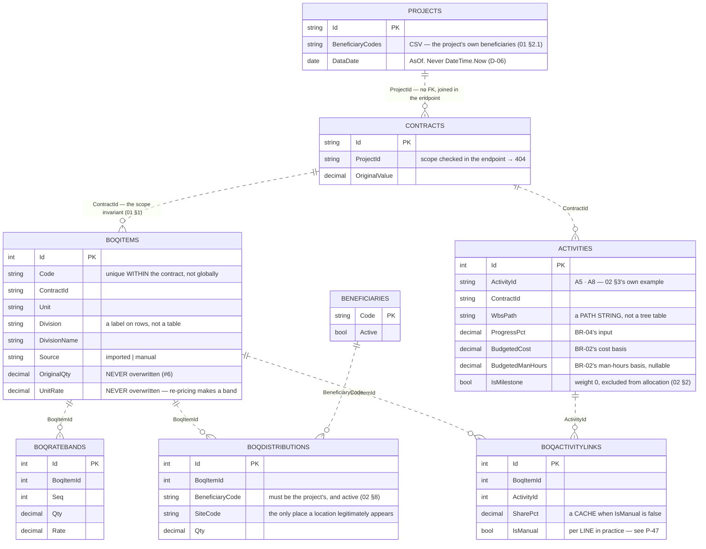
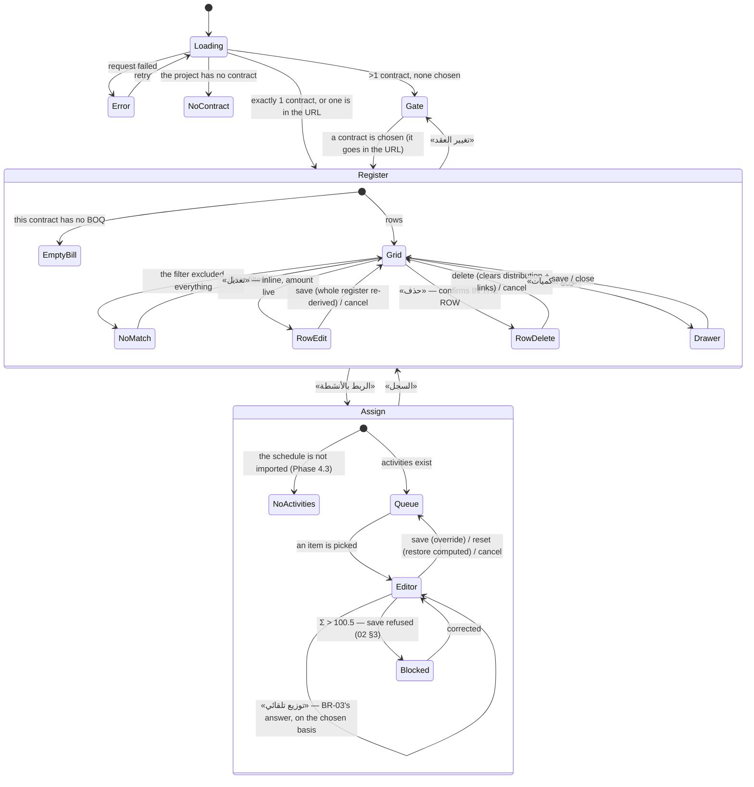

# UML — BOQ tab (Phase 4.2)

**SCR-W4** — a contract's bill of quantities, its allocation to activities, and
the distribution of its quantities to beneficiaries (`04 §4`).

Endpoints **`EP-BOQ-01`** … **`EP-BOQ-08`**, all under
`/api/projects/{projectId}/boq/…`.

Reference components: **`DBoqWorkspace`** `app/boq-workspace.jsx:16` ·
**`DBoqRegister`** `app/boq-register.jsx:435` · **`DBoqAssign`**
`app/boq-assign.jsx:11` — the v1.1 branch, `../epm@design/system-revamp`.

This is the densest screen in the system and the first one where five tables
have to agree. It is also the first that **writes four different things**: a
line's figures, a line's deletion, a distribution, and an allocation.

---

## 1. What files make up this feature

`boq.types.ts` and `BoqDto.cs` carry **identical member names**, which is what
lets `grep -rn "EP-BOQ-02" api web` cross the language boundary.

---

## 2. The request, end to end

The register. Every read below goes through **one** derivation — `Derive()` —
so the grid and the allocation matrix can never disagree about a coverage.

A write, and why the response is the whole register rather than one row:

---

## 3. What it reads and writes

**Written by this screen:** `BoqItems` (`EP-BOQ-03` update, `EP-BOQ-04` delete),
`BoqDistributions` (`EP-BOQ-06`, and cleared by `EP-BOQ-04`),
`BoqActivityLinks` (`EP-BOQ-08`, and cleared by `EP-BOQ-04`).
`BoqRateBands` is read only — Phase 5.4 is what writes a band.

**Derived, never stored:** weight, share, coverage, assigned amount, absolute
weight, progress, achieved amount, achieved quantity, distributed, remaining,
distribution state, and the effective quantity/rate/amount of a banded line.

---

## 4. What the screen can look like

`EmptyBill` and `NoMatch` are **two different empty states with two different
messages and two different buttons** (`04 §9`), and so are `NoContract` and
`Gate`.

---

## 5. Where to change what

| To change… | Edit |
|---|---|
| the weight rule, or its rounding | `Domain/BoqWeights.cs` → `Domain/Rounding.cs` |
| how a share is computed, or what `full` means | `Domain/Allocation.cs` |
| how a BOQ line's progress follows its activities | `Domain/ProgressReflection.cs` |
| the distribution states, or the input cap | `Domain/Distribution.cs` |
| what a re-priced line's quantity/rate/amount are | `Domain/TierSplit.cs` |
| which columns the register offers | `columns` in `boq.page.ts` + the header/cells in `.html` |
| a column heading, a button, an empty state | `core/lang.ts` (`boq_*`) |
| a coverage or distribution **state label** | `Features/Lookups/LookupCatalog.cs` (06 §10, §11) — never `lang.ts` |
| what an endpoint refuses, and its message | `Features/Boq/BoqEndpoints.cs` |
| the fixture's items, activities, links or distribution | `Features/Dev/Fixture.cs` → `Boq(db)` |

---

## 6. Known gaps

- **No create and no import.** `04 §4` and ROADMAP 4.2 ask for inline EDIT and
  DELETE, and those exist. A line is created by importing the contract's BOQ
  sheet, which is not a screen this phase builds — so the empty state explains
  where a bill comes from rather than offering a button that cannot work.
- **`BoqRateBands` is exercised by no data.** The read path is complete and
  tested in `TierSplitTests`, but nothing writes a band until Phase 5.4 applies
  a re-pricing order, so no fixture line renders `banded`.
- **The unit and the division name are single columns, not `{ar, en}` pairs**,
  so they stay in Arabic when the UI is in English. This is deliberate and it
  is the same argument `core/format.ts` makes about dates: both are transcribed
  from the contract's own bill of quantities, so they are a **record**, not
  prose. Changing it would mean translating a legal document's own wording.
- **The activity count in Z10 includes milestones.** It is «الأنشطة» — how many
  activities this contract has — and a milestone is one. It is excluded from
  allocation everywhere that matters: the denominator, the picker, and
  `EP-BOQ-08`'s validation.
- **No amendment disclosure yet.** `DAmdMark` and `DAmdPanel` — the badge and
  drawer that show a line's change-order impact — are ROADMAP 4.5, shared with
  the Schedule tab. The register carries `banded`, which is the part of that
  story `BoqRateBands` can already tell.
- **Saved views and the density toggle are not ported.** Both are
  `usePersistedState` chrome in the reference with no server side; the column
  menu, which is the part that changes what the grid *says*, is ported.

---

## 7. Three things worth knowing before changing this screen

**Coverage is not weight.** `Coverage` compares Σ shares to 100%. `Weight` is
the line's share of the bill. Different questions, different denominators, and
`02 §3` calls conflating them an early error. `AssignedWeight` is the one place
they are deliberately multiplied, and the gap between it and `Weight` is the
part of the contract linked to no work — which can never be earned.

**The override is per LINE, not per link** (P-47). One manual link puts the
whole line into override mode. Mixing a stored share with a computed one gives
a total nobody chose, and a coverage nobody can explain. It is also what makes
`partial` and `over` reachable at all: a computed set always sums to exactly
100.

**The man-hours basis is a what-if** (P-48). Nothing stores which basis the
schedule was imported on, so the register always computes on cost. Flipping the
toggle shows what the shares *would* be; only «توزيع تلقائي» followed by a save
makes it binding — and that save is, correctly, an override.
