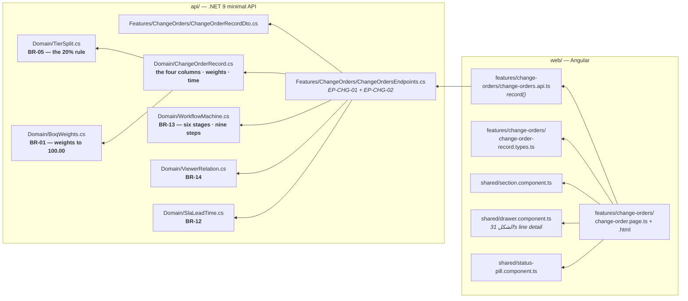
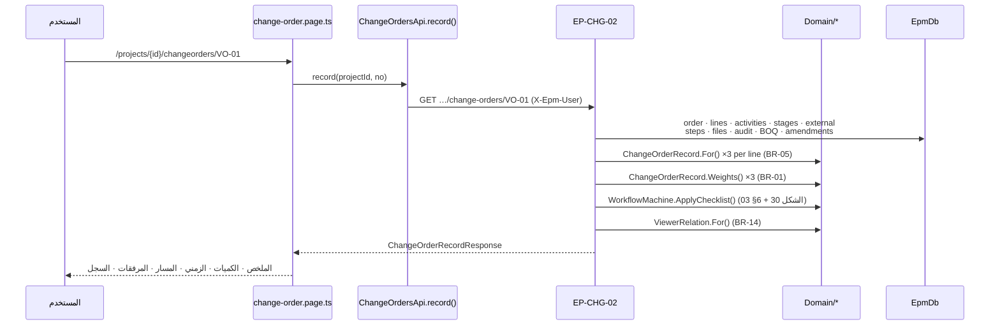
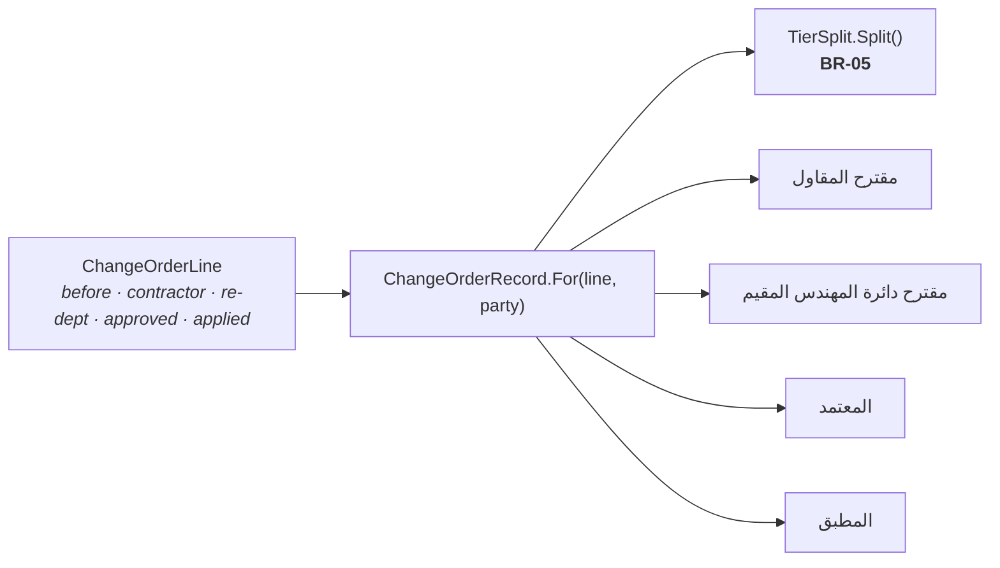
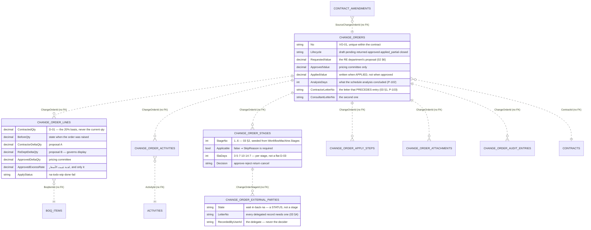
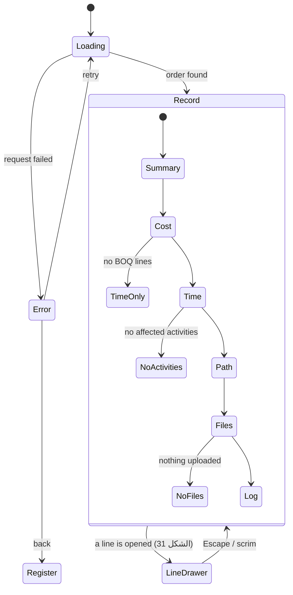

# UML — Change orders, the RECORD (Phase 5.2)

**SCR-W8's record** — one change order as an official document: what was
requested, what was approved, what was applied.

Endpoint **`EP-CHG-02`**. Reference component: the record half of **`DModVO`**
`app/vo-record.jsx:960`, with **`voRecord`** `:129` as its derivation. Binding
plates: **ملحق الأشكال 30–34**.

> **The reference and the live prototype agree here.** `vo-record.jsx` at
> `infinite-azaiton.github.io/epm` (v338) is byte-identical to the checked-in
> copy, and so are all five stylesheets — checked during this phase, because
> P-69 established that the snapshot in `docs/spec/reference/` can be stale.

---

## 1. What files make up this feature

**Nothing in `change-order.page.ts` multiplies a quantity by a rate.** Every
resulting quantity, value, impact, weight and finish date arrives derived
(CLAUDE.md §3.1); the component picks a tab and formats.

---

## 2. One request, six tabs

The tabs do **not** fetch. `03 §9` calls the record an official document about a
decision somebody is being asked to take, and a tab that arrives late is a tab
that gets skipped.

---

## 3. The four columns (الشكل 31)

**One function, four calls.** Storing the results instead would put a derived
value in the database (CLAUDE.md §3.5) and let the columns disagree with the
split that produced them. A party that has not proposed gets **nulls, never
zeros** — «بانتظار القرار» and "approved nothing" are different facts (`02 §6`).

The excess rate is the only rate a party may move, and only لجنة تثبيت الأسعار
sets the binding one (`02 §5`) — so the approved column's rate cell prints the
committee's name until it exists, never a computed guess.

---

## 3.5 The data it reads

**`EP-CHG-02` writes nothing.** Every table above is read; the writes are 5.4's.

---

## 3.6 What the screen can look like

There is no "empty database" state: an order that does not exist is a **404**,
and the page renders the error state with a way back to the register — `04 §9`'s
rule, applied to a record rather than a list.

---

## 4. Why the weights are recomputed three times

`BoqWeights.ForContract` runs over **every** line of the contract, not just the
affected ones: a weight is a share of the contract (BR-01), so the untouched
lines are the denominator. It runs once for the RE department's column, once for
the approved one and once for the applied one, and الشكل 31's «التحقق من 100%»
is the answer of that recomputation rather than an assertion printed beside it.

**This is what makes an untouched line's weight move.** Adding value to one line
dilutes every other line's share — the fact the plate exists to show, and the
reason the sum has to be re-checked instead of assumed.

---

## 5. The trail (الشكل 33)

- The six stages, their owners and their notes come from
  `WorkflowMachine.Stages` — `03 §2` as code. **The fixture seeds from the same
  table** (P-100), so a stage cannot be stored under one name and rendered under
  another.
- A **skipped** stage is listed with its reason (`03 §2`), never dropped, and it
  owns nothing: it can make nobody `awaiting` and nobody `upcoming`.
- **External parties are statuses inside the owning stage** (`03 §3`), with the
  deciding party named and the delegate recorded as the recorder (`03 §4`).
- An open stage's clock runs to the **data date** (D-06); a closed one's to its
  own action date. «معدل دوران المعاملة» is the sum of those — which is not the
  order's age, and the plate prints both so they cannot be confused.

---

## 6. Three things worth knowing before changing this screen

**Approved ≠ applied, and this screen is where it shows.** `contract.valueBefore`
/ `valueAfter` and the amendment state come from `ContractAmendment`, matched
through `SourceChangeOrderId` (P-104) — never by comparing figures, because two
orders can move the same figures. VO-05 is approved with its amendment still
`pending`; VO-01 is closed with its amendment `effective`.

**The checklist is nine steps, and two of them have no `03 §6` number** (P-101).
`SpecStep` carries the spec's numbering where it exists so both readings stay
greppable: seven for the written rule, nine for الشكل 30.

**The analysis days are stored on the ORDER** (P-102). They are neither the sum
nor the maximum of the affected activities' days, because float absorbs some of
an extension and a shared path compounds it — which is precisely what الشكل 32's
standing note says.
