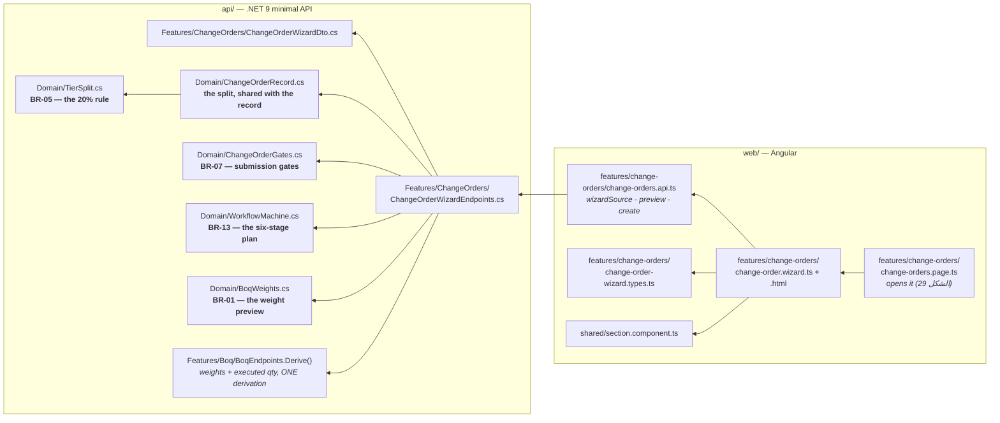
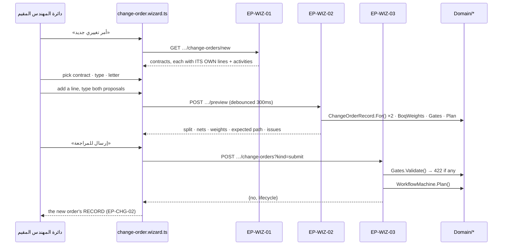
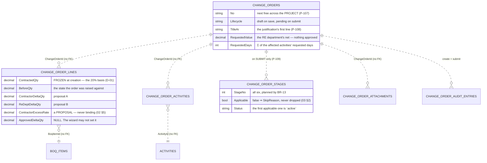
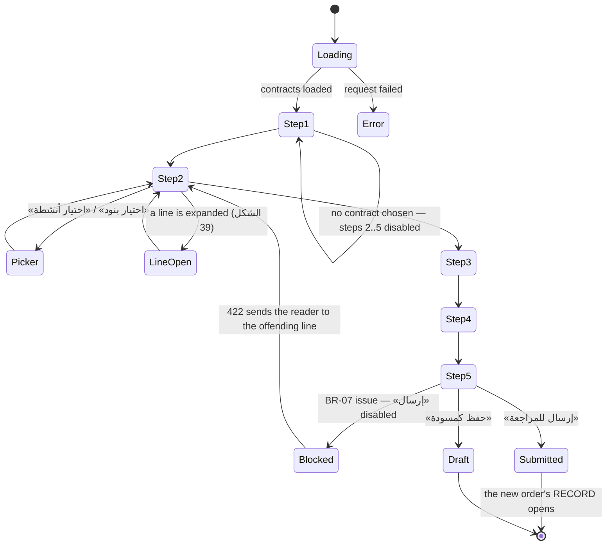

# UML — Change orders, the CREATION WIZARD (Phase 5.3)

**المسار 9** — composing a change order: the contract, the type, the official
letter, the affected lines and activities, the impact, the documents, and the
decision to save it or send it.

Endpoints **`EP-WIZ-01`** · **`EP-WIZ-02`** · **`EP-WIZ-03`**. Reference
component: **`DVOCreateWizard`** `app/vo-wizard.jsx:6`. Binding plates:
**ملحق الأشكال 37–42**.

> **This is the one screen that WRITES a change order.** Everything else in the
> feature reads: the register lists, the record reports, and 5.4's decisions
> move an order that already exists.

---

## 1. What files make up this feature

**`Derive()` is reused, not re-derived** (P-54). A wizard that recomputed the
weight or the executed quantity could offer a line whose figures disagree with
the BOQ register the user just came from.

---

## 2. Three calls, and what each is for

**Why a preview endpoint exists at all:** `03 §8` and الشكل 39 recalculate as the
two proposals are typed, and CLAUDE.md §3.1 forbids computing that in Angular.
The round trip is the price of one implementation of BR-05 instead of two
(P-106).

---

## 3. What it writes

**No approved column is ever written here.** `ApprovedValue`, `ApprovedDays`,
`ApprovedDeltaQty` and `ApprovedExcessRate` stay null until the pricing and
rate-fixing committees rule — the wizard has no field for any of them, and the
screens name the body that sets each one instead.

---

## 4. What the screen can look like

A draft is allowed to be incomplete — that is what a draft is. Only submission
is gated (`02 §7`).

---

## 5. Three things worth knowing before changing this screen

**The contract is not a filter, it is the scope.** `EP-WIZ-01` returns contracts
each carrying their own lines and activities, so the client is never holding a
list it could compose a cross-contract order from. BR-07's `cross-contract` gate
still runs on the way in, because a UI that cannot express something is not the
same as a rule that forbids it.

**Nothing here is approved, and the screen says so rather than hiding it.**
«القيمة المعتمدة» reads «يُحدَّد في التدقيق المالي» and the excess rate reads
«يُثبَّت بلجنة تثبيت الأسعار» — two labels that exist because the fields behind
them deliberately do not (`02 §5`–§6, D-08).

**The expected path is computed, not printed.** الشكل 42 shows six stages; two of
them are conditional, and the wizard asks `WorkflowMachine.Plan` with the
order's own conditions. A stage that will not run is listed with its reason,
which is the same treatment the record's المسار tab gives it (`03 §2`).
