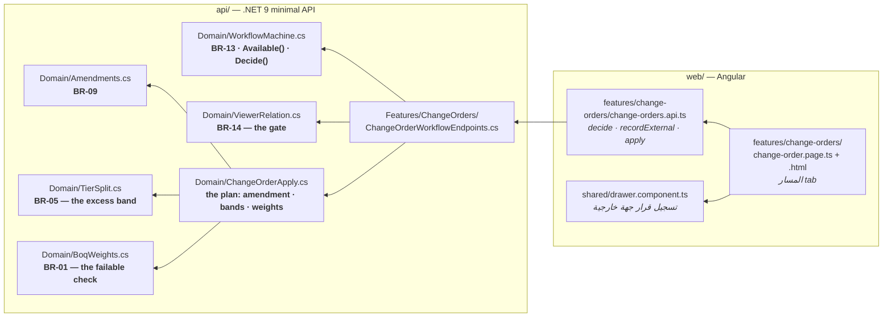
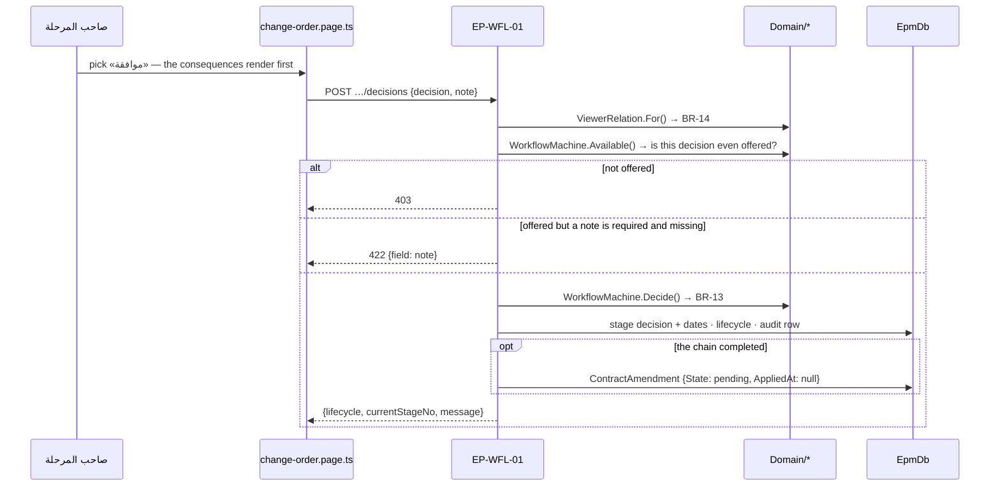
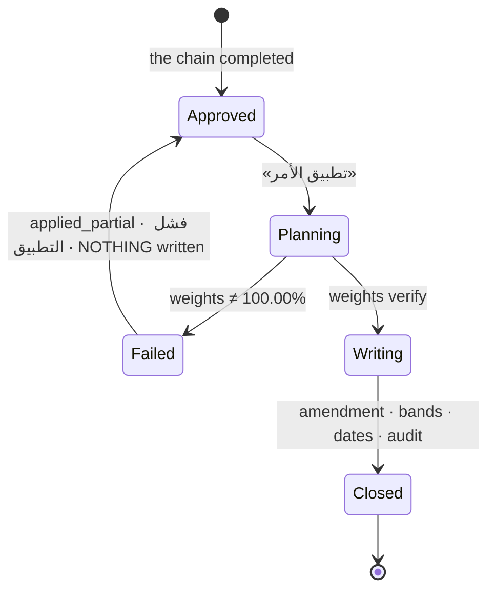
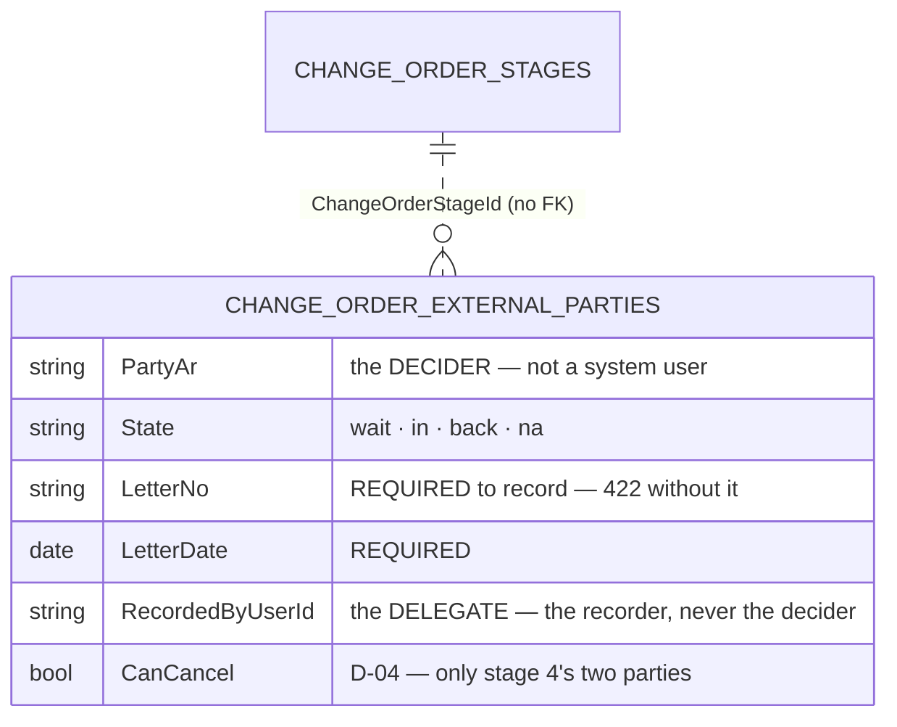

# UML — Change orders, THE WORKFLOW (Phase 5.4)

**`03 §3`–§7 · ملحق الشكل 33** — taking a decision on a change order, recording
an external party's outcome on its behalf, and APPLYING the order to the
contract.

Endpoints **`EP-WFL-01`** · **`EP-WFL-02`** · **`EP-WFL-03`**. Reference
component: the decision panel of **`DModVO`** `app/vo-record.jsx:1394`.

> **These three write to an order that already exists.** The register lists, the
> record reports, the wizard creates — this is where an order MOVES.

---

## 1. What files make up this feature

**The page and the endpoint read the same rule.** `WorkflowMachine.Available`
decides which actions exist; the endpoint calls it and the page mirrors it in
one `computed` (P-115). Hiding a control is courtesy — the 403 is the rule.

---

## 2. A decision, and what it moves

The pending amendment created on approval is what `02 §9`'s projection is
rendered from — SCR-E3, SCR-W1 and SCR-W3 already read those rows (P-111).

---

## 3. Applying — all of it, or none of it

`Domain/ChangeOrderApply.Plan` computes every change as a **value** before a
single row is written, which is what makes the failure safe: the steps are
recorded, step 5 reads `fail`, the order stays in `applied_partial`, and the
contract is untouched (P-112).

What a successful apply writes:

| Table | What moves |
|---|---|
| `ContractAmendments` | the pending row FLIPS to `effective` with its value, finish and duration (BR-09) |
| `BoqRateBands` | the quantity at the original rate, plus a **second band** for the portion beyond 20% at the rate لجنة تثبيت الأسعار fixed (`02 §5`), flagged `IsExcessBand` |
| `BoqItems` | **nothing.** `OriginalQty` and `UnitRate` are what D-01 measures the next order's 20% against (non-negotiable #6) |
| `Activities` | `ForecastFinish` and `RemainingDuration` by the approved days |
| `ChangeOrderApplySteps` | all nine, with their outcome |
| `ChangeOrderAuditEntries` | one row per changed field, previous → new |

BR-10's penalty baseline moves with the contractual finish, and the audit says
so in its own row rather than leaving it implied.

---

## 4. External parties are statuses (`03 §3`–§4)

- Only a **delegate** may record (403 otherwise), and only on the stage that is
  actually open (422 otherwise).
- A stage with a party still `wait` **cannot be approved** — `approve` is not
  offered and the endpoint refuses it.
- A `back` from a party that `CanCancel` ends the order as `cancelled`, which is
  the only path to that lifecycle (P-113).

---

## 5. Three things worth knowing before changing this

**Approving still changes nothing.** `EP-WFL-01` writes a lifecycle, a stage
pointer and a pending amendment. Everything a contract can feel happens in
`EP-WFL-03`, and it is a separate deliberate act by the execution stage's owner.

**A return keeps its own history** (P-114). The returning stage stays
`returned` with its comment; the stage it goes back to reopens with a fresh
clock. Resetting the returning stage would erase the fact that a return
happened, on the tab whose whole subject is what happened.

**Every gate is server-side.** BR-14 is re-resolved from the persona header on
each of the three, because `03 §7` makes the relation the entire authorisation
model — and the identity being a header (P-05) is exactly why what it may do
cannot be decided in the browser.
