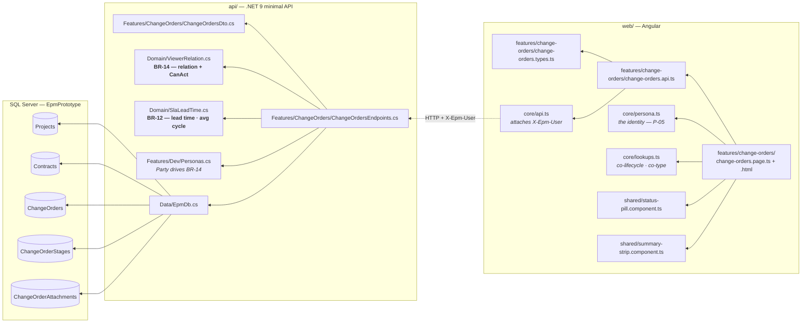
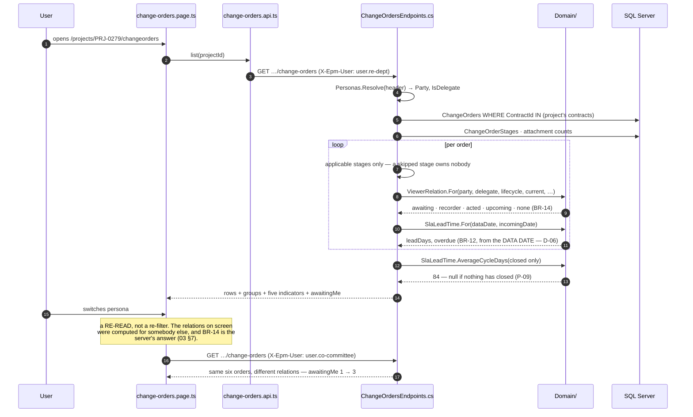
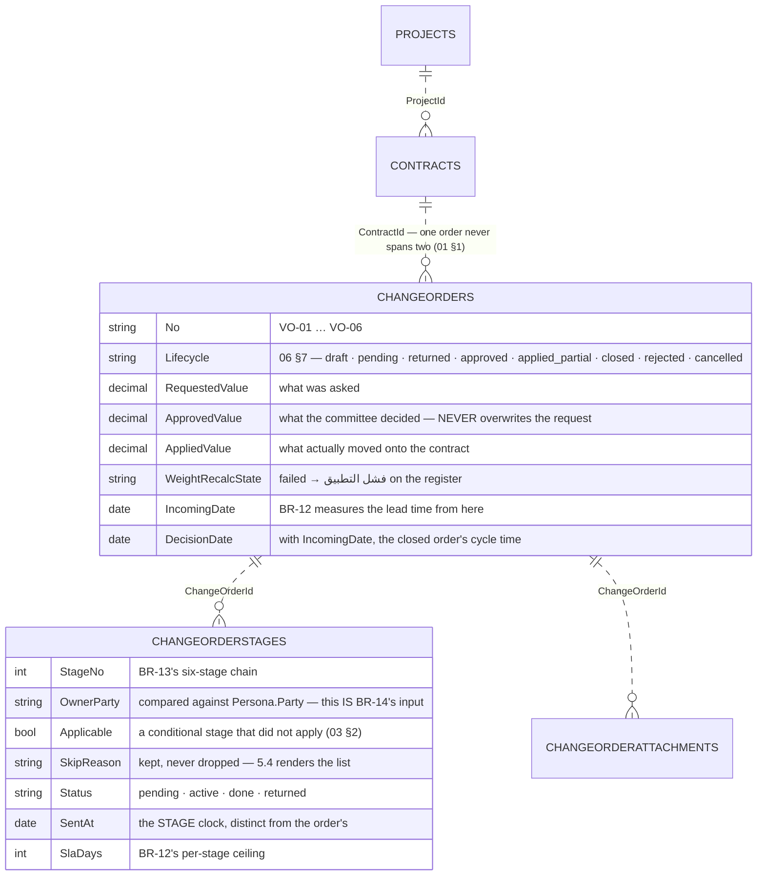
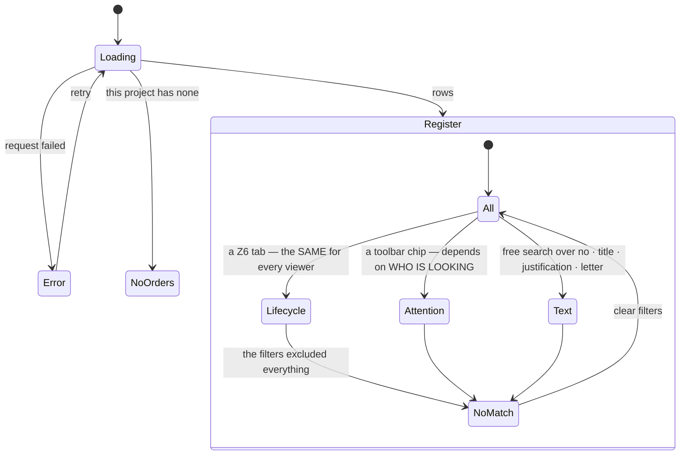

# UML — Change orders, the register (Phase 5.1)

**SCR-W8** — every change order on a project, grouped by lifecycle, with the
viewer's own relation to each one.

Endpoint **`EP-CHG-01`**. Reference component: **`DModVO`**
`app/vo-record.jsx:454` — the v1.1 branch, `../epm@design/system-revamp`.

> **ROADMAP names `project-modules.jsx:1142`. That is the PRE-v1.1 component.**
> v1.1 moved the whole module into its own file and says so at
> `vo-record.jsx:4`: *"Loaded after project-modules.jsx so this DModVO replaces
> the earlier one."* The rows already built carry their corrected v1.1 line;
> this one did not, and now does.

This is the first screen whose CONTENT depends on who is looking.

---

## 1. What files make up this feature

---

## 2. The request, end to end

---

## 3. What it reads and writes

**Written by this screen:** nothing. The register lists and filters; every
decision, transition and attachment is Phase 5.2 and 5.4.

**Derived, never stored:** the viewer relation, `canAct`, every exception chip,
the lead time, the group counts and all five indicators.

> **`ChangeOrderStage` and `ChangeOrderAttachment` are registered in 5.1, not
> 5.4** — the same call 4.2 made about `Activity`. `03 §10` puts "current stage
> · current owner" and the attachment count in the register's own row spec, and
> BR-14 resolves the relation off the stage chain. The register cannot be built
> without either.

---

## 4. The two axes, and why they are separate

`NoOrders` and `NoMatch` are **two different empty states with two different
messages and two different buttons** (`04 §9`).

The reference's own comment is the reason they are separate axes: *"Lifecycle is
one axis and follows the workflow order; attention is another and depends on who
is looking. Mixing them was why «بحاجة إلى إجراء» sat next to «المعتمدة» as if
they answered the same question."*

---

## 5. Where to change what

| To change… | Edit |
|---|---|
| how a relation is resolved, or what may act | `Domain/ViewerRelation.cs` |
| the lead time, the per-stage SLA, the cycle average | `Domain/SlaLeadTime.cs` |
| when an exception chip fires | `Row()` in `Features/ChangeOrders/ChangeOrdersEndpoints.cs` |
| the whole-order overdue ceiling | `OrderOverdueDays` in the same file |
| which lifecycles share a group | `groupOf` in `change-orders.page.ts` **and** the groups list in the endpoint — they must agree |
| a lifecycle or type **label** | `Features/Lookups/LookupCatalog.cs` (`co-lifecycle`, `co-type`) — never `lang.ts` |
| a column heading, a chip, an empty state | `core/lang.ts` (`chg_*`) |
| the six seeded orders | `Features/Dev/Fixture.cs` → `ChangeOrders(db)` |

---

## 6. Known gaps

- **No record page, no decisions, no wizard.** 5.2, 5.3 and 5.4. The register
  says so in a message bar rather than offering a row click that goes nowhere.
- **`recorder` is unreachable.** It needs `ChangeOrderExternalParty` to know an
  external party is pending, which 5.4 registers. The endpoint passes
  `externalPartyPending: false` explicitly rather than guessing — a relation
  claimed without its input would be worse than one that never fires.
- **A returned order's re-opened stage is fixture data, not a transition.**
  VO-03 sits with the RE department because the fixture says so; the machine
  that puts it there is 5.4.
- **Exception chips are computed, not stored.** `03 §10` treats them as
  exceptions on top of the lifecycle, so nothing persists them — which also
  means they move with the data date, as they should.

---

## 7. Three things worth knowing before changing this screen

**The relation is the server's answer, always** (`03 §7`, BR-14). `canAct`
arrives as a boolean. The browser never recomputes it and never infers it from a
party name, because it is the entire authorisation model for an order — and the
identity being a fake header (P-05) is exactly why what that identity may do has
to be decided somewhere the browser cannot reach.

**"Pending" and "overdue" are different sets, and the fixture proves it.**
`06 §12` seeds VO-02 at 22 days and VO-06 at 5 for no other reason. If they ever
collapsed, the «متأخر» chip would be a synonym for «قيد الاعتماد». The same care
separates the WHOLE-ORDER ceiling (14 days since the incoming letter) from the
PER-STAGE SLA (BR-12) — an order can breach either without the other.

**Approving changes nothing** (`02 §9`). Net approved sums approved orders, and
none of that money is on any contract until it is APPLIED. VO-05 is approved and
untouched; its 3,000,000 appears in no contract total anywhere in the system, and
the register says so under the table rather than leaving a reader to assume the
figure is binding.
