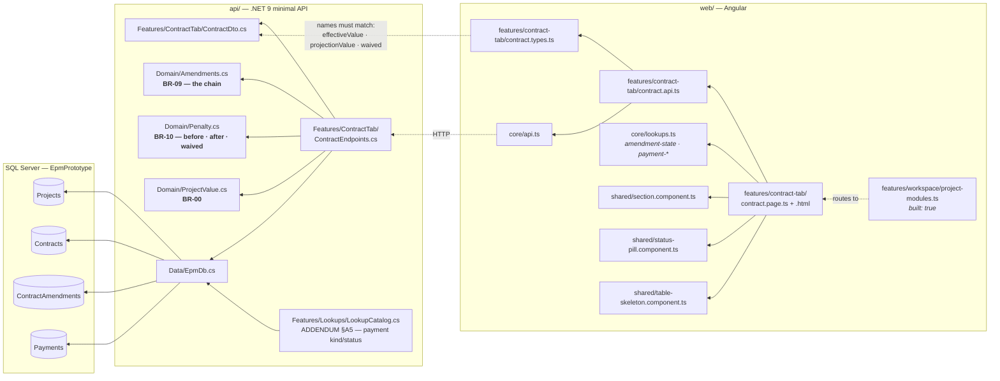
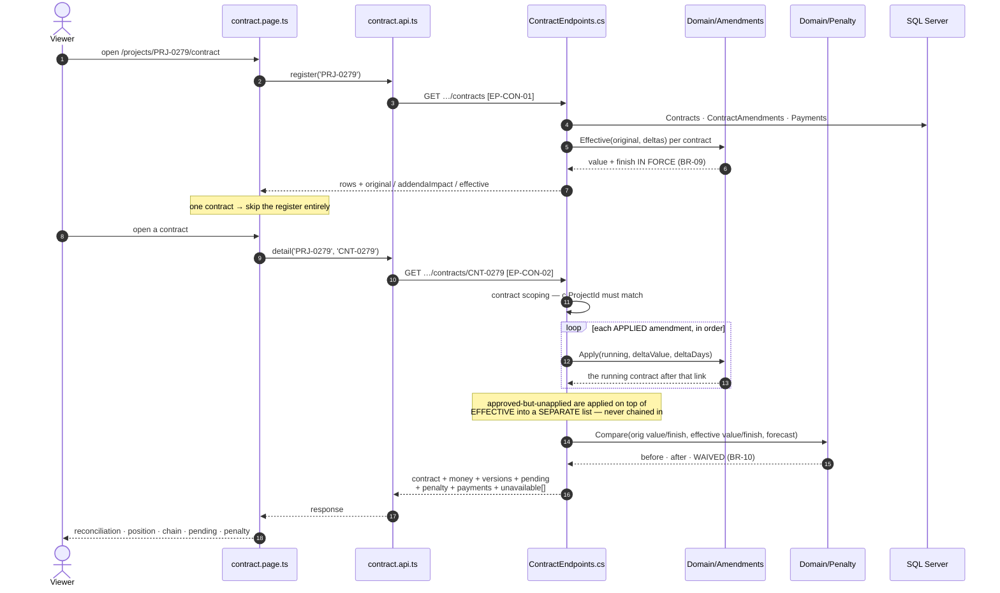
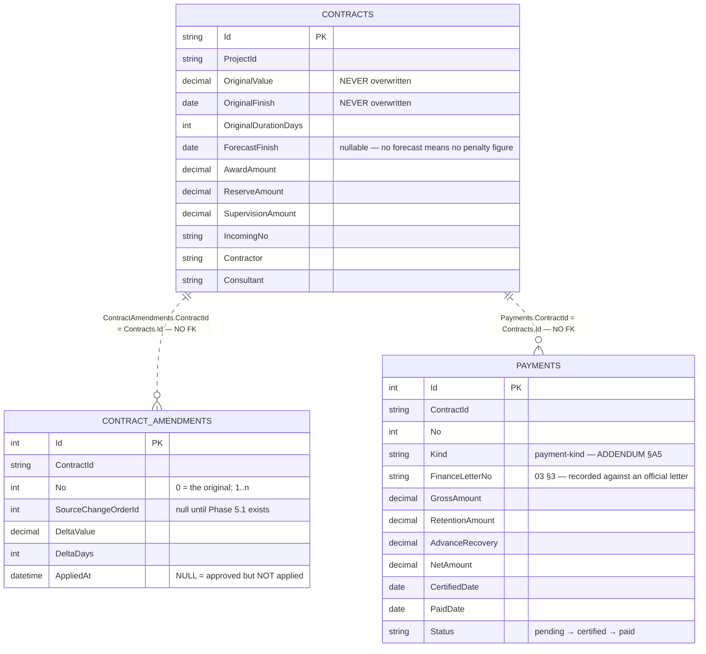
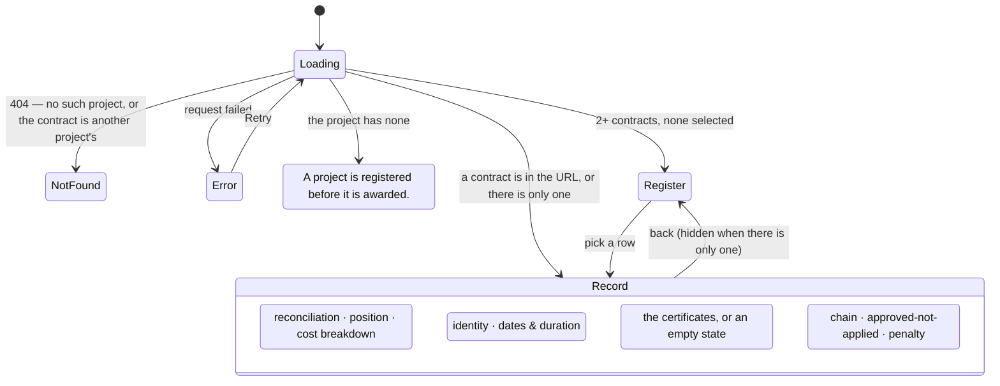

# UML — Contract tab (Phase 4.1)

**SCR-W3** — the project's contracts and their amendment chain (`04 §7`).
Endpoints **`EP-CON-01`** `GET /api/projects/{id}/contracts` ·
**`EP-CON-02`** `GET /api/projects/{id}/contracts/{contractId}`

Reference components: **`DModContractNew`** `app/project-modules.jsx:363` ·
**`DContractAmendments`** `app/contract-amendments.jsx:301` — the v1.1 branch,
`../epm@design/system-revamp`.

This is the screen where **approved ≠ applied** stops being a rule in a
document and becomes two tables that must not be added together.

---

## 1. What files make up this feature

> **One new table: `Payments`.** Nothing in the system could say what had been
> paid until now — which is why SCR-E1's financial tiles and four rows of the
> SCR-E7 catalog were rendering "unavailable".

---

## 2. The request, end to end

---

## 3. What it reads

**`EP-CON-01` and `EP-CON-02` write nothing** — every figure on them is derived at
projection time. المسار 2's `EP-CON-03` / `EP-CON-04` are the contract tab's only
writes, and they touch `Contracts` alone.

### The three values, and why they are three

| Figure | How | Never |
|---|---|---|
| **Original** | `Contracts.OriginalValue`, stored | overwritten (non-negotiable #6) |
| **Effective** | original + Σ **applied** deltas — `Amendments.Effective` (BR-09) | includes an unapplied amendment |
| **Projection** | effective + Σ **unapplied** deltas — `Amendments.Projection` (`02 §9`) | added into any total on the screen |

`CNT-0279`: awarded **240,000,000**, one applied amendment → effective
**250,000,000**, one approved-and-unapplied → projection **253,000,000**. The
contract is worth 250,000,000 today.

### Disbursed is `paid`, not `certified`

`Payments.Status` is a sequence — pending → certified → paid — and the gap
between the last two is exactly where a delayed project's money sits.
`EP-CON-01` sums only `paid` into **disbursed**; `certified` is its own figure.
On `CNT-0279` that is 76,700,000 against 117,925,000.

---

## 4. What the screen can look like

---

## 5. Where to change what

| Change | File |
|---|---|
| A column, a sub-tab, the reconciliation layout | `web/…/features/contract-tab/contract.page.html` |
| Sub-tab state, bar geometry, label resolution | `…/contract.page.ts` |
| Chrome strings | `web/src/app/core/lang.ts` (`con_*`) |
| Amendment-state / payment labels | `Features/Lookups/LookupCatalog.cs` (06 §8 · ADDENDUM §A5) |
| How the chain is built | `api/…/Domain/Amendments.cs` (BR-09) — **not** the endpoint |
| How the penalty is computed | `api/…/Domain/Penalty.cs` (BR-10) — **not** the endpoint |
| What counts as disbursed | `ContractEndpoints.cs` — the `Status == "paid"` filter |
| The payload shape | `ContractDto.cs` **and** `contract.types.ts` |

---

## 6. Known gaps

| # | Gap | Why it is a gap and not a defect |
|---|---|---|
| 1 | **An amendment cannot name the order that created it.** The Change order column is an em dash on every row, with a note saying so. | `ContractAmendments.SourceChangeOrderId` has nothing to point at until the change-order register exists (Phase 5.1). Stated rather than left blank (P-09). |
| 2 | **Spend is not split across award / reserve / supervision.** All three show their amount and no spend, with the reason printed. | A payment is recorded against the CONTRACT. Apportioning it across the three expense items would be an allocation nobody authorised. |
| 3 | **No financial %.** The money is shown; the percentage is not. | `02 §4` says financial % "comes from payments" without fixing the denominator — effective value or total contract cost including reserve and supervision. Choosing one would be a guess with a number attached (P-44). |
| 4 | **The penalty's "no forecast" branch is not exercised by the fixture.** Every fixture contract carries a `ForecastFinish`. | The branch exists and returns `unavailable: true`; nothing in the seeded data reaches it. |
| ~~5~~ | ~~**No edit mode, no "add contract".** Both are demo toasts.~~ **CLOSED by المسار 2** — `EP-CON-03` creates, `EP-CON-04` updates, `EP-CON-05` reads the definition back, on the same shape المسار 1 uses for a project. | |
| 6 | **No per-payment record pane.** The reference opens a Z8 drawer with the payment's line items and attachments. | Payments have no line items in this model — `04 §7`'s certificate breakdown belongs to Phase 4.4's Financials screen. |
| 7 | **The reference's penalty formula is NOT the one used.** | See §7. |

---

## 7. Two things this screen does that the reference does not

**It keeps the projection out of every total.** The reference renders one
`projected` figure beside the effective one; here the approved-but-unapplied
amendments are a **separate table with its own heading** — «الاعتماد لا يغيّر
العقد — هذه الأرقام غير مضافة إلى أي مجموع أعلاه» — and their columns are
labelled *value if applied* rather than *value*. `02 §9` is the rule; making the
two tables impossible to read as one list is how the screen enforces it.

**It uses the specification's penalty rule, not the reference's.** v1.1 computes
the daily penalty as `value × rate / duration` with `rate` between 10% and 25%,
citing Regs 2/2014 — a total ceiling reached when the delay equals the full
contract duration. `02 §10` and D-02 say **0.1% per day, capped at 10%**. The
written spec owns the arithmetic and the reference owns the screen (CLAUDE.md
§1), so `Domain/Penalty.cs` is unchanged and its tests still pass. **The
divergence is real and is recorded as P-45 for the client to settle** — on
`CNT-0279` the two rules give materially different money.

On that contract the current rule reports: 61 days and 14,640,000 before the
amendments, 16 days and 4,000,000 after, **10,640,000 waived** — which is what
the 45-day extension bought. `CNT-0207` is the other case: 135 days late and the
penalty pinned at its 10% cap of 3,120,000, with nothing waived because that
contract has no amendments.
