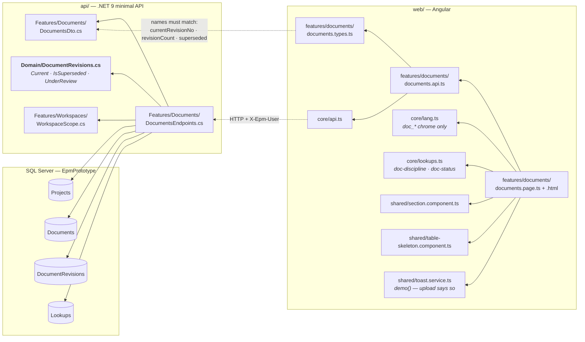
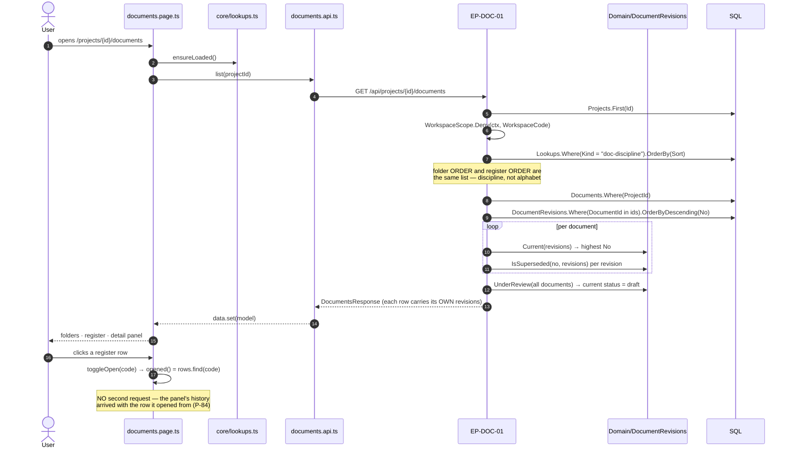
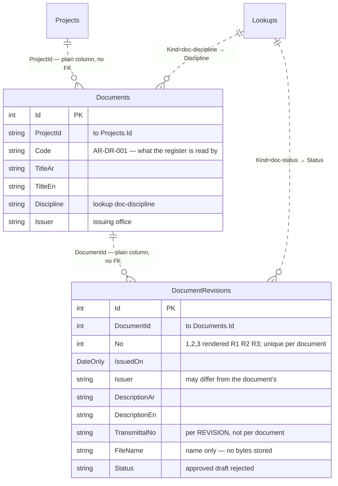
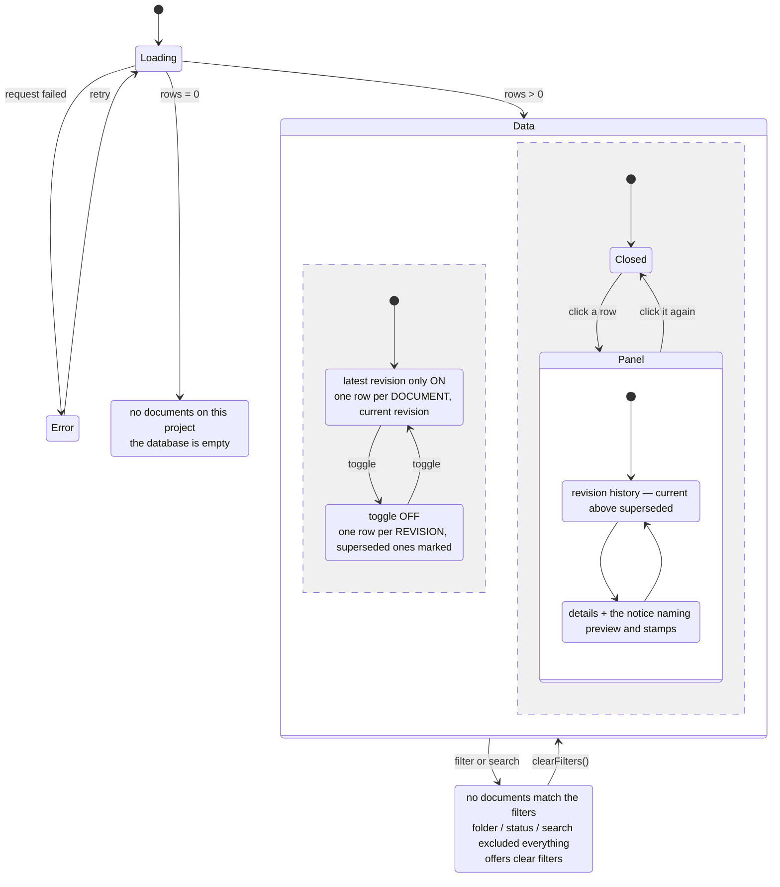

# UML — Documents & Drawings (Phase 6)

**SCR-W12** — الوثائق والمخططات · **ملحق الشكل 46**.
Endpoint **`EP-DOC-01`** · `GET /api/projects/{projectId}/documents`

Reference component: **`DModDrawings`** — `project-modules.jsx:1396`.

The plate carries a notice of its own, inside the detail panel:

> «كل ملف جديد يُنشئ مراجعة جديدة؛ المراجعة السابقة تبقى في السجل معلَّمة كملغاة،
> ولا يوجد استبدال في المكان.»

That sentence is the whole design of this feature. It is why there are **two
tables and not one**, why a revision is only ever INSERTED, and why «which
revision is current» is a computed answer rather than a stored flag.

---

## 1. What files make up this feature

> **The page owns no arithmetic.** `Current`, `IsSuperseded` and `UnderReview`
> are all in `Domain/DocumentRevisions`; the endpoint filters and projects; the
> page filters an already-projected list and formats it (CLAUDE.md §3.1).

---

## 2. What happens when the tab opens

**One read carries the history.** Fetching the revisions separately would give
the panel its own chance to disagree with the row it opened from — the call the
BOQ item card already made.

---

## 3. What it reads and writes

**Nothing on this screen is stored twice.**

| Not a column | Why | Where it comes from |
|---|---|---|
| `IsCurrent` | Two answers to one question; they disagree the first time an old revision is inserted late | `DocumentRevisions.Current` — the highest `No` |
| `Superseded` | Same | `DocumentRevisions.IsSuperseded` — a higher `No` exists |
| Document `Status` | A document has no status; its *current revision* does — which is why a drawing can be معتمد at R1 and مسوّدة at R2 | projected from the current revision |
| `UnderReview` count | A stored counter goes stale the moment a revision lands | `DocumentRevisions.UnderReview` |

**`EP-DOC-01` writes nothing.** «رفع وثيقة» and «رفع مراجعة» are demo stubs and
say so in a toast — the insert path is not built.

---

## 4. What the screen can look like

The two empty states are different states with different messages and different
buttons (`04 §9`): an empty database is not an over-filtered register.

---

## 5. Where to change what

| Change | File |
|---|---|
| Which revision is current, what counts as ملغاة, what «قيد المراجعة» means | `api/Epm.Api/Domain/DocumentRevisions.cs` |
| Folder order, status chips, what the row carries | `api/Epm.Api/Features/Documents/DocumentsEndpoints.cs` |
| A field on the register or the panel | `DocumentsDto.cs` **and** `documents.types.ts` — same names |
| Discipline names, issue-status names | `Lookups` rows `doc-discipline` · `doc-status` — not code |
| Column layout, the toggle, the panel tabs | `documents.page.html` |
| Screen chrome text | `core/lang.ts` `doc_*` |

---

## 6. Known gaps

- **No write path.** «رفع وثيقة» and «رفع مراجعة» are stubs. Inserting a
  revision is the one write this screen wants, and it is deliberately not built
  until there is a file store to put bytes in.
- **المعاينة and التأشيرات are named, not drawn** (P-118). No file contents are
  stored and no flow records a stamp, so the two tabs the plate shows are
  described in a notice inside التفاصيل rather than opened onto nothing.
- **No transmittal record.** `TransmittalNo` is a string on the revision; the
  transmittal itself — its covering letter, its recipients, its date out — has
  no table. الشكل 46 does not draw one either.
- **No link to the change order that caused a re-issue.** «مطابقة للمنفَّذ»
  revisions usually follow an applied VO; nothing joins the two yet.
