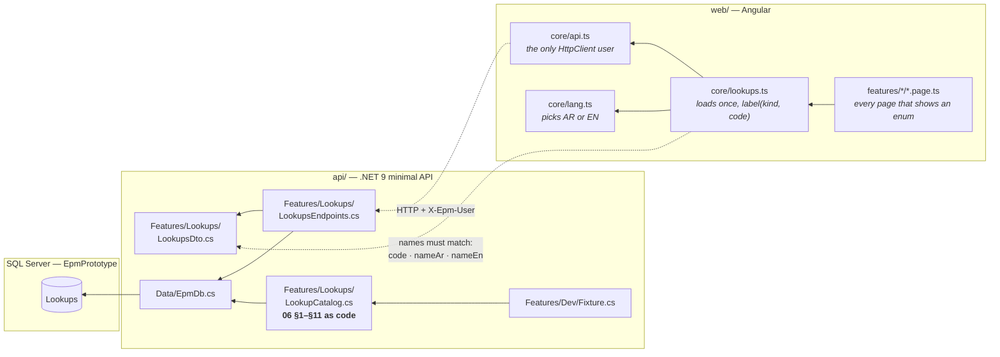
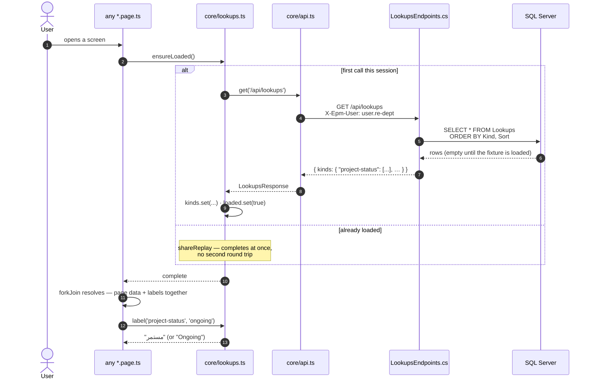
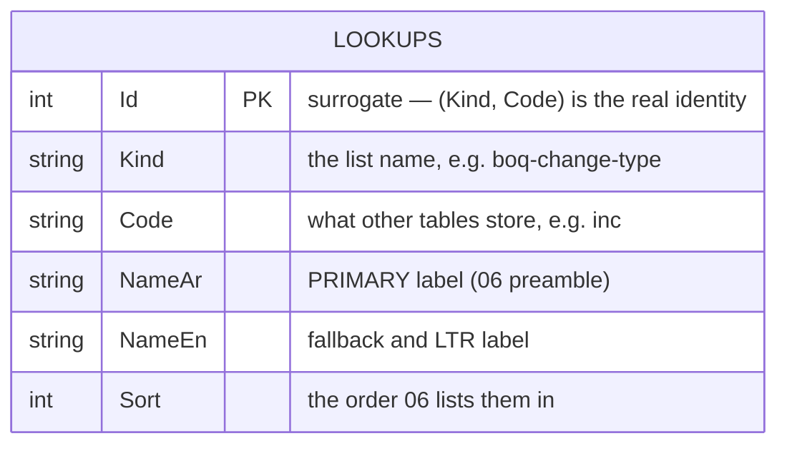
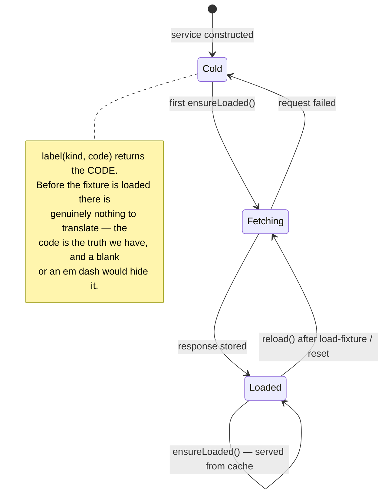

# UML — Lookups (Phase 1.1)

Every enum label in the application (`06 §1–§11`), served once per session.
Endpoint **`EP-LKP-01`** · `GET /api/lookups`

**No screen of its own.** This is a shared primitive: any page that renders a
status, a stage, a change type, a lifecycle state or a coverage state asks
`core/lookups.ts` for the label instead of hard-coding it.

---

## 1. What files make up this feature

> **`LookupCatalog.cs` is not fixture data.** `Fixture.cs` is illustrative and
> says so at the top; the value lists are the specification's own enumerations
> and every stored code in the system comes from one of them. They live beside
> the endpoint so one grep for `boq-change-type` finds the list, the endpoint
> and the Angular caller. `Fixture.Load()` merely inserts them, because nothing
> is seeded on boot (`P-03`).

---

## 2. The request, end to end

**Why one call for all twenty kinds:** the whole set is a few hundred short
rows, it does not change during a session, and one round trip beats a request
per kind on every screen.

**Why `forkJoin` and not a background load:** a page that renders before its
labels arrive shows raw codes for a frame. Waiting costs nothing after the
first screen — `ensureLoaded()` completes synchronously from cache.

---

## 3. The data it reads

**One generic table, not twenty small ones.** One place to look, one endpoint,
one Angular service. `Kind` is the list name.

**`(Kind, Code)` is unique but not constrained.** There is no unique index —
storage is flat and invariants are checked where they can be read (`P-01`).

**Every other table's enum column points here by `Code`.** `Projects.Status`
holds `ongoing`, not `مستمر`. Changing a code to fix a label breaks every row
that stores it; change `NameAr` instead.

---

## 4. The twenty kinds

| Kind | Spec | Codes |
|---|---|---|
| `project-status` | 06 §1 | ongoing · completed · delayed · suspended · cancelled |
| `execution-stage` | 06 §2 | design · tender · award · mobilisation · foundations · structure · envelope · mep-first-fix · finishes · mep-second-fix · testing-commissioning · handover |
| `project-type` | 06 §3 | construction · equipment · design-studies — **only three** (D-13) |
| `contract-status` | 06 §4 | the 5-state set · awarded-not-started · suspended-admin-order · under-settlement · terminated |
| `funding-type` | 06 §5 | federal-budget · regional-budget · loan · grant · self-funding · investment · reconstruction-fund · emergency-allocation · carry-over-allocation · other |
| `beneficiary-type` | 06 §6 | university · department · campus · site · facility · other |
| `co-type` | 06 §7 | engineering · supply — **only two** |
| `boq-change-type` | 06 §7 | inc · dec · rate · del · redist — **no "add new item"** |
| `activity-change-type` | 06 §7 | inc · dec · start · finish · both |
| `co-lifecycle` | 06 §7, 03 §6 | draft · pending · returned · approved · applied_partial · closed · rejected · cancelled |
| `decision` | 06 §7, 03 §5 | approve · reject · return · cancel |
| `apply-step-status` | 06 §7, 03 §6 | na · todo · wip · done · fail |
| `weight-recalc-state` | 06 §7, 03 §6 | none · review · approved · applied · fail |
| `external-party-state` | 06 §7, 03 §3 | wait · in · back · na |
| `viewer-relation` | 06 §7, 03 §7 | awaiting · recorder · acted · upcoming · none |
| `attachment-category` | 06 §7, 03 §8 | letter · drawing · boq · analysis · photos · support |
| `amendment-state` | 06 §8 | original · superseded · effective · pending · partial |
| `activity-status` | 06 §9 | notstarted · inprogress · ahead · delayed · completed |
| `distribution-state` | 06 §10 | none · partial · full · over |
| `allocation-coverage` | 06 §11 | unassigned · full · partial · over |

Two kinds carry rows the data dictionary does not list, both recorded in
`DECISIONS.md`:

- **`co-lifecycle` gains `approved` and `cancelled`** (`P-13`). `06 §7` lists
  six keys; `03 §6`'s lifecycle needs `approved` — the state whose entire point
  is *the values were agreed and the contract has not changed* — and `03 §5`'s
  fourth decision terminates an order as `cancelled`.
- **`attachment-category` codes are ours** — `06 §7` gives the six Arabic
  labels without keys.

---

## 5. States

There is no error state on this service. A failed lookup fetch degrades to raw
codes; it does not blank a page whose own data loaded fine.

---

## 6. Where to change what

| You want to… | Touch these, in this order |
|---|---|
| Fix a label's wording | `LookupCatalog.cs` (`NameAr` / `NameEn`), then `POST /api/dev/load-fixture?force=true` |
| Add a row to a list | `LookupCatalog.cs` only — nothing else changes |
| Add a whole new kind | `LookupCatalog.cs` + the §4 table above + the `Lookup` entity's kind list |
| Change the response shape | `LookupsDto.cs` **and** `core/lookups.ts` — member names must stay identical |
| Use a label on a new page | inject `LookupsService`, `forkJoin` `ensureLoaded()` with the page's request |

**Never change a `Code` to fix a label.** Codes are stored on other rows.

---

## 7. Known gaps

- **Lookups are edited in code, not in the UI.** `06` says business people
  maintain these lists, which is why they are a table and not a constants file;
  the admin screen that would let them do it is not in Phase 1.
- **No `co-stage` kind.** The six change-order stages (`03 §2`) are conditional
  and carry an owner party and an SLA, so they are the `WorkflowMachine`
  (BR-13) in `Domain/`, not a flat value list.
- **`project-status` and `contract-status` duplicate five rows.** `06` states
  them as two lists (`§1` and `§4`), and a contract's extended states do not
  apply to a project. Kept as two so a screen asks for the list it means.
