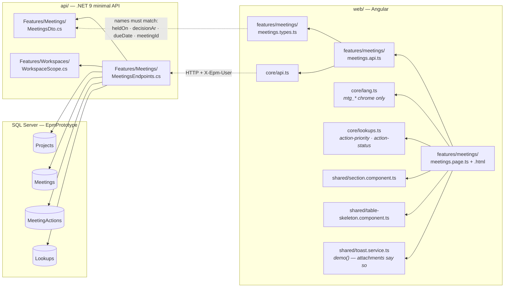
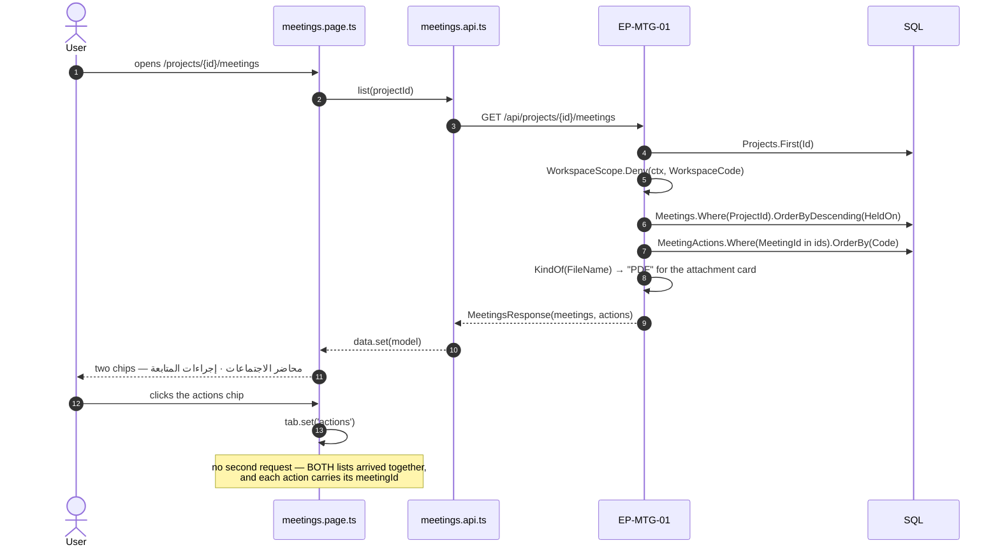
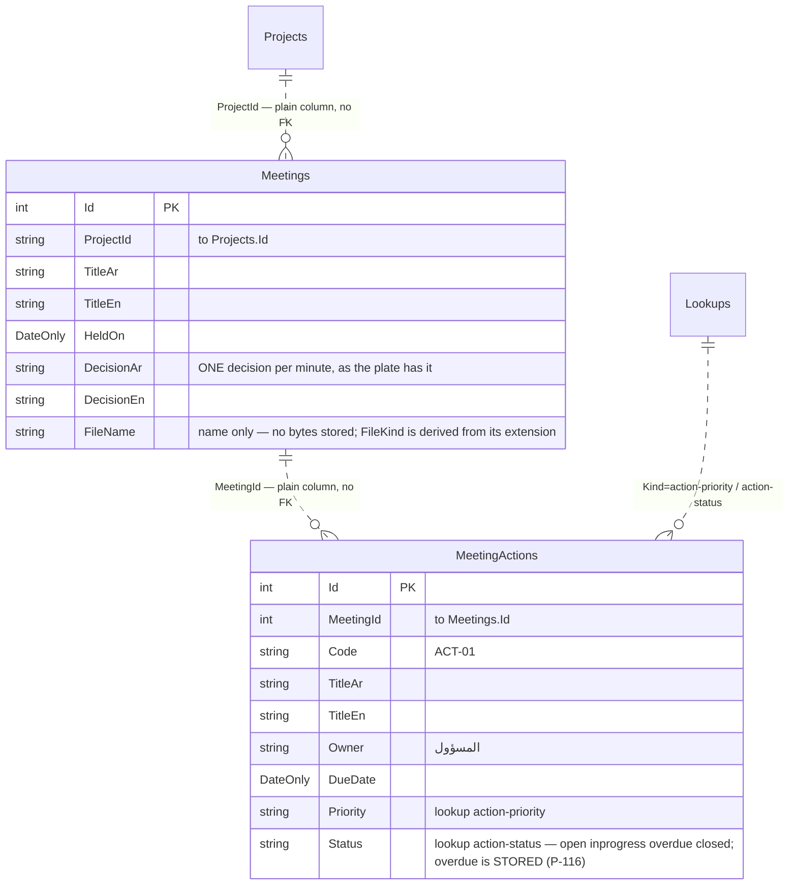
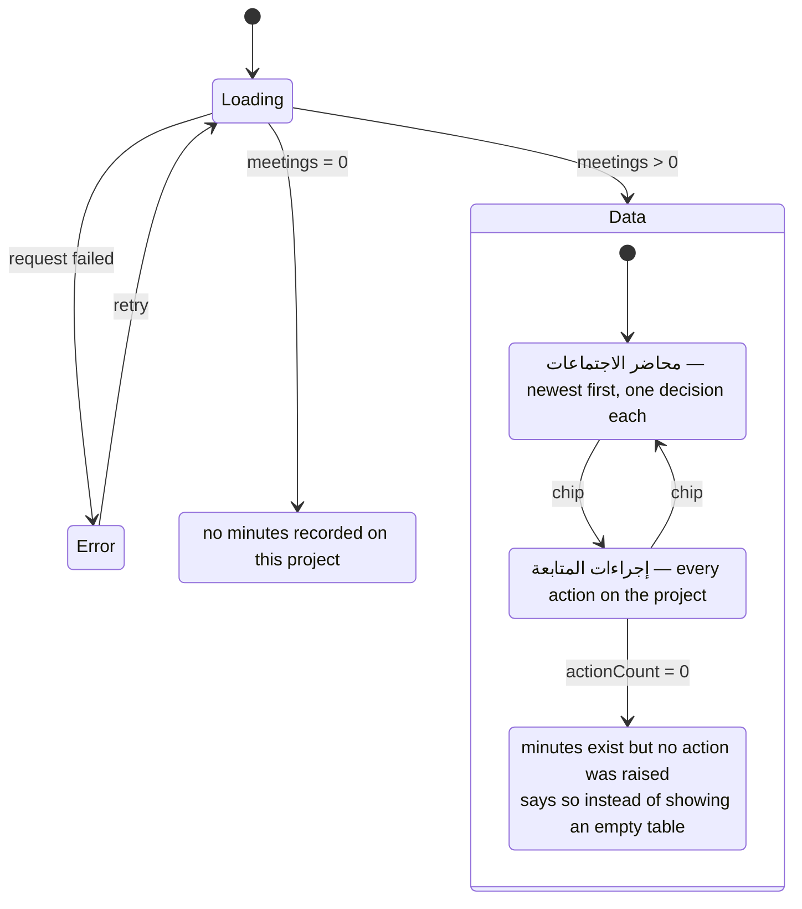

# UML — Meetings & Actions (Phase 6)

**SCR-W11** — الاجتماعات والإجراءات · **ملحق الشكل 45**.
Endpoint **`EP-MTG-01`** · `GET /api/projects/{projectId}/meetings`

Reference component: **`DModMeetings`** — `project-modules.jsx:1365`.

Two lists side by side: محاضر الاجتماعات — each minute carrying **one** قرار —
and إجراءات المتابعة, the actions those minutes produced.

**«متأخر» is a stored value, not a derivation** (P-116). The first cut computed
lateness from the due date against the project data date, the way BR-12 times a
payment desk. الشكل 45 refutes it on its own face: ACT-02 is due 2026-05-10
against a data date of 2026-08-11 and reads «قيد التنفيذ», while ACT-01 reads
«متأخر». Both are past due; only one is marked. This register is maintained by
whoever keeps the minutes, and lateness on it is their judgement.

---

## 1. What files make up this feature

> **No `Domain/` file.** This is the rare screen with no arithmetic at all —
> every value on it was typed into the minutes. Adding a rule here would be
> inventing one (see the P-116 note above).

---

## 2. What happens when the tab opens

---

## 3. What it reads and writes

**`EP-MTG-01` writes nothing.** Recording a minute, closing an action and
attaching a file are not built.

---

## 4. What the screen can look like

---

## 5. Where to change what

| Change | File |
|---|---|
| What the minute or the action carries | `api/Epm.Api/Features/Meetings/MeetingsEndpoints.cs` |
| A field on either list | `MeetingsDto.cs` **and** `meetings.types.ts` — same names |
| Priority / status names, including whether متأخر exists | `Lookups` rows `action-priority` · `action-status` — not code |
| Layout of the two lists | `meetings.page.html` |
| Screen chrome text | `core/lang.ts` `mtg_*` |

---

## 6. Known gaps

- **Read-only.** No minute is recorded and no action is closed from this screen.
- **One decision per minute.** الشكل 45 shows a single قرار per محضر, so
  `DecisionAr/En` are columns rather than a table. A minute with three decisions
  has nowhere to put the other two.
- **Attendees are not recorded.** The plate does not list them either.
- **No link to what an action is about.** An action referring to a change order
  or a BOQ item is plain text; nothing joins it to that record.
- **The two lists never scope each other.** Every action carries its
  `meetingId`, but the screen shows them as two chips over the whole project —
  which is what الشكل 45 draws. Filtering the actions to one minute is a
  one-signal change if it is ever wanted.
- **Lateness is nobody's job here.** Because «متأخر» is stored, an action can sit
  past its due date reading «قيد التنفيذ» indefinitely — which is what the plate
  shows, and a real deployment would want a report that says so.
