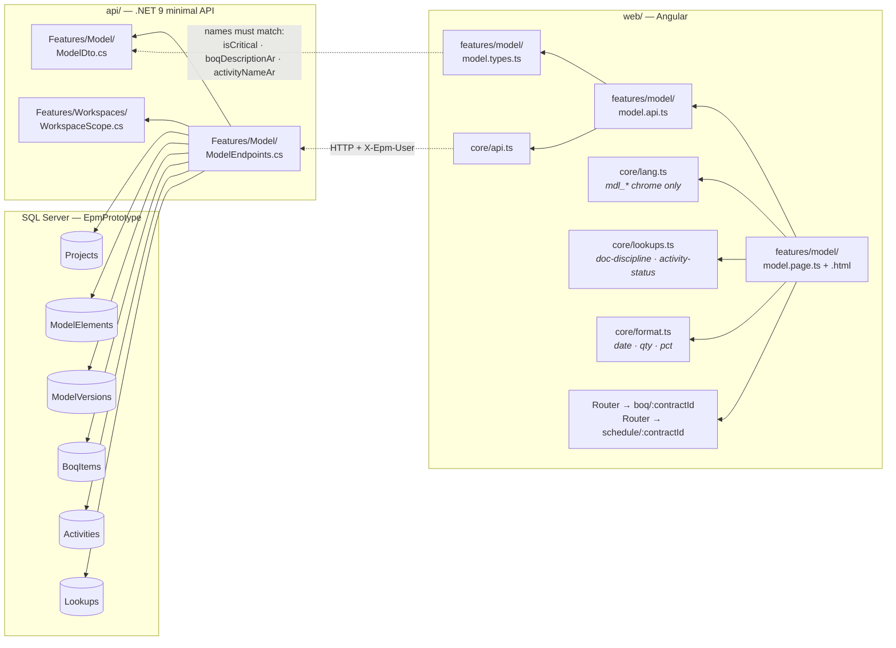
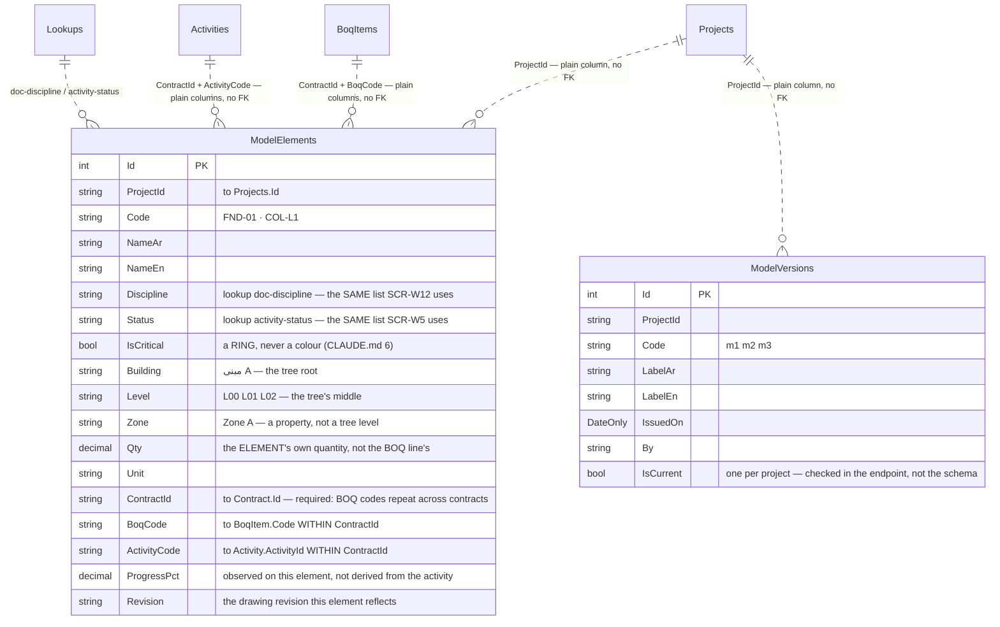
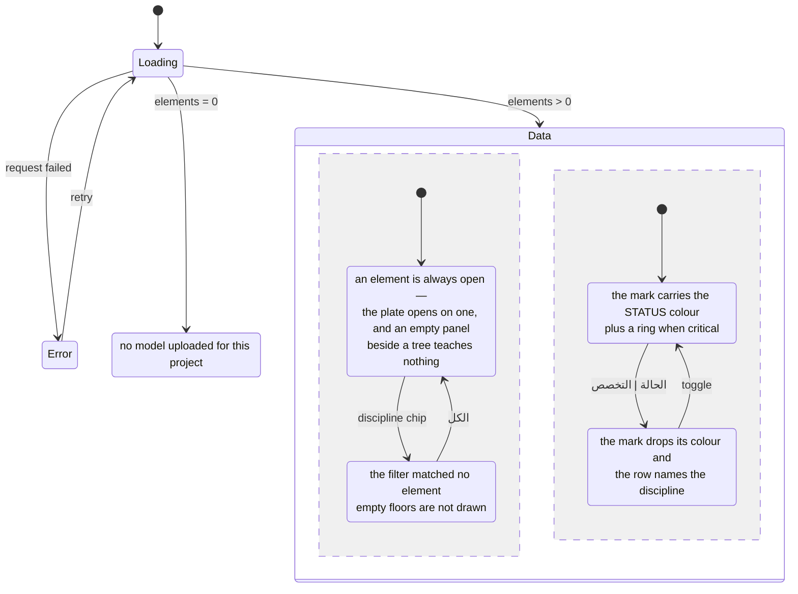

# UML — 3D Model (Phase 6, a deliberate stub)

**SCR-W10** — النموذج ثلاثي الأبعاد · **ملحق الشكل 44**.
Endpoint **`EP-MDL-01`** · `GET /api/projects/{projectId}/model`

Reference component: **`model-module.jsx`**.

`07 §8` lists this screen's centrepiece as out of Phase 1, in these words:
**real BIM/IFC rendering (keep the tab, stub the viewer)**. So this feature is
built to a rule: *everything on الشكل 44 that carries data is real, and the
scene is a placeholder that names itself* (P-120).

What survives that cut is the part the plate says the screen is FOR:

> «روابط العنصر ST-120 — أعمدة خرسانية و A4 — الهيكل الخرساني تربط النموذج
> ببنود حساب الكميات وبأنشطة الجدول الزمني والمخططات.»

An element names one BOQ line and one activity, and following either one lands
on the tab that owns it.

---

## 1. What files make up this feature



> **No `Domain/` file, and that is the finding.** Every figure here was
> observed and recorded — an element's status, its criticality, its own
> quantity, its percent complete — and the counts are counts. Adding a rule
> would be inventing one, the same call SCR-W11 made.

---

## 2. What happens when the tab opens

```mermaid
sequenceDiagram
  autonumber
  actor U as User
  participant PG as model.page.ts
  participant AP as model.api.ts
  participant EP as EP-MDL-01
  participant DB as SQL

  U->>PG: opens /projects/{id}/model
  PG->>AP: get(projectId)
  AP->>EP: GET /api/projects/{id}/model
  EP->>DB: Projects.First(Id)
  EP->>DB: Lookups.Where(Kind = "doc-discipline").OrderBy(Sort)
  EP->>DB: ModelElements.Where(ProjectId)
  Note over EP: ordered Building → Level → DISCIPLINE → Code (P-121)
  EP->>DB: BoqItems.Where(ContractId in element contracts)
  EP->>DB: Activities.Where(ContractId in element contracts)
  loop per element
    EP->>EP: resolve BoqCode and ActivityCode WITHIN its own ContractId
  end
  EP->>DB: ModelVersions.Where(ProjectId).OrderByDescending(IssuedOn)
  EP-->>AP: ModelResponse (tree + elements + versions + chips)
  AP-->>PG: data.set(model); select the first element
  PG-->>U: tree · stubbed scene + colour key · element panel

  U->>PG: clicks the BOQ link on an element
  PG->>PG: router.navigate(['/projects', id, 'boq', element.contractId])
  Note over PG: the CONTRACT travels with the link — switching<br/>contracts re-scopes everything (01 §1)
```

---

## 3. What it reads and writes



**No geometry is stored.** The `ModelObject` starting point carried X/Y/Z and
width/depth/height for a viewer `07 §8` puts out of Phase 1; those six columns
would have existed unread, so the table was pruned to what الشكل 44 shows
(CLAUDE.md §4) and renamed to the plate's own word, العنصر.

**`EP-MDL-01` writes nothing.** Uploading a model, re-issuing a version and
moving an element's status are not built.

---

## 4. What the screen can look like



The scene is in every one of those states the same thing: a placeholder naming
`07 §8`. It never spins, never loads and never pretends.

---

## 5. Where to change what

| Change | File |
|---|---|
| What an element carries, how the tree is grouped, how a link resolves | `api/Epm.Api/Features/Model/ModelEndpoints.cs` |
| A field on the element panel | `ModelDto.cs` **and** `model.types.ts` — same names |
| Discipline and status names, and the discipline ORDER | `Lookups` rows `doc-discipline` · `activity-status` — not code |
| The elements and versions themselves | `Features/Dev/Fixture.cs` `ModelElements(db)` — they are DATA |
| The three panes, the stub's wording, the colour key | `model.page.html` |
| The status mark and the critical ring | `web/src/styles.css` `.epm-model-mark` |
| Screen chrome text | `core/lang.ts` `mdl_*` |

---

## 6. Known gaps

- **The scene** (P-120). No geometry is stored and nothing renders one. The
  placeholder says so, and the plate's measure/section/snapshot toolbar is not
  drawn rather than drawn dead.
- **The version selector is a record.** Elements belong to the project, not to
  a version, so «what the model looked like at m2» cannot be shown without the
  scene. The list states which issue is current; picking an older one is not
  offered.
- **No المخطط / الصور panes.** الشكل 44 has a bottom switch to a drawing sheet
  and a photo gallery. The drawing half now has real data — SCR-W12's
  `DocumentRevisions` — but nothing links an element to a revision, and no
  photo is stored at all.
- **Nothing writes.** No upload, no re-issue, no status move. An element's
  status and progress are fixture values; in production they would come from
  the same place SCR-W6 moves progress.
- **Discipline order follows the lookup, not الشكل 44** (P-121). The two plates
  disagree and one shared list can only have one order.
