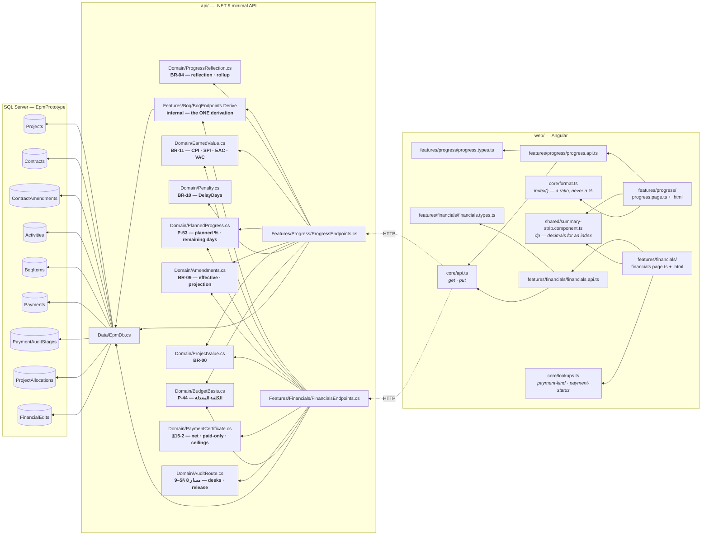
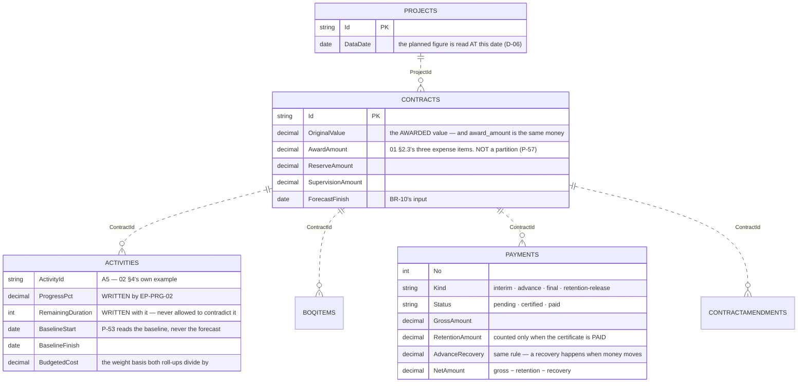
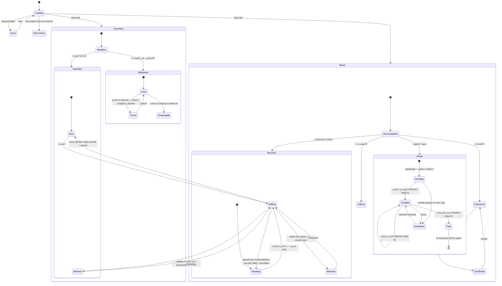

# UML — Progress + Financials (Phase 4.4)

**SCR-W6** — where an activity's progress is entered and BR-04 reflects it onto
the BOQ. **SCR-W7** — the project's money: approved, revised, disbursed, and the
two balances neither of those contains.

Endpoints **`EP-PRG-01`**, **`EP-PRG-02`**, **`EP-FIN-01`**, **`EP-FIN-02`**,
**`EP-FIN-03`** and **`EP-FIN-04`**.

Reference components: **`DModProgress`** `app/project-modules.jsx:1391` ·
**`DModFinancialNew`** `:907` — the v1.1 branch, `../epm@design/system-revamp`.

> **The two screens are documented together because they are one derivation.**
> Physical %, EV, SPI and CPI appear on both, and both read them from the same
> `BoqEndpoints.Derive` and the same `Domain/EarnedValue` call. Splitting the
> document would be the first step towards splitting the arithmetic (P-54).

---

## 1. What files make up these features



---

## 2. The write, end to end — `02 §4`'s own example

```mermaid
sequenceDiagram
  autonumber
  participant U as User
  participant PG as progress.page.ts
  participant A as progress.api.ts
  participant EP as ProgressEndpoints.cs
  participant D as Domain/
  participant DB as SQL Server

  U->>PG: opens /projects/PRJ-0279/progress
  PG->>A: get(projectId)
  A->>EP: GET …/progress  [EP-PRG-01]
  EP->>DB: Contracts · Activities · Payments · ContractAmendments
  EP->>EP: BoqEndpoints.Derive(contract, "cost")  — the ONE derivation
  EP->>D: ProgressReflection.For(links, amount, qty)
  D-->>EP: BQ-003 31.64% → 8,456,400  (BR-04)
  EP->>D: PlannedProgress.PlannedPct(baseline, asOf)
  D-->>EP: 100% — the baseline required it all by 2026-08-02  (P-53)
  EP->>D: EarnedValue.For(budget, planned, actual, ac)
  D-->>EP: SPI 0.49 · CPI 1.99  (BR-11)
  EP-->>PG: ProgressResponse

  U->>PG: types 100 into A5's box
  Note over PG: BLOCKED BEFORE THE REQUEST if outside 0–100,<br/>or if a milestone is given anything but 0 or 100.<br/>The endpoint checks both again (04 §9).
  PG->>A: saveProgress(projectId, "A5", 100)
  A->>EP: PUT …/progress/activities/A5  [EP-PRG-02]
  EP->>EP: scope check — A5's contract belongs to this project, else 404
  EP->>D: PlannedProgress.RemainingDuration(121, 100) → 0
  EP->>DB: UPDATE Activities SET ProgressPct, RemainingDuration
  EP->>EP: rebuild the WHOLE model
  EP-->>PG: ProgressResponse
  Note over PG: BQ-003 → 52.73%, achieved 14,094,000;<br/>the contract roll-up, the project's physical %,<br/>EV, SPI and CPI all move with it.
```

**The response is the whole model, never the row that changed.** One activity's
progress moves every BOQ line it feeds, the contract executed value above those,
the project physical %, and through it EV, SPI and CPI. Patching one row into a
cached model would leave five figures on screen that no longer agree.

---

## 3. What they read and write



**Written by these screens:** `Activities.ProgressPct` and
`Activities.RemainingDuration`, by `EP-PRG-02`. And by SCR-W7, which writes
three tables now: `EP-FIN-02` registers a certificate, its attachments and its
audit route (ملحق الشكل 20); `EP-FIN-03` walks that route — المسار 8 steps 5–9 —
writing `PaymentAuditStages.FinishedAt` and, through `Domain/AuditRoute` alone,
`Payment.Status`/`CertifiedDate`/`PaidDate`; and `EP-FIN-04` is ملحق الشكل 18,
«مدخل التحرير الوحيد للبيانات المالية للمشروع», writing `Projects.PlannedCost`,
`Projects.RevisedCost`, `Projects.TransferState`, `ProjectAllocations` and one
`FinancialEdits` row per changed field.

**Derived, never stored:** physical %, financial %, planned %, every BOQ line's
progress / achieved quantity / achieved amount / remaining value, contract
executed value, revised cost, disbursed, retention held, advance outstanding,
balance, and all four EVM indices.

---

## 4. What the screens can look like



---

## 5. Where to change what

| To change… | Edit |
|---|---|
| how a BOQ line's progress follows its activities | `Domain/ProgressReflection.cs` |
| what "planned" means, or the remaining-duration formula | `Domain/PlannedProgress.cs` |
| any EVM index | `Domain/EarnedValue.cs` |
| what a progress write refuses | `Features/Progress/ProgressEndpoints.cs` — and the mirror check in `progress.page.ts`'s `draftError` |
| what counts as disbursed, retained or recovered | `Domain/PaymentCertificate.cs` |
| either of §15-2's two spend ceilings | `Domain/PaymentCertificate.Ceilings` |
| the audit route's desks, their caps, or what releasing one means | `Domain/AuditRoute.cs` |
| which figure «الكلفة المعدلة» names, on ALL THREE screens | `Domain/BudgetBasis.cs` |
| who may release a desk, or edit the recorded figures | `Features/Dev/Personas.cs` |
| an index's rendering (a ratio, never a percentage) | `core/format.ts` `index()` |
| a KPI tile's decimals | `Stat.dp` in `shared/summary-strip.component.ts` |
| a column heading, a button, an empty state | `core/lang.ts` (`prg_*`, `fin_*`) |
| SCR-W7 chrome — the pinned equation, the year selector, the status bar | `.d-fsheet-recon` · `.d-yearsel` · `.d-pz10` in `styles/desktop.css`, all copied from the reference — grep before writing a rule (P-186 · P-187) |
| a payment **kind or status label** | `Features/Lookups/LookupCatalog.cs` — never `lang.ts` |

---

## 6. Known gaps

- **A component has no forecast of its own** (P-90). BR-11 forecasts from a CPI
  and an expense item has no earned value to form one; apportioning the
  contract's EAC across three lines would be an allocation rule no document
  states, so the column prints an em dash on those rows.
- **No official payment code** (P-79). «دفعة N» is the sequential number on the
  contract; الشكل 9's `PAY-100` is fixture data and no scheme is invented.
- **The 90% alerts do not fire from live figures.** R2 and R9 warn at 90% of the
  allocation and of the revised cost; `Alerts` rows are seeded, and only the
  100% CEILINGS are enforced, by `EP-FIN-02` and `EP-FIN-03` (P-182).
- **No multi-currency** (P-185). العرض الفني §16 puts USD in Phase 1; «د.ع» is
  hard-coded, and the change belongs to the contract, not to this screen.
- **Progress does not move an activity's STATUS.** `ProgressPct` and `Status`
  are separate columns (`06 §9`), and a status is set by the section that owns
  the work. An activity can therefore read 100% and «متأخر» at once — which is
  true, and is what a late-but-finished activity is.
- **The S-curve is absent.** The reference generates it with a smoothstep over
  the project span. A curve of fabricated points cannot be labelled unavailable,
  so there is none — the same call SCR-W1 already made.

---

## 7. Three things worth knowing before changing these screens

**Planned progress is an ASSUMPTION, and it is the one figure here that is**
(P-53). `02` never defines it, but BR-11 needs it. It is linear across each
activity's own baseline span, on the same cost weights physical % uses, so SPI
compares like with like and a reader can re-derive it from two columns already
on the Schedule screen. Replacing it is one function.

**Paid is not certified, anywhere** (P-26). Disbursed, retention held and
advance outstanding all count PAID certificates only. `CNT-0279`'s third
certificate is certified and unpaid on purpose: counting it would report
2,425,000 of retention the ministry is not holding and 4,850,000 of advance the
contractor has not repaid.

**The three expense items are not parts of the contract** (P-57). `01 §2.3`
defines `original_value` as "the awarded value" and `award_amount` is that same
money, so award + reserve + supervision exceeds every contract by exactly the
two allowances. They live in their own table with their own heading; rendered as
an indented sub-tree they would out-total the row above them.

**«الكلفة المعدلة» is TWO different figures and الشكل 14 prints both** (P-180).
The reconciliation strip runs on the RECORDED budget — الشكل 18's pair, stored
on the project — and the sheet's footer totals the contracts' commitments. On
the plate those are 1,500,000,000 and 2,156,653,454, and «أساسا القياس» is the
box that exists to raise the difference. Everything that divides by «المعدلة»
divides by the budget: العرض الفني §23-1 defines الإنجاز المالي as «المصروف
التراكمي نسبةً إلى الكلفة المعدلة», which is the denominator P-44 could not fix.
`Domain/BudgetBasis` holds it and all three screens call it, so changing the
basis is one function and never three.
