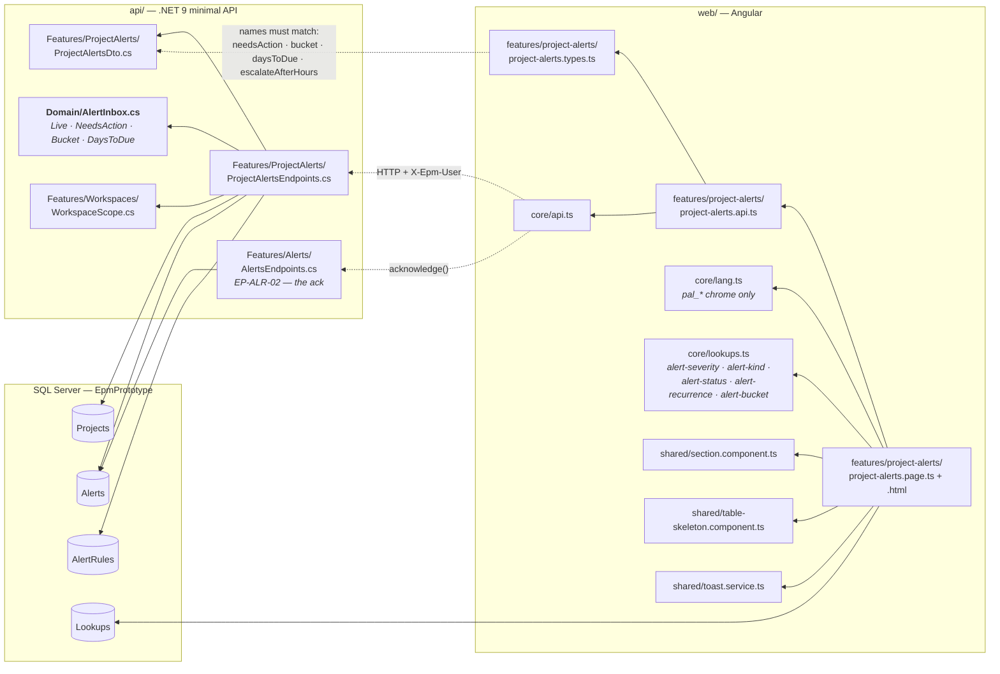
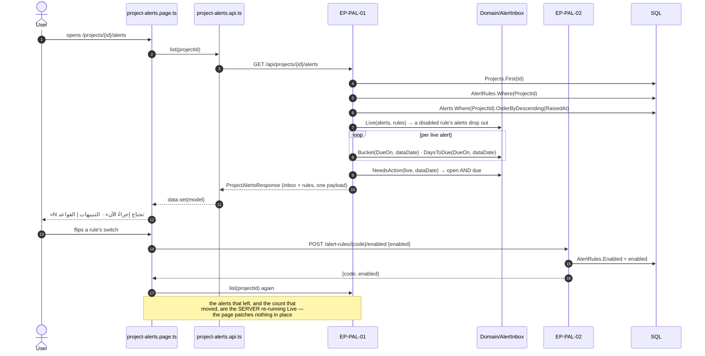
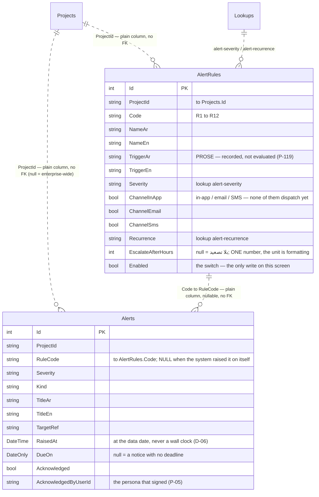
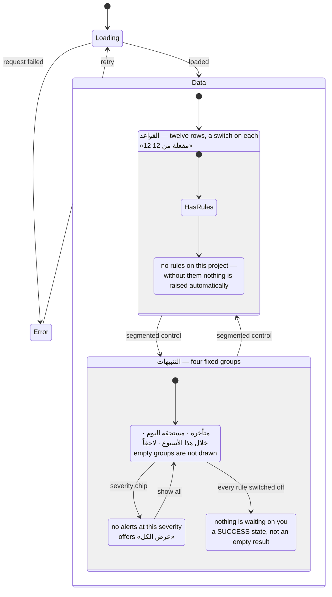

# UML — Project Alerts (Phase 6)

**SCR-W13** — التنبيهات · **ملحق الشكل 47**.
Endpoints **`EP-PAL-01`** · **`EP-PAL-02`**

Reference component: **`DModAlerts`** — `alerts-module.jsx:20`.

The plate carries a notice of its own, above the rules table:

> «إيقاف قاعدة يوقف التنبيهات التي أنتجتها فورًا — التنبيه ليس سجلًا مستقلًا
> يُحرَّر.»

That sentence is a rule, not a caption. It is `Domain/AlertInbox.Live`, and the
switch on every row of the table proves it: turning R5 off takes the footer from
«التنبيهات 8 · تحتاج إجراءً 3» to «7 · 2», and turning it back on restores both
— with the acknowledgements already recorded on those alerts intact.

---

## 1. What files make up this feature

> **Acknowledging is not this feature's write.** It is the Alerts Centre's
> `EP-ALR-02`, reused. One acknowledgement path means one place the persona is
> recorded (P-05); a second one here would be a second answer to who signed.

---

## 2. What happens when the tab opens

---

## 3. What it reads and writes

**Nothing about the suppression is stored.**

| Not a column | Why | Where it comes from |
|---|---|---|
| `Suppressed` on the alert | A rule switch would have to rewrite every alert it produced, and a half-finished sweep leaves the two disagreeing | `AlertInbox.Live` filters at read time |
| `Bucket` | It changes every day without anything being written | `AlertInbox.Bucket(DueOn, dataDate)` |
| `NeedsAction` count | A stored counter goes stale the moment a rule is switched or an alert acknowledged | `AlertInbox.NeedsAction` |
| A parsed trigger expression | Nothing evaluates it — claiming otherwise is the defect (P-119) | prose in `TriggerAr/En` |

`EP-PAL-02` writes **one bool**. `EP-PAL-01` writes nothing.

---

## 4. What the screen can look like

An empty inbox is **not** "no records found". It is the healthy state, and it
says so with its own icon and its own words (`04 §9`).

---

## 5. Where to change what

| Change | File |
|---|---|
| What suppression means, what «تحتاج إجراءً» counts, where a group's boundary falls | `api/Epm.Api/Domain/AlertInbox.cs` |
| What the row or the rule carries, the chip counts | `api/Epm.Api/Features/ProjectAlerts/ProjectAlertsEndpoints.cs` |
| A field on either list | `ProjectAlertsDto.cs` **and** `project-alerts.types.ts` — same names |
| Severity, kind, recurrence and group names | `Lookups` rows — not code |
| The twelve rules themselves | `Features/Dev/Fixture.cs` `AlertRules(db)` — they are DATA |
| Layout, the switch, the group order on screen | `project-alerts.page.html` |
| Screen chrome text, the Arabic day forms | `core/lang.ts` `pal_*` |

---

## 6. Known gaps

- **No engine** (P-119). No scheduler evaluates a trigger, and no channel
  dispatches: «داخل النظام · بريد · رسالة» describes where a notification would
  go. `07 §2` lists real email and SMS as POC work. The screen states this under
  the table rather than leaving the reader to assume.
- **No rule editor.** الشكل 47 shows a «ضبط قواعد التنبيه» button; the switch is
  built and the editor behind that button is not. Severity, channels, recurrence
  and the escalation ceiling are fixture data.
- **No escalation timeline.** The reference's detail pane walks a rule's
  escalation chain — مدير المشروع → مدير القسم → الوكيل الفني — and nothing
  records those steps here, so no pane is drawn.
- **No snooze.** The reference feed carries a third status; nothing in `02` or
  `03` says when a snooze expires or who may set one, so it is not stored
  (`Alert.cs`).
- **Rules are per project with no catalogue.** A second project needs its own
  twelve rows; there is no enterprise default set to inherit from.
