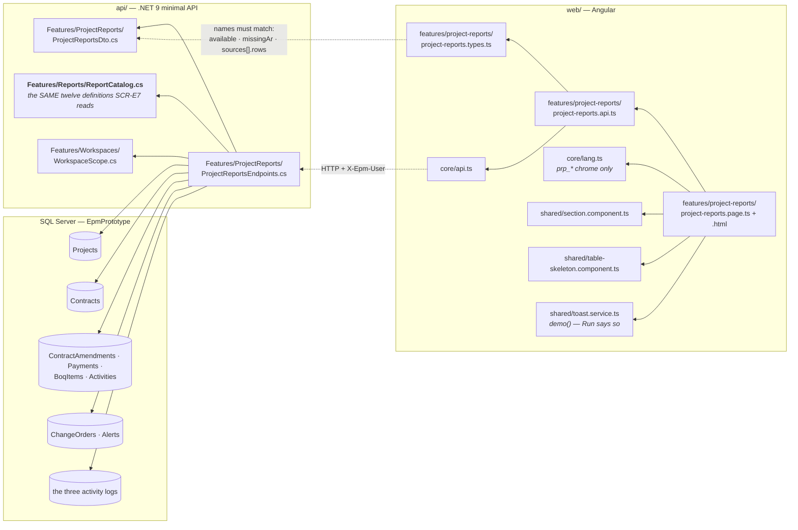
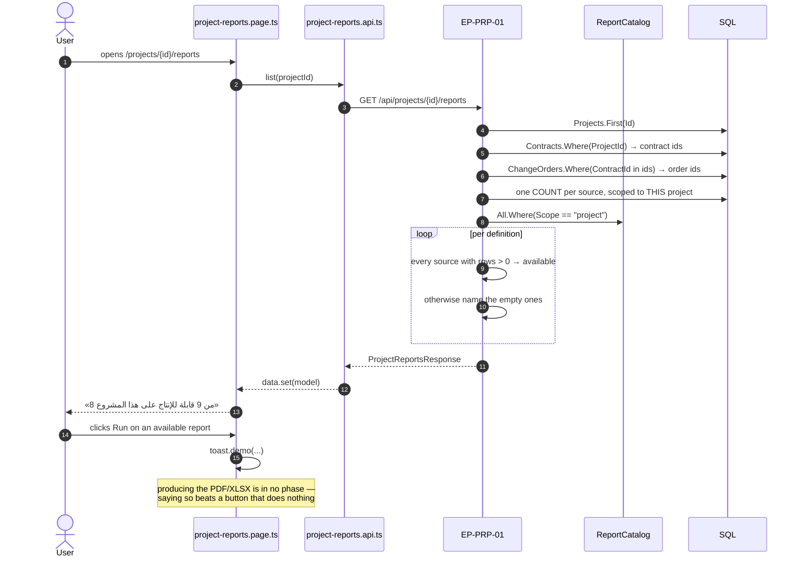
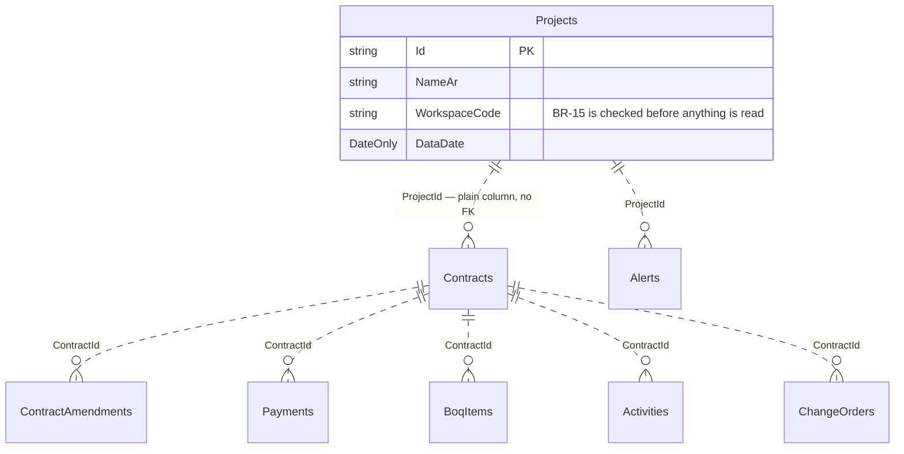
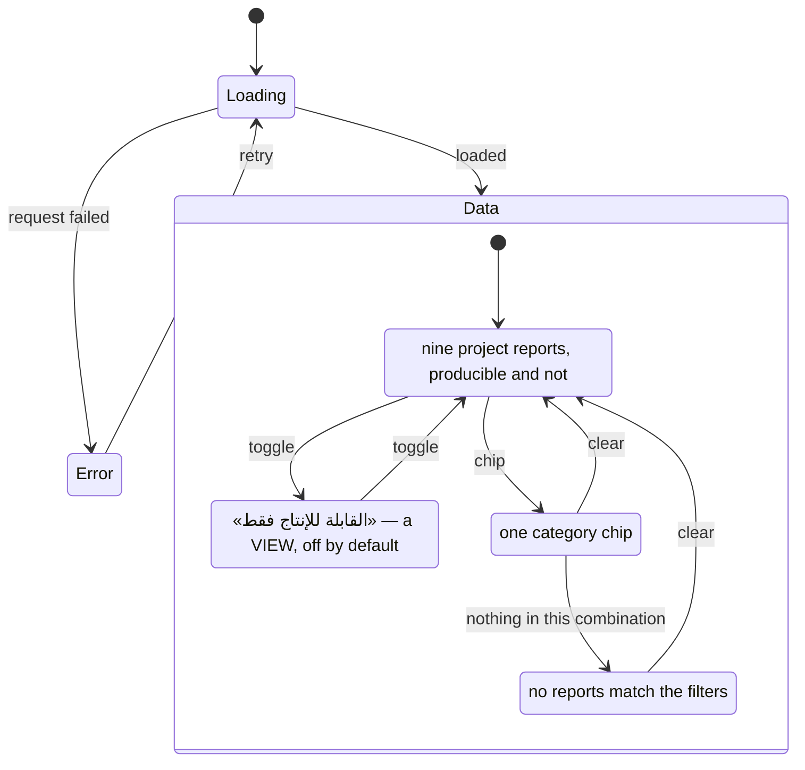

# UML — Project Reports (Phase 6)

**SCR-W14** — التقارير والتحليلات, the project tab · `04 §3`.
Endpoint **`EP-PRP-01`** · `GET /api/projects/{projectId}/reports`

Reference component: **`DModReports`** — `project-modules.jsx:2771`.

**One catalogue, two questions** (P-123). This screen and SCR-E7 read the same
`ReportCatalog` — there is exactly one list of the reports this system defines.
What differs is what each asks of a row:

| Screen | Question | Answer comes from |
|---|---|---|
| SCR-E7 | can this report be produced **at all**? | is the table registered in `EpmDb` |
| SCR-W14 | can it be produced **for this project**? | does the project have rows in it |

The second is the sharper question and it has a different answer. RPT-09
«الأوامر التغييرية» is available ministry-wide the moment the table exists, and
on a project with no change order there is still nothing to print.

---

## 1. What files make up this feature

> **Category and frequency labels come from the CATALOGUE, not from Lookups.**
> A report definition owns its own vocabulary (see `ReportCatalog`'s header):
> no table stores `RPT-01` or `fin`, so splitting the labels into `Lookups`
> would put one definition behind two mechanisms.

---

## 2. What happens when the tab opens

---

## 3. What it reads and writes

> **No table of its own, and every table read as a COUNT.** This feature stores
> nothing and computes nothing; the only figures on the screen are how many rows
> this project has in each source. A report DEFINITION lives in
> `ReportCatalog.cs` — code, not data — for the reasons that file's header sets
> out.

**`EP-PRP-01` writes nothing.**

---

## 4. What the screen can look like

There is no "empty database" state: the catalogue is code, so the register
always has nine rows. What varies is how many of them this project can produce.

---

## 5. Where to change what

| Change | File |
|---|---|
| The reports themselves — title, category, frequency, formats, sources | `api/Epm.Api/Features/Reports/ReportCatalog.cs` — **shared with SCR-E7** |
| How availability is decided, which sources are counted | `ProjectReportsEndpoints.cs` |
| What a source is CALLED on this screen | `ProjectReportsEndpoints.SourceNames` |
| A field on a row | `ProjectReportsDto.cs` **and** `project-reports.types.ts` — same names |
| Column layout, the toggle | `project-reports.page.html` |
| Screen chrome text | `core/lang.ts` `prp_*` |

---

## 6. Known gaps

- **Nothing is produced.** No PDF, no XLSX, in any phase of this build. The
  Run button says «تجريبي» in the reference's own wording.
- **No preview.** `DModReports` renders a figure strip and two charts per
  report. Those figures already exist behind `EP-OVW-01`, `EP-FIN-01` and
  `EP-SCD-01`; rendering them here would be a fourth place the same numbers are
  drawn, and the first place they could disagree. A preview should read those
  endpoints rather than recompute, which is a design decision worth taking
  deliberately rather than in passing.
- **No period selector.** The reference offers شهري/ربعي/سنوي over a preview
  that does not exist here yet.
- **RPT-12 can never be available.** «الفقرات التجهيزية» has no table and no
  documented starting point; it says so instead of naming a phase (`07 §9`).
- **Availability is all-or-nothing per source.** A report reading three sources
  needs rows in all three. That is right for a report that joins them and
  arguably strict for one that unions them — RPT-11 reads all three activity
  logs and would still be partly printable with one of them empty.
