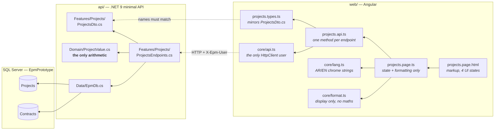
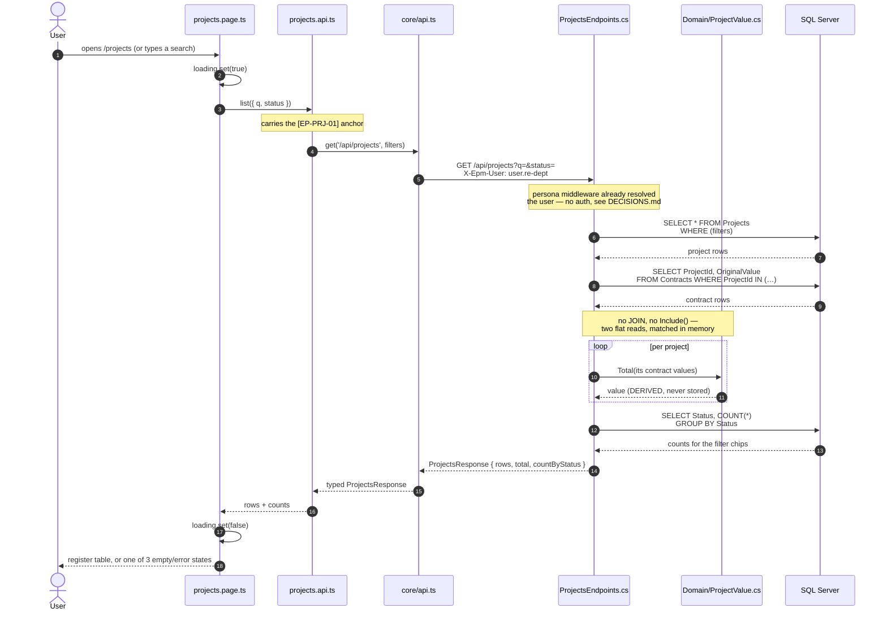
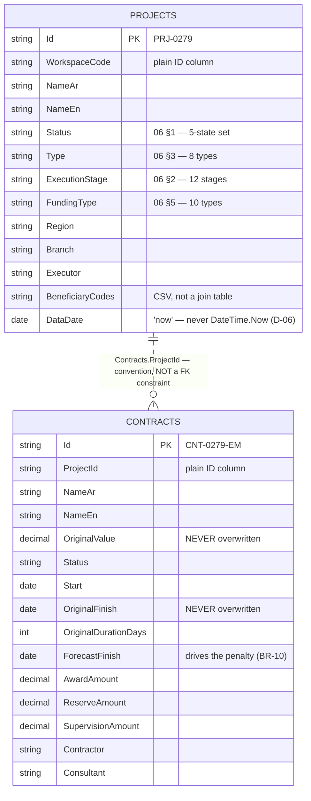
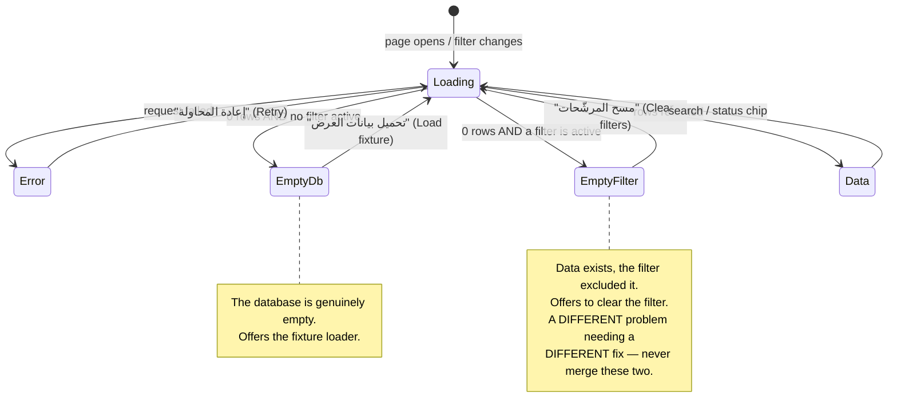

# UML — Projects list (SCR-E2)

The cross-portfolio project list (`04 §2`). Route `/projects`.
Endpoint **`EP-PRJ-01`** · `GET /api/projects`

---

## 1. What files make up this feature

Everything you would touch to change this screen. Nothing else in the repo is involved.

> **The dotted line between `projects.types.ts` and `ProjectsDto.cs` is the contract that makes tracing work.** Member names are identical on both sides, so `grep -rn "contractCount"` finds the TypeScript interface, the C# record, and the endpoint projection in one search.

---

## 2. The request, end to end

What actually happens when the page loads or a filter changes.

**Why three queries instead of one join:** flat reads are the whole storage model here — no navigation properties, no foreign keys. You can read exactly what hits the database. That costs a query; it buys never wondering what EF generated.

---

## 3. The data it reads

**Three things this diagram is telling you:**

- **The dotted relationship is deliberate.** There is no foreign key in the database. `Contracts.ProjectId` is just a string column; the relationship exists only in the `Where()` clause of the endpoint, where you can read it.
- **There is no `Value` column on `PROJECTS`.** Project value is Σ contract values, computed per request (`01 §3`). Adding that column would be a defect.
- **`OriginalValue` and `OriginalFinish` are never overwritten.** Amendments layer on top of them (handoff non-negotiable #6). The Contract page adds that layer; the signature of `ProjectValue.Total` does not change when it does.

---

## 4. The four states this screen can be in

The database starts **empty** — nothing is seeded on boot — so the empty state is load-bearing, not decoration (`04 §9`).

---

## 5. Where to change what

| You want to… | Touch these, in this order |
|---|---|
| Add a column to the table | `Project.cs` → `ProjectsDto.cs` → `projects.types.ts` → `projects.page.html`, then `POST /api/dev/reset` |
| Change how a figure is displayed | `core/format.ts` only |
| Change a filter or the query | `ProjectsEndpoints.cs` only |
| Change how project value is calculated | `Domain/ProjectValue.cs` only — it is the single definition |
| Change a label | `core/lang.ts` (UI chrome) — enum labels will move to the `Lookups` table |
| Restyle anything | Look in `web/src/styles/` first. Only add to `web/src/styles.css` if the class genuinely does not exist |

---

## 6. Known gaps

- **`ExecutionStage` renders its raw code** (`finishes`, `handover`) instead of an Arabic label. The `Lookups` table (`06`) is not wired yet; the page that adds it fixes every enum column across the app at once.
- **Project value uses `OriginalValue`.** It should use the *effective* value — original plus applied amendment deltas (`02 §9`). The Contract page adds `ContractAmendments`; only the argument passed to `ProjectValue.Total` changes.
- **`physicalPct` / `financialPct` are absent.** They need BOQ progress (BR-04) and payments respectively.
