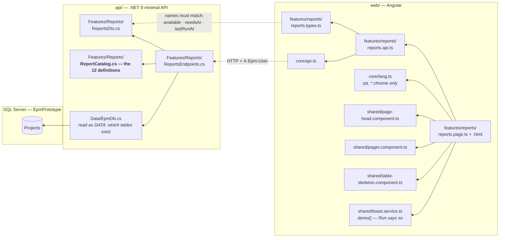
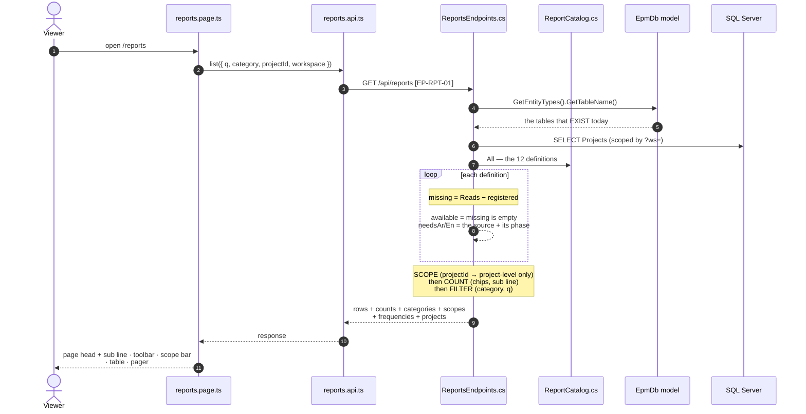
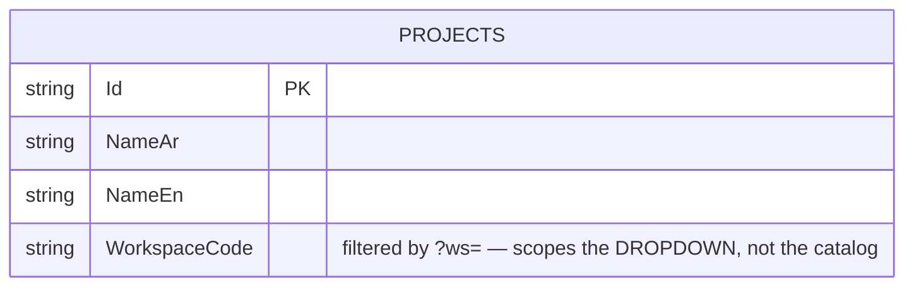
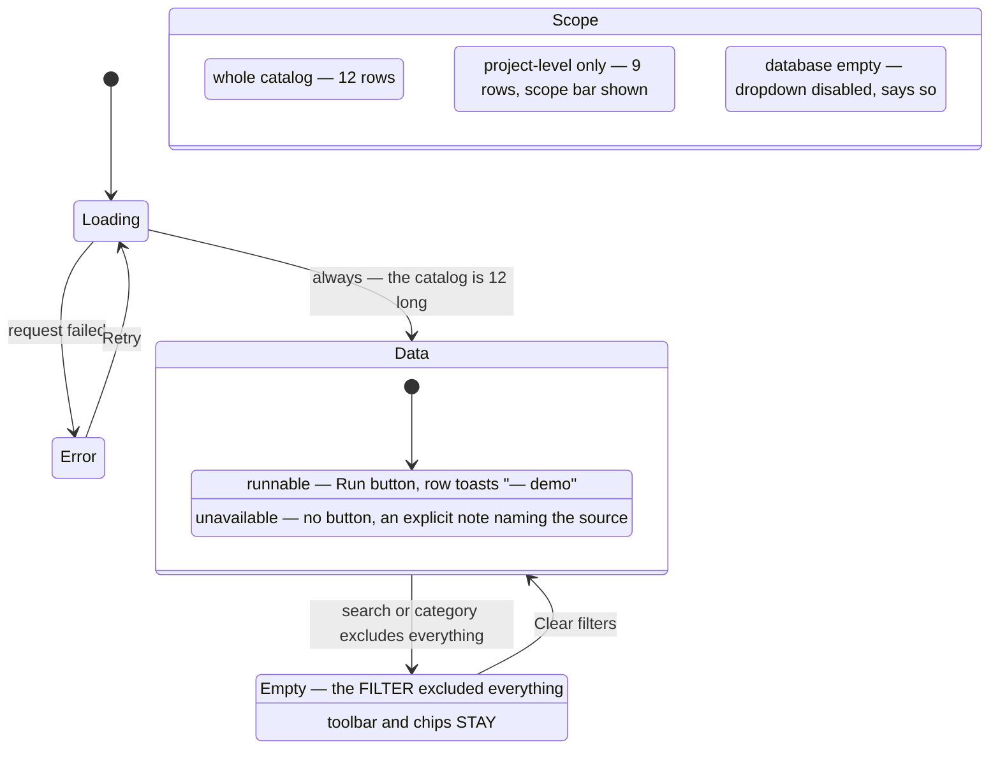

# UML — Reports & Analytics (Phase 2.6)

**SCR-E7** — the gate every defined report is run from (`04 §2`).
Endpoint **`EP-RPT-01`** · `GET /api/reports`

Reference component: **`DReports`** — the v1.1 branch,
`../epm@design/system-revamp` `app/desktop-reports.jsx:58`.

This is the screen that says what the system can and cannot tell you. Twelve
reports are defined; **three of them can be produced today** and the other nine
name the table they are waiting for and the phase that builds it. That figure
moves on its own as later phases register their DbSets — nothing in this feature
has to be edited for a row to become runnable.

---

## 1. What files make up this feature

> **No table of its own, and one it reads twice over.** The only rows this
> feature queries are `Projects`, for the scope dropdown. `EpmDb` appears a
> second time as **data**: the endpoint reads the EF model to find out which
> tables the system actually has, which is what makes `available` true or false.

---

## 2. The request, end to end

Every filter is a round trip. The chip counts and the table rows have to agree,
and only one of the two can own that arithmetic.

---

## 3. What it reads

**Writes nothing, and stores nothing.** The catalog is not a table: it is
`Features/Reports/ReportCatalog.cs`, twelve records long, and it is the same
twelve on a database that has never been loaded.

### Where each value comes from

| Value | Source | Note |
|---|---|---|
| Title · description · formats | `ReportCatalog` | AR verbatim from the v1.1 reference |
| Category · scope · frequency | `ReportCatalog` | code + both labels, the shape `EP-LKP-01` sends |
| `available` | `EpmDb` model ∩ the row's `Reads` | true for RPT-06 · RPT-08 · RPT-10 |
| `needsAr` / `needsEn` | `ReportsEndpoints.SourceNeeds` | the missing table and the phase that builds it |
| `lastRunAt` | — | **always null**; nothing has ever run a report |
| Project options | `Projects`, scoped by `?ws=` | id + both names, nothing else |

### Why nine rows are unavailable

| Report | Waiting for | Phase |
|---|---|---|
| RPT-01 · RPT-02 · RPT-03 | `Payments` | 4.1 |
| RPT-04 | `BoqItems` + `Payments` | 4.2 · 4.1 |
| RPT-05 | `BoqItems` | 4.2 |
| RPT-07 | `Activities` | 4.3 |
| RPT-09 | `ChangeOrders` | 5.1 |
| RPT-11 | `AuditEvents` | 6 |
| RPT-12 | `SupplyItems` | not modelled at all |

---

## 4. What the screen can look like

**There is no "empty because the database is empty" state for the table**, and
that is not a missing state — it is what a catalog is. The database being empty
shows up in exactly one place, the scope dropdown, which disables itself and
says «لا مشاريع بعد» rather than presenting an empty list.

---

## 5. Where to change what

| Change | File |
|---|---|
| A report's title, description, formats, category, scope, frequency | `api/…/Features/Reports/ReportCatalog.cs` |
| A new report | same file — add a `Definition`, declare its `Reads` |
| What a missing source is called and when it arrives | `ReportsEndpoints.SourceNeeds` |
| Scoping, counts, filtering, ordering | `api/…/Features/Reports/ReportsEndpoints.cs` |
| A column, its order, the row layout | `web/…/features/reports/reports.page.html` |
| Filter behaviour, label resolution, the sub line | `…/reports.page.ts` |
| Chrome strings | `web/src/app/core/lang.ts` (`rpt_*`, `col_*`) |
| The payload shape | `ReportsDto.cs` **and** `reports.types.ts` |

**A report becomes runnable by registering its DbSet in `EpmDb`.** Nothing in
this feature is edited: `available` is computed from the model.

---

## 6. Known gaps

| # | Gap | Why it is a gap and not a defect |
|---|---|---|
| 1 | **No report is actually produced.** Run fires the reference's own «— تجريبي / — demo» toast. | Rendering a PDF or an XLSX is in no phase of ROADMAP.md. The reference toasts too. What this port adds is that only the three rows whose data exists carry the button at all. |
| 2 | **`lastRunAt` is always null**, so the column is twelve em dashes. | There is no `ReportRuns` table, because nothing runs a report. The reference hard-codes a date per row; that would be a fabricated audit fact here (P-09). The column stays because it is the reference's, and it becomes real the day a run is recorded. |
| 3 | **Scheduling is a stub.** The «المجدولة» page-head button toasts. | `Frequency` is a *declared* cadence, part of the definition — not a scheduler. A scheduler needs a job runner, which no phase asks for. |
| 4 | **«تقرير مخصّص» is a stub.** | A custom-report builder is a product in its own right; the reference's button is a stub too. |
| 5 | **Rows do not open anything.** The reference's whole row is a run trigger; ours is not clickable and the action lives only in the button. | With nine of twelve unrunnable, a clickable row would be a click target that does nothing on three quarters of the table. |
| 6 | **No Export button.** | v1.1's `DReports` does not have one — that was the pre-v1.1 chart board. Exporting the *catalog* is not a thing anyone asked for. |
| 7 | **The catalog is not maintainable by the client.** Adding a report is a code change. | Unlike a lookup value, a report definition is a capability — the code that renders it and the code that declares it are the same change. See P-37 / the catalog's own remarks. |

---

## 7. Three things this screen does that the reference does not

**It says which reports it can actually produce.** Each definition declares the
tables it reads; the endpoint compares that against the tables registered in
`EpmDb` — read from the EF model, not from a second hand-maintained list. Nine
of the twelve name their missing source and the phase that builds it, in the
row, in words. The reference makes every row runnable because in a clickable
prototype every row toasts. Here that would assert twelve capabilities the
system does not have, on the one screen whose subject is what the system knows
about itself. Same "unavailable + reason" contract as SCR-E1's EVM tiles and
SCR-E5's critical-path tile (P-09, P-38).

**It does not invent a last-run date.** Twelve em dashes are the truth: no
report has ever been run and there is nowhere to record that one had been.

**Its chip counts move with the scope and hold still under the filters.**
Choosing a project genuinely removes the portfolio-level reports from the
catalog, so the chips recount — 12 → 9. Typing in the search box or picking a
chip does not, or the numbers would dance under the cursor. The reference counts
the full catalog always, so its chips can read higher than the rows they filter.
