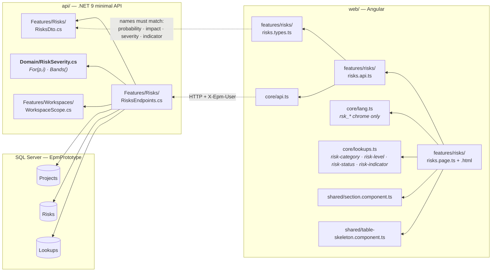
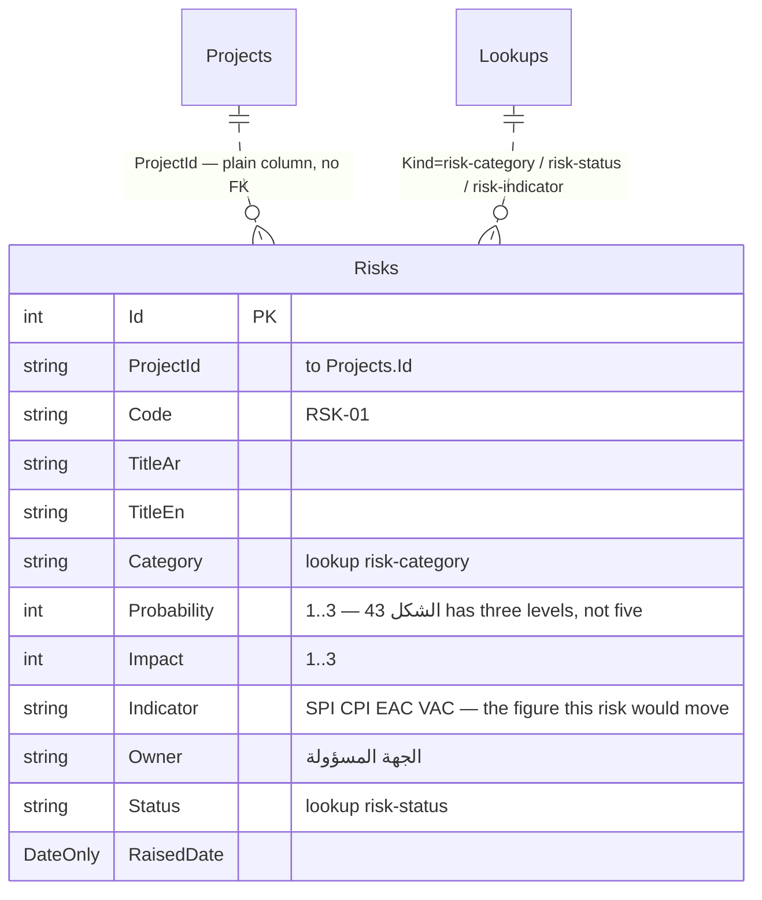
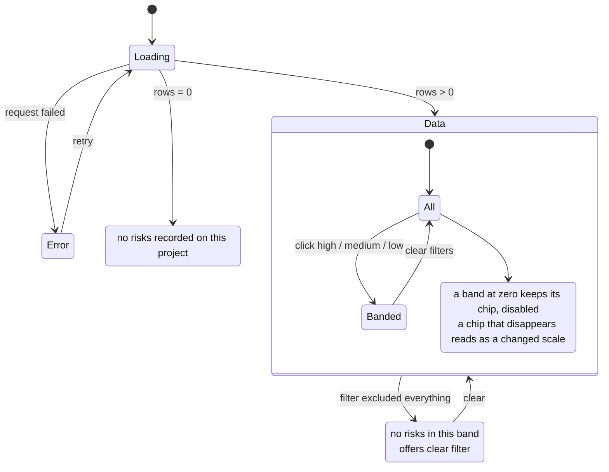

# UML — Risk Register (Phase 6)

**SCR-W9** — سجل المخاطر · **ملحق الشكل 43**.
Endpoint **`EP-RSK-01`** · `GET /api/projects/{projectId}/risks`

Reference component: **`DModRisk`** — `project-modules.jsx:1693`.

**The plate wins over the reference here.** `DModRisk` draws the familiar 5×5
probability/impact matrix; الشكل 43 scores on **three** levels — عالية · متوسطة ·
منخفضة. A 5×5 would need two levels the client never named (P-117), so
`Probability` and `Impact` are `1..3` and severity is scored from them.

The screen is the plate's: severity chips over a collapsible register of nine
columns — الرقم · الوصف · النوع · الاحتمالية · التأثير · الخطورة · الجهة
المسؤولة · المؤشر · الحالة — a footer strip counting المخاطر and عالية/متوسطة,
and a read-only notice under it.

---

## 1. What files make up this feature



---

## 2. What happens when the tab opens

```mermaid
sequenceDiagram
  autonumber
  actor U as User
  participant PG as risks.page.ts
  participant AP as risks.api.ts
  participant EP as EP-RSK-01
  participant DM as Domain/RiskSeverity
  participant DB as SQL

  U->>PG: opens /projects/{id}/risk
  PG->>AP: list(projectId)
  AP->>EP: GET /api/projects/{id}/risks
  EP->>DB: Projects.First(Id)
  EP->>EP: WorkspaceScope.Deny(ctx, WorkspaceCode)
  EP->>DB: Risks.Where(ProjectId).OrderBy(Code)
  loop per risk
    EP->>DM: For(Probability, Impact) → high / medium / low
  end
  EP->>DM: Bands(rows) → all THREE, even at zero
  EP-->>AP: RisksResponse(bands, rows)
  AP-->>PG: data.set(model)
  PG-->>U: severity chips over the register

  U->>PG: clicks a severity chip
  PG->>PG: band.set(code) — a client-side filter over rows already held
  Note over PG: no second request; an empty band's chip<br/>is rendered DISABLED rather than dropped
```

---

## 3. What it reads and writes



**Severity is not a column.** `RiskSeverity.For(p, i)` scores `p × i`: ≤2 منخفضة,
≤4 متوسطة, otherwise عالية. Storing it would let a row's own probability and
impact disagree with its badge.

**`EP-RSK-01` writes nothing.** Raising, re-scoring and closing a risk are not
built.

---

## 4. What the screen can look like



`Bands()` returns all three bands every time — an emptied band reads as a zero,
not as a scale that changed under the reader.

---

## 5. Where to change what

| Change | File |
|---|---|
| The severity thresholds, the number of levels | `api/Epm.Api/Domain/RiskSeverity.cs` |
| What the row carries, band counts | `api/Epm.Api/Features/Risks/RisksEndpoints.cs` |
| A field on the register | `RisksDto.cs` **and** `risks.types.ts` — same names |
| Category / status / indicator names | `Lookups` rows — not code |
| Chip and table layout | `risks.page.html` |
| Screen chrome text | `core/lang.ts` `rsk_*` |

---

## 6. Known gaps

- **Read-only, and the screen says so.** No raise, re-score, reassign or close.
  الشكل 43 shows the register; the flows behind it are not drawn.
- **No probability/impact matrix view.** The severity is scored and the bands
  are counted, but nothing plots the 3×3 itself — the chips carry the counts.
- **`Indicator` names a figure but does not link to it.** A risk pointing at CPI
  does not join to the earned-value figures SCR-W1 computes.
- **No issues list.** ROADMAP's line for this screen mentioned "register +
  severity grid + issues"; الشكل 43 has neither, so neither is built.
- **No mitigation record.** A risk has an owner and a status but no actions —
  the follow-up actions on الشكل 45 belong to meetings, not to risks.
