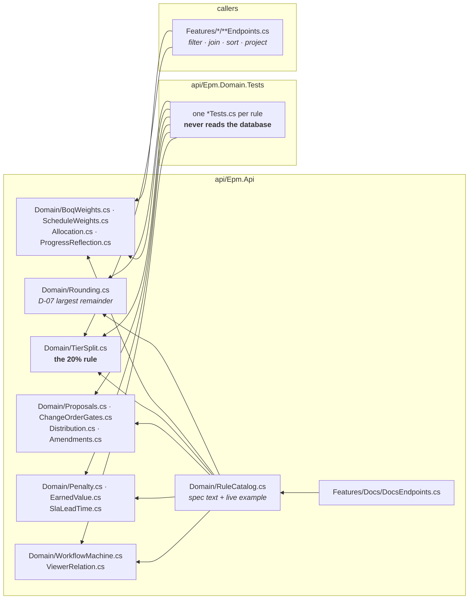
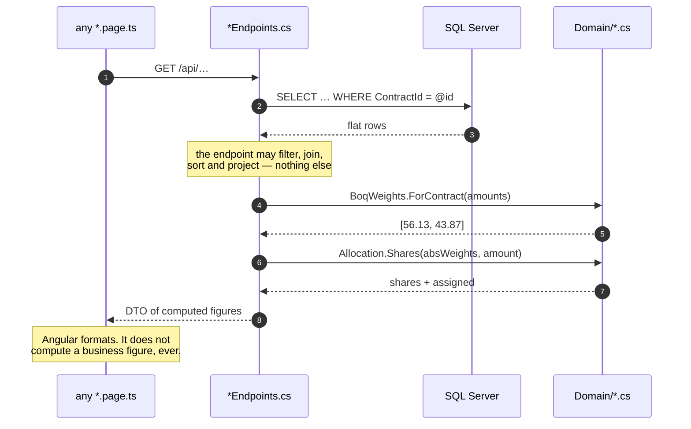
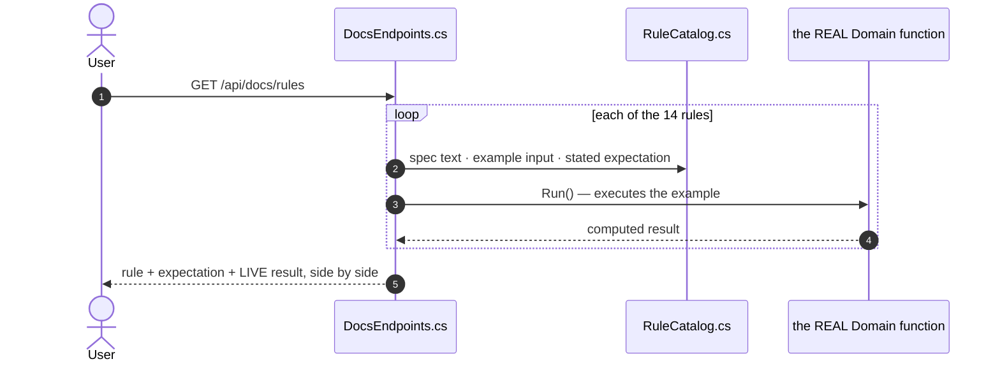
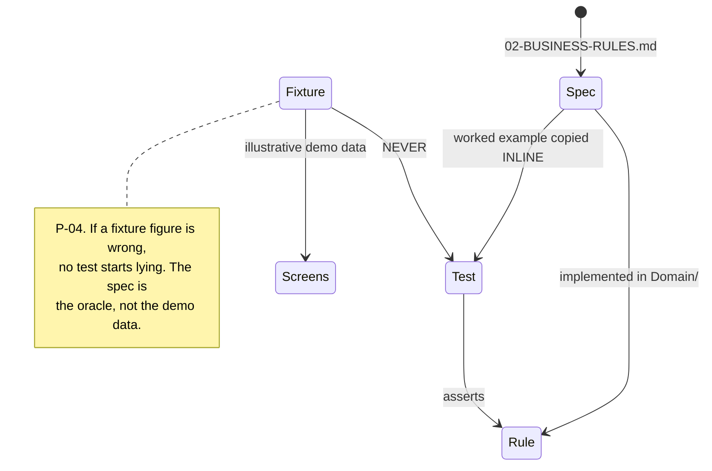

# UML — Domain rules (Phase 1.2)

`02-BUSINESS-RULES.md` and `03-CHANGE-ORDER-PROCESS.md` as code. One rule, one
file, one test file. Endpoint **`EP-DOCS-01`** · `GET /api/docs/rules`

**Ported from** [`../../../epm/prototype-lite/core/domain.js`](../../../epm/prototype-lite/core/domain.js) —
the base prototype's domain layer, which already carries the rule / spec /
example annotations in the right shape. Signatures follow it: flat functions
over plain values, not an object model.

---

## 1. What files make up this feature

> **Nothing in `Domain/` reads the database and nothing knows what a request
> is.** Endpoints filter, join, sort and project; the moment a weight, a share,
> a tier split, a penalty or a lifecycle transition is needed, they call in
> here. That is CLAUDE.md architecture rule 1, and it is checkable:
> `grep -rn "EpmDb\|DbContext" api/Epm.Api/Domain` must return nothing.

---

## 2. The rules

| ID | BR | Spec | File | Worked example |
|---|---|---|---|---|
| `BOQ-WEIGHT` | BR-01 | 02 §1 | `BoqWeights.cs` | 56,131,000 / 43,869,000 → 56.13 / 43.87, sum 100.00 |
| `ACT-WEIGHT` | BR-02 | 02 §2 | `ScheduleWeights.cs` | 36 of 100, parent 60 → absolute 36, relative 60 |
| `ALLOC-SHARE` | BR-03 | 02 §3 | `Allocation.cs` | [5.8, 5.2] on 26,730,000 → 14,094,000 / 12,636,000, full |
| `BOQ-PROGRESS` | BR-04 | 02 §4 | `ProgressReflection.cs` | 52.6% → achieved 14,059,980 |
| `TIER-20` | BR-05 | 02 §5 | `TierSplit.cs` | qty 100 +30 → 20 at the original rate, 10 excess |
| `PROPOSALS` | BR-06 | 02 §6 | `Proposals.cs` | RE dept governs, divergence −600,000, indicative |
| `CO-GATES` | BR-07 | 02 §7 | `ChangeOrderGates.cs` | decrease 30 vs remaining 10 → blocked |
| `DISTRIB` | BR-08 | 02 §8 | `Distribution.cs` | qty 120, rows [40, 50] → partial, remaining 30 |
| `AMEND` | BR-09 | 02 §9 | `Amendments.cs` | +5,000,000 / +45d → no 1, 105,000,000, 2026-08-14 |
| `PENALTY` | BR-10 | 02 §10 | `Penalty.cs` | 61 days → 6,100,000; after an order 1,680,000, waived 4,420,000 |
| `EVM` | BR-11 | 02 §11 | `EarnedValue.cs` | CPI 0.945, SPI 0.867 |
| `SLA` | BR-12 | 02 §12 | `SlaLeadTime.cs` | data date 2026-08-02, letter 2026-07-11 → 22 days, overdue |
| `WORKFLOW` | BR-13 | 03 §2, §5, §6 | `WorkflowMachine.cs` | stages 3 and 4 skipped with reasons; 2 → 5 |
| `RELATION` | BR-14 | 03 §7 | `ViewerRelation.cs` | rate committee at stage 2 → upcoming, read-only |

`Rounding.cs` (D-07) underpins BR-01 and any percentage column with a stated
total. `ProjectValue.cs` (BR-00) is the Σ behind the Projects list.

---

## 3. How a rule reaches a screen

---

## 4. The /docs route — documentation as code

**Executed on every request, never cached.** If a rule changes and its spec
text does not, the page shows a result that disagrees with the stated
expectation — in public, on every load. `RuleCatalogTests` guards the catalog
itself: every BR-01…BR-14 present, ids unique, every example runs.

`Run()` must call the same function the endpoints call. Inlining arithmetic in
the catalog would make it a second implementation and defeat the point.

---

## 5. Testing

128 tests. Beyond the worked examples they pin the edge cases the spec calls
out — an empty contract making no 100% claim, exactly 20% not tripping the
threshold, approving changing nothing, terminal orders being read-only for
everyone — plus a property test that BOQ weights sum to exactly 100.00 across
500 random item sets.

---

## 6. Where to change what

| You want to… | Touch these, in this order |
|---|---|
| Change a rule | the one file in `Domain/` + its `*Tests.cs` + its `RuleCatalog` entry |
| Change a worked example | `RuleCatalog.cs` and the test — they must agree with `02` |
| Use a rule in a screen | call it from that feature's `*Endpoints.cs`; never in Angular |
| Add a rule | `Domain/<Name>.cs` + `<Name>Tests.cs` + a `RuleCatalog` entry + a `TRACE.md` row |

**Never compute a business figure in an endpoint or a component.** If you are
writing `× 0.20`, `/ total * 100` or `+ deltaDays` outside `Domain/`, the rule
already exists in here or belongs in here.

---

## 7. Known gaps

- **No `/docs` Angular route yet.** `EP-DOCS-01` serves the data; the screen
  that renders it is Phase 7.
- **Two spec figures do not match their own rule**, both recorded and asserted:
  `02 §3`'s assigned amounts (P-15) and the `co-lifecycle` list (P-13).
- **`ScheduleWeights` takes pre-computed totals.** The WBS path rollup that
  produces `allTotal` and `parentTotal` belongs with the Schedule tab
  (Phase 4.3), which is where WBS paths first exist.
- **`Distribution` has no import validation.** The five import checks of
  `02 §8` are validation-engine work, not rule arithmetic; they arrive with the
  BOQ distribution drawer (Phase 4.2).
- **BR-00 still receives original contract values**, not effective ones — the
  amendment table is registered in Phase 2.1. `ProjectValueTests` pins the two
  totals that will stop agreeing.
