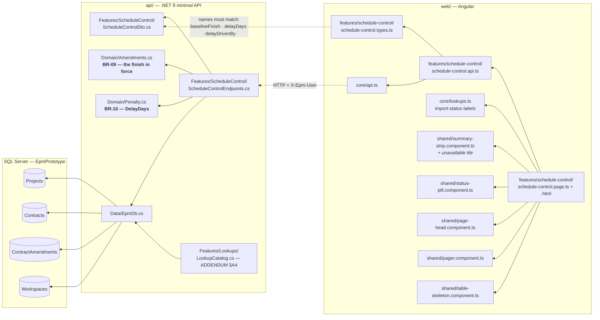
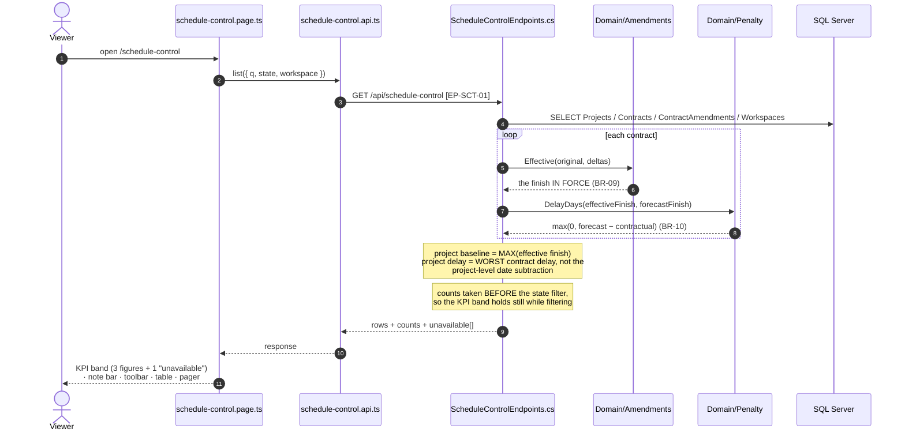
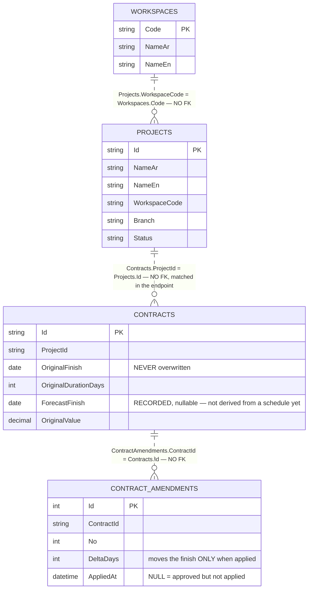
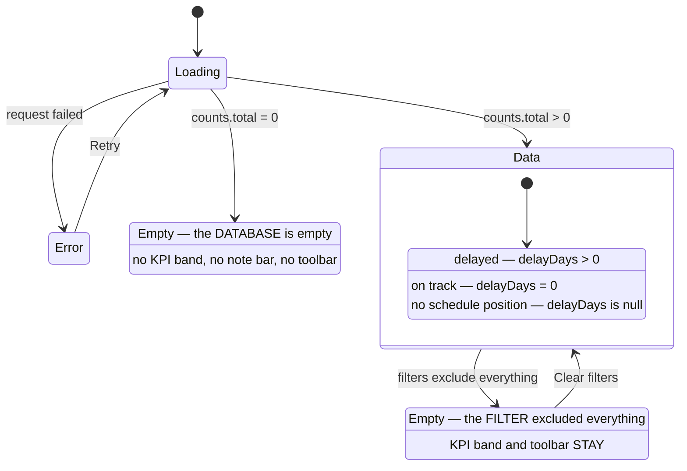

# UML — Schedule Control (Phase 2.5)

**SCR-E5** — portfolio-wide schedule health (`04 §2`).
Endpoint **`EP-SCT-01`** · `GET /api/schedule-control`

Reference component: **`DScheduleControl`** — the v1.1 branch,
`../epm@design/system-revamp` `app/enterprise-areas.jsx:8`.

This is the screen where **BR-09 stops being an accounting detail**. Measured
against the original contractual finish, two of the five fixture projects are
late. Measured against the finish actually in force, one of them is on track —
because it was formally granted the time.

---

## 1. What files make up this feature

> **No table of its own.** Schedule Control registers nothing: it is a different
> reading of `Projects` and `Contracts`. The Activities table it eventually
> needs arrives in Phase 4.3 with the project Schedule tab.

---

## 2. The request, end to end

---

## 3. What it reads

**Writes nothing.** Every figure is derived at projection time (`01 §3`).

### The three derived figures

| Figure | How | Rule |
|---|---|---|
| Baseline finish | `MAX` over contracts of `Amendments.Effective(...).Finish` | BR-09 |
| Delay days | `MAX` over contracts of `Penalty.DelayDays(effectiveFinish, forecastFinish)` | BR-10 |
| Critical activities | **not derivable** — needs Activities + dependencies | Phase 4.3 |

---

## 4. What the screen can look like

Every row is in exactly one of the three per-row states, and
`delayed + onTrack + noSchedule = total`. The third is stated in a note bar
above the table, because it is excluded from **both** the other counts and that
exclusion has to be visible for the two to add up.

---

## 5. Where to change what

| Change | File |
|---|---|
| A column, its order, the note bar | `web/src/app/features/schedule-control/schedule-control.page.html` |
| KPI tiles, foot lines, filter behaviour | `…/schedule-control.page.ts` |
| Chrome strings | `web/src/app/core/lang.ts` (`sc_*`) |
| Import-status labels | `api/…/Features/Lookups/LookupCatalog.cs` — ADDENDUM §A4 |
| How the baseline is derived | `api/…/Domain/Amendments.cs` (BR-09) — **not** the endpoint |
| How delay is measured | `api/…/Domain/Penalty.cs` (BR-10) — **not** the endpoint |
| Scoping, counts, ordering | `api/…/Features/ScheduleControl/ScheduleControlEndpoints.cs` |
| The payload shape | `ScheduleControlDto.cs` **and** `schedule-control.types.ts` |

---

## 6. Known gaps

| # | Gap | Why it is a gap and not a defect |
|---|---|---|
| 1 | **Critical activities is not derivable.** KPI tile renders "unavailable + reason"; the column renders an em dash. | Needs Activities and their dependencies (Phase 4.3). The reference derives it from `p.id.charCodeAt(6) % 3` — a character of the project ID. Same treatment SCR-E1 gives physical %, SPI and CPI (P-09). |
| 2 | **Import status is `pending` for every project.** | True, not a placeholder: the Activities table is not registered, so no P6 schedule has been imported for anyone. Becomes a real query in Phase 4.3 (P-31). |
| 3 | **The forecast finish is RECORDED, not derived.** `Contracts.ForecastFinish` is a stored column. | In a finished system the forecast rolls up from the activity schedule. Until Phase 4.3 it is what the RE department recorded, which is a legitimate source — but it is not the schedule's own answer, and the column means "last recorded forecast". |
| 4 | **No page-head Export / Import P6 buttons.** The reference carries both. | Demo toasts, and the built Contracts and Alerts pages omit the same pattern. Export is Phase 2.6; the P6 import parser is explicitly out of scope (`07 §8`). |
| 5 | **Rows are not clickable.** The reference opens the project workspace. | No project workspace until Phase 3. |
| 6 | The third filter chip is **"no schedule position"**, not the reference's "critical activities". | The reference's chip filters on a fabricated number. Ours filters on something real and answers a question the reference never asks. |

---

## 7. Four things this screen does that the reference does not

**It measures against the finish in force.** The reference subtracts two dates
off a generated schedule. Here the baseline is `Amendments.Effective(...).Finish`
— original plus **applied** amendment days (BR-09). `PRJ-0148` reads **on track**
at `2026-04-20`; against its original `2026-03-31` finish it would read 20 days
late, for time it was formally granted. Approved-but-**unapplied** extensions
are not counted: that project is still late today (`02 §9`).

**The delay is the worst contract's, not the project's.** `PRJ-0279` runs two
contracts. Project-level date subtraction gives 16 days. The
electromechanical contract `CNT-0279-EM` carries no amendment and is **61 days**
late — hidden behind the longer civil contract's extended finish. The row shows
61 and names `CNT-0279-EM`, so the figure is one hop from its source.

**"No schedule position" is its own state.** Two fixture projects have no
contract, so they have no contractual finish and nothing has been forecast for
them. They are not on track. Folding them in would turn absent data into good
news on the screen an executive reads to find bad news.

**The delay figure is not coloured by threshold.** The reference paints it
`--error` when late and `--success` when not. `CLAUDE.md §6` and `05 §7.9`
forbid exactly that — the neutral branch is `--on-surface`. Lateness is carried
by the sign, the label, the KPI band and the worst-first sort (P-30).
