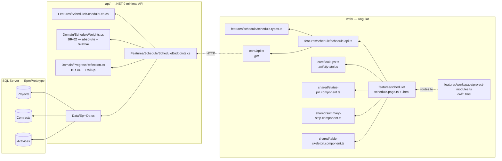
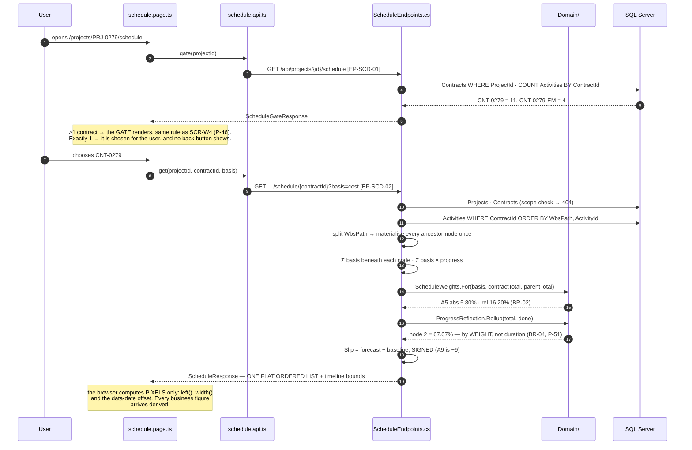
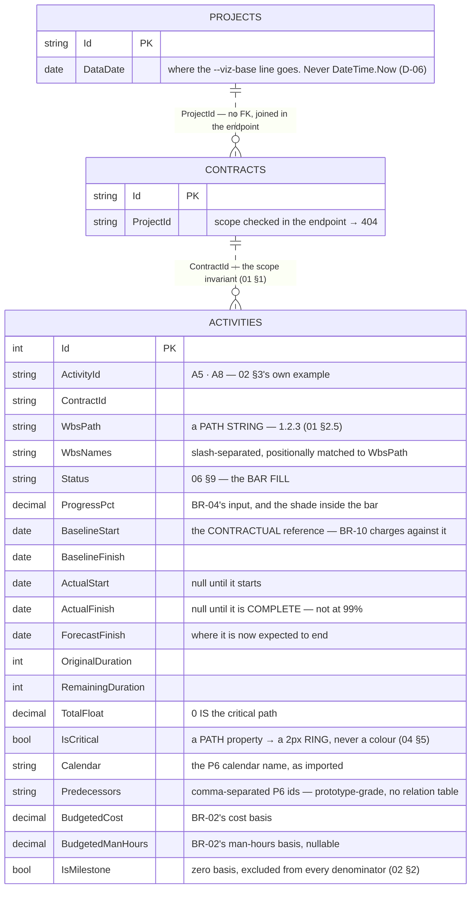
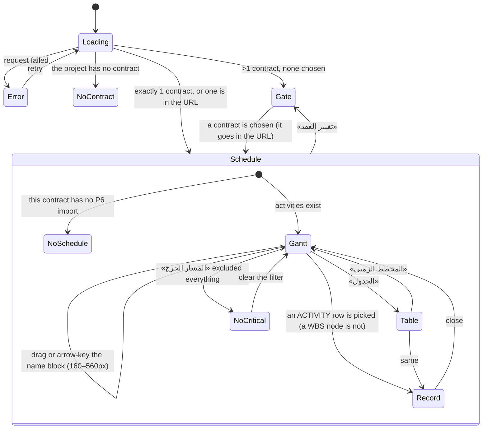

# UML — Schedule tab (Phase 4.3)

**SCR-W5** — a contract's programme, as a Gantt and as a table (`04 §5`).

Endpoints **`EP-SCD-01`** and **`EP-SCD-02`**, both under
`/api/projects/{projectId}/schedule/…`.

Reference components: **`DGantt`** `app/schedule-module.jsx:80` ·
**`DSchedTable`** `:257` · **`DModSchedule`** `:437` — the v1.1 branch,
`../epm@design/system-revamp`.

This is the screen that finishes the `Activities` table. Phase 4.2 registered
it with only the four columns SCR-W4 needed — weight basis, progress, milestone
flag — because BR-03 and BR-04 could not wait for it. 4.3 restored the rest:
the baseline, the actuals, the forecast, the float, the calendar and the
predecessors that make a programme.

It reads five rules and **writes nothing**.

---

## 1. What files make up this feature

`schedule.types.ts` and `ScheduleDto.cs` carry **identical member names**, which
is what lets `grep -rn "EP-SCD-02" api web` cross the language boundary.

---

## 2. The request, end to end

The basis toggle re-issues `EP-SCD-02` rather than recomputing in the browser:
the denominator changes, so **every** weight and every roll-up changes, and
recomputing half of them client-side is how the two views start disagreeing.

---

## 3. What it reads and writes

**Written by this screen:** nothing. Progress is edited on SCR-W6 (Phase 4.4),
where `02 §4`'s reflection onto the BOQ lines is visible while you drag it — an
editor here would move a number whose consequence is off screen.

**Derived, never stored:** both weights, every node's dates and progress, the
slip, the timeline bounds, and the whole WBS tree.

> **There is no WBS table.** A self-referencing one bought nothing: the tree is
> only ever rendered whole, from one contract's activities. `ScheduleEndpoints`
> splits the paths, materialises each ancestor once, and emits **one flat
> ordered list**; the browser indents by `Level` and hides a subtree by matching
> `Path`. That is why a collapse cannot desynchronise from the data — there is
> only one tree.

---

## 4. What the screen can look like

`NoSchedule` and `NoCritical` are **two different empty states with two
different messages and two different buttons** (`04 §9`), and so are
`NoContract` and `Gate`.

---

## 5. Where to change what

| To change… | Edit |
|---|---|
| how either weight is computed | `Domain/ScheduleWeights.cs` |
| how a WBS node's progress rolls up | `Domain/ProgressReflection.cs` |
| the tree, the node order, or what a node's dates mean | `Build()` in `Features/Schedule/ScheduleEndpoints.cs` |
| the chart bounds, or the tail past the last bar | `Timeline()` + `TailDays` in the same file |
| bar geometry, the data-date offset, the collapse | `schedule.page.ts` — the only things the browser computes |
| which 4 columns survive below 1280px | `.d-gantt.cols-compact` — `web/src/styles/desktop.css:1607` |
| the 1280px breakpoint itself | the `matchMedia` in `schedule.page.ts`'s constructor |
| the critical RING, or the name block's width | the SCR-W5 block at the end of `web/src/styles.css` |
| a column heading, a button, an empty state | `core/lang.ts` (`scd_*`) |
| an activity **status label** | `Features/Lookups/LookupCatalog.cs` (`activity-status`) — never `lang.ts` |
| the fixture's activities, dates, float or critical chain | `Features/Dev/Fixture.cs` → `Act(…)` |

---

## 6. Known gaps

- **No P6 import and no editing.** `04 §5` describes a viewer; a schedule is
  imported from Primavera, which is not a screen this phase builds. The empty
  state says where a programme comes from rather than offering a button that
  cannot work.
- **Predecessors are a string, and no arrows are drawn.** `04 §5` does not ask
  for dependency arrows and the reference does not draw them, so a relation
  table would carry weight nothing reads. The ids are shown on the activity
  record.
- **`IsCritical` is stored, not computed.** A real critical path is a forward
  and backward pass over the dependency graph; here it arrives from the P6
  export, like `TotalFloat`. The fixture keeps the two consistent — every
  critical activity has float 0 and they form one unbroken chain.
- **WBS node names stay in Arabic when the UI is English.** `WbsNames` is one
  column, not an `{ar, en}` pair — the same argument the BOQ tab's
  `DivisionName` makes: it is transcribed from the contract's own programme, so
  it is a **record**, not prose.
- **No amendment disclosure yet.** `DAmdMark` and `DAmdPanel` are ROADMAP 4.5,
  shared with the BOQ tab. Until then an applied extension shows only where it
  already showed: the contract's effective finish (BR-09) on SCR-W3.
- **The baseline never moves, and nothing on this screen can move it.** That is
  correct — an applied change order shifts the contractual finish in the
  contract amendment, not the activity baseline — but it means a heavily
  amended contract will show a large slip on rows that are formally on time.
  4.5 is where that gets its label.

---

## 7. Three things worth knowing before changing this screen

**Two weights, two denominators** (BR-02). Absolute divides by every activity in
the **contract**; relative divides by the activity's **parent WBS node**. A
root-level node's parent is the contract, so its two weights are equal — that is
not a bug, it is what "root: ÷ total" means. Passing the node's own parent total
to its children instead would make every activity's relative weight equal its
absolute one, which is `02 §2`'s worked example collapsing to nothing.

**Progress rolls up by weight, not by duration** (P-51). The reference rolls up
by original duration, which lets a long cheap activity outrank a short expensive
one. `02 §4` says weight, and the written spec owns the arithmetic.

**Criticality is a ring; status is the colour** (`04 §5`, P-52). The reference's
own stylesheet paints a critical bar `--error` while its own legend draws a
ring — the chart disagrees with its key. The bar keeps its status fill and wears
a 2px `--on-surface` ring, applied through a `--bar-status` custom property so
the **stylesheet** is correct on its own rather than being out-specified by an
inline style a later edit could quietly remove.
