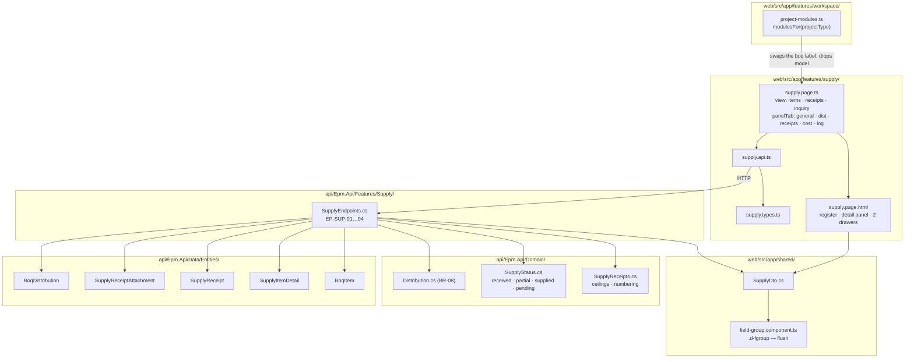
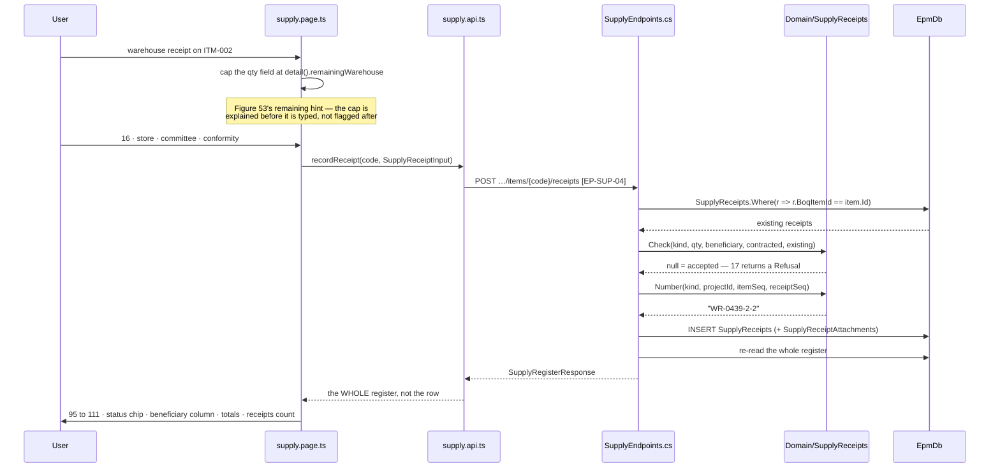
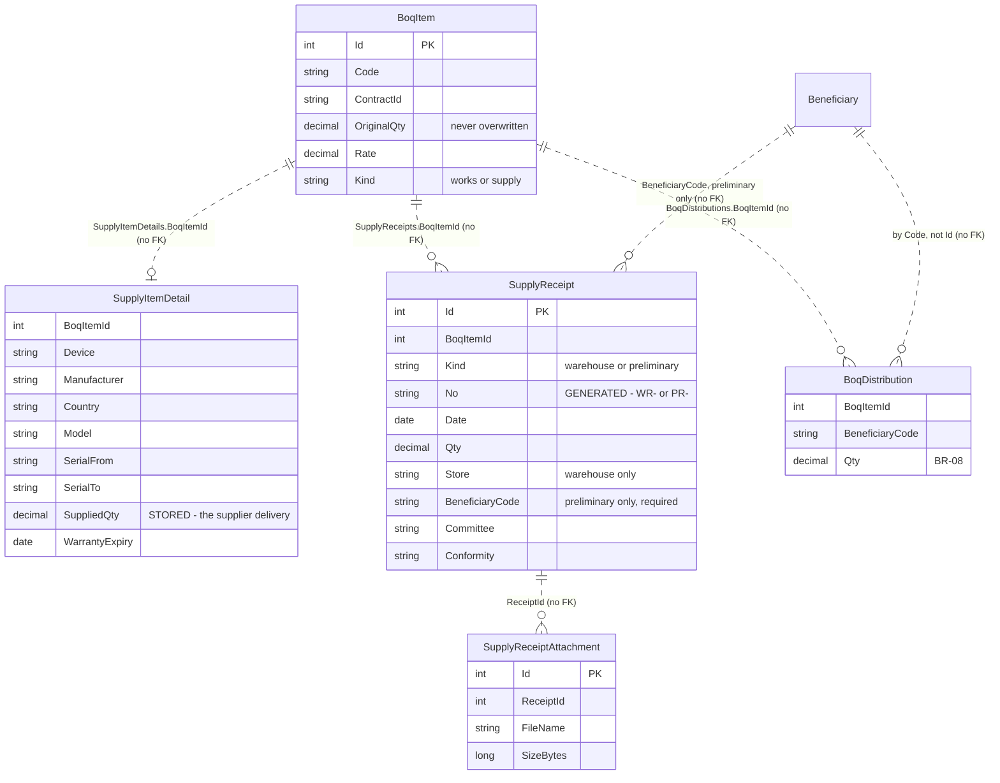
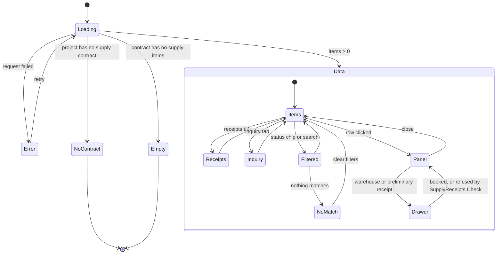

# الفقرات التجهيزية — ملحق الأشكال 50–56 · P-110

**The supply half of a bill, and the receipts that move it.**

On a supply project (`kind = supply`) the bill is not works measured on site —
it is devices ordered, delivered to a store, and handed on to the universities
and hospitals that asked for them. The same `BoqItem` carries it; what this
feature adds is the device half of the line, the two receipts المسار 11 records
as events, and the six plates that read them.

| | |
|---|---|
| Screens | الشكل 50 register · 51 item detail · 52 receipts tab · 53/54 the two drawers · 55 receipts register · 56 inquiry |
| Endpoints | `EP-SUP-01` … `EP-SUP-04` |
| Rules | `Domain/SupplyStatus` · `Domain/SupplyReceipts` · BR-01 · BR-08 |
| Tables | `BoqItems` · `SupplyItemDetails` · `SupplyReceipts` · `SupplyReceiptAttachments` · `BoqDistributions` · `Workspaces` |

---

## 1. File map



**The frame is the shared grid's, not the page's.** Both registers render through `epm-data-table`, which wraps them in `epm-field-group` (`.d-fgroup`, our port of the prototype's `DFGroup`) when given a `title`: a heading row carrying «N من أصل M» and a chevron, a flush `[epmTableToolbar]` slot, then the grid — the shape `supply-items.jsx:545` emits. Reading the appendix prose alone got this wrong once, because the prose lists a screen's own furniture and the frame is the shell every register shares (P-169).

**The rail is type-gated, not duplicated.** `modulesFor(projectType)` keeps the
`boq` module id on a supply project and swaps only its label and icon to
الفقرات التجهيزية; `model` is dropped, because there is no 3D/BIM for equipment
supply. Schedule and progress stay — supply runs the same engines
(`model.js:751`).

---

## 2. Request sequence — recording a warehouse receipt (الشكل 53)

The one flow that MOVES anything. Everything else on the feature reads.



**Why the write returns the whole register.** One receipt moves the item's
received figure, its status chip, the beneficiary's المستلم column, the totals
strip and the الاستلامات tab's count. Patching a row client-side would leave
four of those five stale.

---

## 3. Data



### The derived figures, and where they come from

**`ReceivedQty` is not a column.** `SupplyItemDetail`'s own comment named its
storage «a seam, not a design choice»; المسار 11 records receipts as events, and
this feature is what closed it. The received quantity is Σ the item's *warehouse*
receipts, computed at projection time (`01 §3`, CLAUDE.md §3.5).

| Figure | Source | Not stored because |
|---|---|---|
| `ReceivedQty` | `SupplyReceipts.ReceivedInto` | it is Σ the receipts, and two places to change it is one place to disagree |
| `HandedOverQty` | `SupplyReceipts.HandedOver` | same |
| beneficiary `ReceivedQty` | `SupplyReceipts.HandedOverTo(code)` | الشكل 51's per-beneficiary column |
| `RemainingQty` | contracted − received | |
| `Status` | `Domain/SupplyStatus` | already existed and is unchanged |
| `Weight` | `Domain/BoqWeights` (BR-01) | |
| `AllocatedQty` | `Domain/Distribution` (BR-08) | |

`SuppliedQty` **stays stored** — it is the supplier's declared delivery, not a
receipt, and no event in this system produces it.

### The two ceilings

The rule that matters, and it is why the two receipts are two ceilings rather
than one `Kind` flag:

```
  warehouse    ≤ contracted − Σ warehouse           (what is still owed)
  preliminary  ≤ Σ warehouse − Σ preliminary        (arrived, not yet handed over)
```

A beneficiary cannot take delivery of something that never reached the store.
الشكل 56 prints المستلم 118 against المجهّز 154 side by side precisely because
they are different quantities.

---

## 4. States



**Three empty messages, not one** (`04 §9`): a contract with no supply items, a
register filtered to nothing, and an inquiry that matched nothing are three
different facts and say so. An item contracted but never received is not an
empty state at all — it is «لم يُجهَّز», a status the register counts.

`لا مستند` is likewise a **real state, not a blank**: الشكل 55 calls a receipt
with no attachment «ثغرة توثيقية تستوجب المعالجة», so an attachment is not
required and its absence is reported.

---

## 5. Where to change what

| To change… | Edit |
|---|---|
| the receipt ceilings, or the refusal wording | `Domain/SupplyReceipts.Check` — and its tests, never the endpoint |
| the receipt number format | `Domain/SupplyReceipts.Number` (WR-0439-2-2 · PR-0439-6) |
| the status chips and their counts | `Domain/SupplyStatus` — shared with SCR-W4's supply rows |
| what a beneficiary is allocated | `Domain/Distribution` (BR-08) — the التوزيع tab reads it unchanged |
| the register columns | `SupplyItemRow` + `supply.page.html`, both, with the same names |
| which modules a supply project shows | `web/src/app/features/workspace/project-modules.ts` `modulesFor()` |
| the device half of a line | `SupplyItemDetail` — written by `EP-BOQ-12`, not by this feature |

---

## 6. Known gaps

- **No receipt is ever edited or voided.** A booked receipt is a محضر; correcting
  one is a decision with an owner and a reason, and no plate draws that screen.
  The register shows what was booked.
- **Attachments are metadata only** — no file storage anywhere in this prototype.
  Opening one is a demo action.
- **`Conformity` is recorded, not enforced.** A `غير مطابق` receipt still books
  its quantity: الشكل 54 offers the select but states no consequence, and
  inventing a rejection path would be inventing a workflow.
- **«المخزن» and «لجنة الاستلام» are free text, not selects.** الشكل 53 draws both as «قائمة اختيار». There is no store register and no committee register in this build, and seeding one would be inventing ministry data rather than porting it — so the fields accept text and the plate's intent is recorded here. A `Lookups` category for each is the change when the client supplies the lists.
- **Conformity is displayed on a warehouse receipt but cannot be entered on one.** الشكل 52's warehouse card reads «… · مطابق للمواصفات», yet الشكل 53's field list — رقم الاستلام · التاريخ · الكمية · المخزن · لجنة الاستلام · ملاحظات — has no مطابقة control. The drawer follows الشكل 53 (no field) and the fixture seeds the value الشكل 52 prints. Whether a store receipt records conformity, or the plate's «مطابق للمواصفات» is a fixed descriptor, is unresolved and is not guessed at.
- **A receipt is capped against the CONTRACTED quantity, not against `SuppliedQty`** — so an item can finish «مستلم بالكامل» with a received figure above what the supplier is recorded as delivering (ITM-002: contracted 111 · supplied 104). الشكل 53's own «المتبقي 16» can only be 111 − 95, so the plate settles the formula; nothing settles whether supplied should be a second ceiling. **P-168, open with the client.**
- **Serial numbers are a range** (`SerialFrom` … `SerialTo`), not per-device rows.
  الشكل 56 searches within the range; it cannot say which individual serial went
  to which beneficiary, because `SupplyItemDetail` holds the range and no plate
  asks for a per-unit register.
- **الأشكال 57–60's redistribution is not here.** A change order moving quantity
  between beneficiaries is Phase 11 — `ChangeOrderRedistribution` and
  `Domain/SupplyRedistribution`, applied by `Domain/ChangeOrderApply` — and it
  moves `BoqDistribution` rows rather than receipts. See
  [change-order-wizard.md](change-order-wizard.md).
