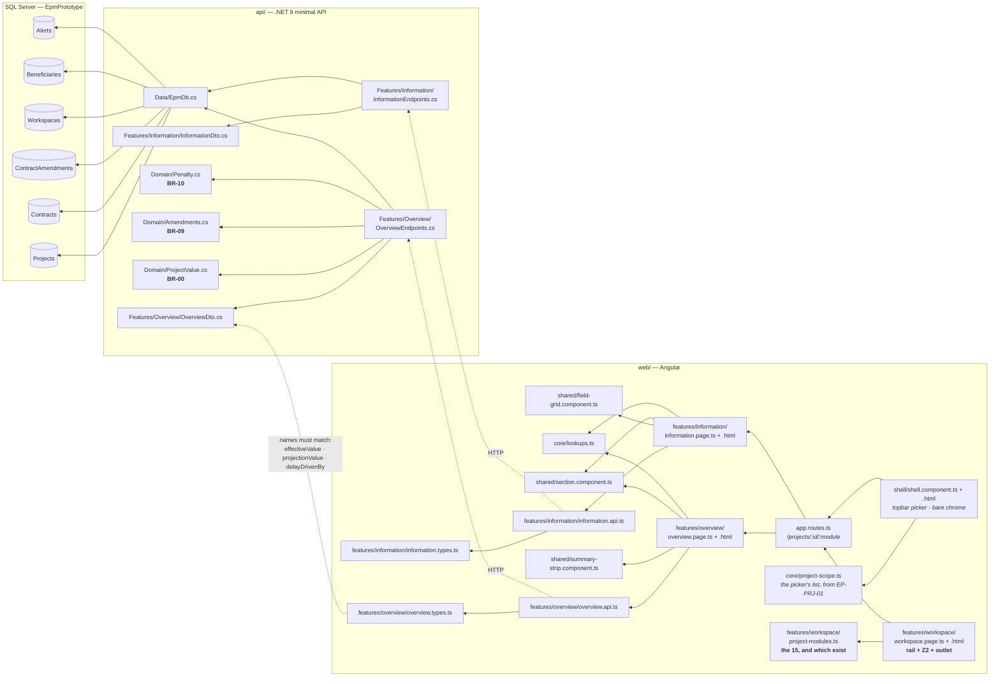
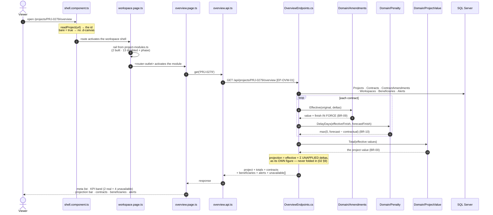
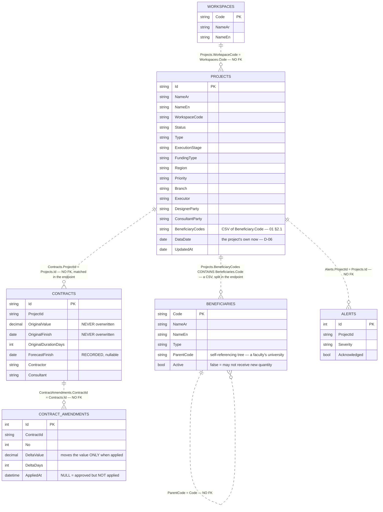
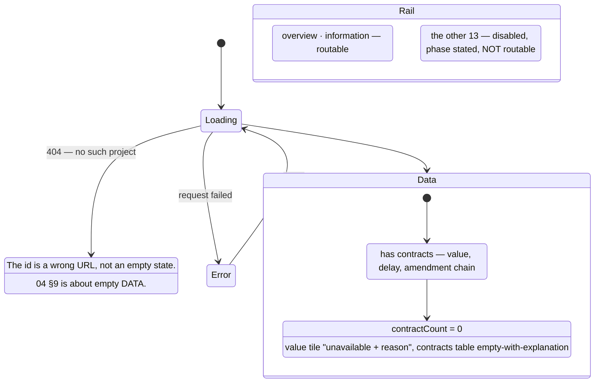

# UML — Project workspace shell (Phase 3)

The frame every project module renders inside, plus the first two modules.

**SCR-W1** Overview — `EP-OVW-01` · `GET /api/projects/{id}/overview`
**SCR-W2** Project Information — `EP-INF-01` · `GET /api/projects/{id}/information`

Reference components: **`DWorkspace`** `app/desktop-workspace.jsx:12` ·
**`DProjectDetail`** `:126` · **`DModOverview`** `app/project-modules.jsx:2512` ·
**`DModInformation`** `:280` — all the v1.1 branch,
`../epm@design/system-revamp`.

> **It is not three panes.** `04 §3` and ROADMAP Phase 3 both describe
> queue · detail · context. v1.1 collapsed that: the queue became the topbar
> project picker, the detail pane grew a grouped module rail, and
> `DProjectContext` is exported by the reference and rendered by nothing. See
> P-40 — and `04 §3` should be updated to match.

---

## 1. What files make up this feature

> **One new table: `Beneficiaries`.** `Projects.BeneficiaryCodes` is a CSV of
> its codes (`01 §2.1`) and SCR-W1 is the first screen to resolve them.

---

## 2. The request, end to end

---

## 3. What it reads

**Writes nothing.** SCR-W2 is the only module in the workspace whose every
value is a stored column; SCR-W1's every figure is derived at projection time.

### The four derived figures on SCR-W1

| Figure | How | Rule |
|---|---|---|
| Project value | `ProjectValue.Total` over `Amendments.Effective(...).Value` | BR-00 over BR-09 |
| Effective finish | `Amendments.Effective(...).Finish` per contract | BR-09 |
| Delay days | worst `Penalty.DelayDays(effectiveFinish, forecastFinish)` | BR-10 |
| Projection | effective + Σ **unapplied** deltas — its own figure | 02 §9 |

---

## 4. What the screen can look like

`PRJ-0277` and `PRJ-0159` reach the no-contract branch in the fixture.

---

## 5. Where to change what

| Change | File |
|---|---|
| A module becomes real | `features/workspace/project-modules.ts` (`built: true`) **and** a route in `app.routes.ts` — both, or it is a dead link |
| The rail's grouping or order | `features/workspace/project-modules.ts` |
| Module labels, group labels | `web/src/app/core/lang.ts` (`mod_*`) |
| Z2 header, breadcrumb, id chip | `features/workspace/workspace.page.html` |
| The project picker | `shell/shell.component.html` + `core/project-scope.ts` |
| Which routes drop the canvas | `bare` in `shell.component.ts` |
| SCR-W1 figures, tiles, columns | `features/overview/*` and `Features/Overview/OverviewEndpoints.cs` |
| SCR-W2 field GROUPING | `Features/Information/InformationEndpoints.cs` — semantic, belongs with the data |
| SCR-W2 field LABELS | `core/lang.ts` (`inf_*`) — a label is chrome |
| How value / finish / delay are derived | `Domain/ProjectValue.cs` · `Amendments.cs` · `Penalty.cs` — **not** an endpoint |

---

## 6. Known gaps

| # | Gap | Why it is a gap and not a defect |
|---|---|---|
| 1 | **No context pane.** `04 §3`'s third pane is not built. | v1.1 does not render one either — `DProjectContext` is dead code there, and `.d-three` carries `data-ctx="off"`. Its per-module actions moved into Z6 (P-40). |
| 2 | **No readiness dots** on the rail. | The reference derives them from `rng(p.id.charCodeAt(6) * 13 + 5)`. No review state is stored anywhere in this system (P-09). |
| 3 | **No S-curve, no physical %, no SPI/CPI.** Four KPI tiles render "unavailable + reason". | Physical % is BR-04 (Phase 4.2), financial % needs payments (4.1), the indices need a baseline curve (4.3). The curve is absent rather than unavailable because a chart cannot be labelled. |
| 4 | **No edit mode.** The reference's Information module edits inline. | Nothing in this build writes except alert acknowledgement, so an edit mode would be a form that discards what you type. |
| 5 | **No activity-log tab** on SCR-W2, and no description field. | There is no audit table until Phase 6, and `Projects` has no description column. |
| 6 | **No per-module Z6 actions.** | Every one of them (import P6, record payment, create change order) belongs to a module that does not exist yet. |
| 7 | **No keyboard ↑/↓ through the picker list.** The reference moves selection with arrows. | Its queue was a permanent pane; ours is a menu, and a menu that navigates on arrow-key would fire a route change per keypress. |
| 8 | **Module permission is not enforced.** The reference locks a module when `!m.perm`. | BR-14 `ViewerRelation` exists in `Domain/`, but nothing maps a persona to a module yet — and inventing a map would gate real screens on a guess. The `locked` visual is used for *unbuilt*, which is a different statement and is labelled as one. |

---

## 7. Three things this shell does that the reference does not

**Its rail cannot lie about what exists.** Thirteen of the fifteen modules are
disabled, each stating the phase that builds it, and none of them is routable.
The route table and `project-modules.ts` are the two halves of one guarantee:
`built: true` with no route would be exactly the dead link the list prevents.

**Its project value is Σ effective, and the projection is beside it, never in
it.** `PRJ-0279` reads **350,000,000** — awarded 340,000,000 plus one applied
amendment. One further amendment is approved and not applied; the screen says
the value *would* be 353,000,000 and puts that on its own line. Folding it in
is the single most consequential mistake this screen could make (`02 §9`).

**Its delay is the same number SCR-E5 shows.** 61 days on `PRJ-0279`, driven by
`CNT-0279-EM` — not the 16 days a project-level date subtraction gives, because
the electromechanical contract has slipped behind a longer sibling's extended
finish. Both screens call `Penalty.DelayDays`, so they cannot disagree.
